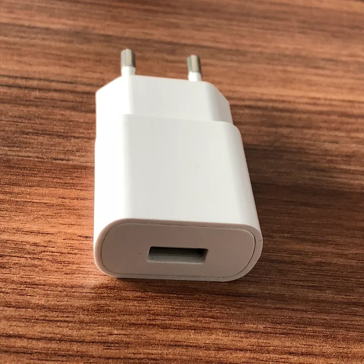
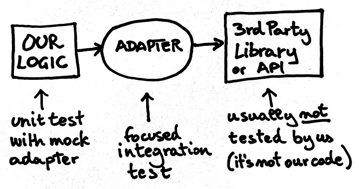
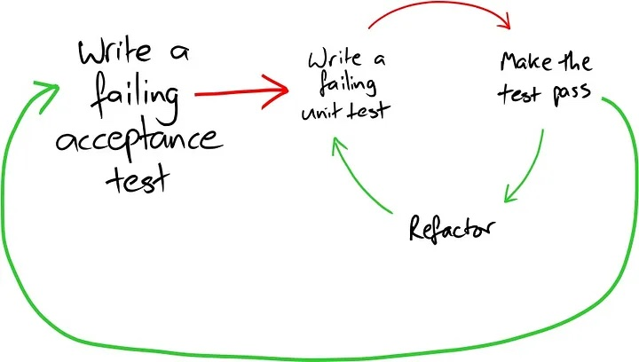
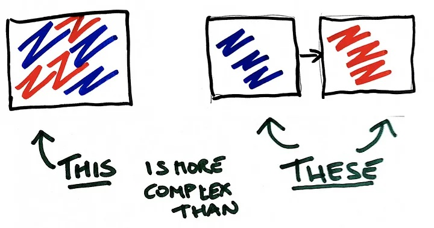
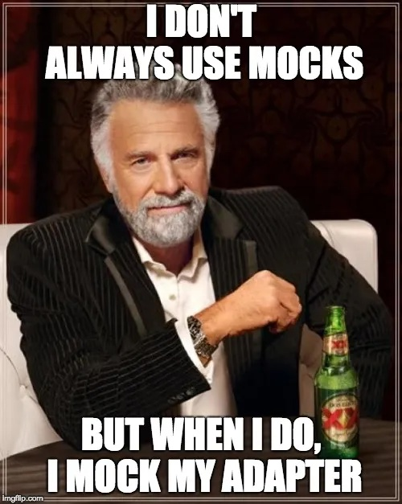

+++
title = 'How I Learned to Love Mocks'
date = "2018-09-27"
draft = false
+++

*This article was previously [published on Medium](https://medium.com/@xpmatteo/how-i-learned-to-love-mocks-1-fb341b71328)*

<figure>
  
  <figcaption>A power adapter: 220V AC on one end, USB on the other</figcaption>
</figure>

We all want to have fast, reliable and simple tests (and code). One thing that gets in the way of all of those good things is that the code that we want to write depends on external systems, such as databases, web services, etc. We then look to mocks to take care of the dependencies, and here is where many find that their code goes BOOM.

I think the main reason why people have poor results with mocks is that they miss a subtle thing. It's in one of the [original papers on mock objects](http://jmock.org/oopsla2004.pdf):

> Only mock types you own.

But, what does that mean? To me, it means that when our code depends on a 3rd party API, it should not depend on that API directly. It should depend on that API through an *adapter*.

An adapter, much like an electrical socket adapter, is a thing that sits between our logic, and 3rd party dependencies. On the 3rd party side, it talks the API of that 3rd party. On our logic side, it provides the ideal API that we wish we had available to make it easy to write our logic.

<figure>
  
  <figcaption>The design we aim for, and how we go about testing it</figcaption>
</figure>


Mocking the other API leads to problems
=======================================

For instance: suppose that I am developing a function that will send a birthday greetings email. Suppose I ignore the above advice, and try to develop directly against the Java Mail API. My test starts with

```java
@Test
public void testSendGreetings1() throws Exception {
  birthdayService.sendBirthdayGreetings("jane.doe@example.com", "Jane");

  // I want to assert that a message is being sent, with
  //  - Subject: Happy Birthday!
  //  - Body: Happy Birthday, dear Jane
  //  - Recipient: jane.doe@example.com
  // ??? how do I do that ???
}
```

I have no idea how to send email with Java. I google a bit and learn that I need to do something like this:

```java
// This production code mixes business logic and 3rd party API calls
void sendBirthdayGreetings(String recipient, String firstName) throws MessagingException {
  // Construct the bits of the message
  String body = "Happy Birthday, dear %NAME%".replace("%NAME%", firstName);
  String subject = "Happy Birthday!";

  // Create a mail session
  java.util.Properties props = new java.util.Properties();
  props.put("mail.smtp.host", smtpHost);
  props.put("mail.smtp.port", Integer.valueOf(smtpPort));
  Session session = Session.getInstance(props, null);

  // Construct the message
  Message message = new MimeMessage(session);
  message.setFrom(new InternetAddress("sender@example.com"));
  message.setRecipient(Message.RecipientType.TO, new InternetAddress(recipient));
  message.setSubject(subject);
  message.setText(body);

  // Send the message
  Transport.send(message);
}
```

The key API call here is `Transport.send(message)`, which is unfortunately a static method, therefore difficult to mock. So I spend some time googling. It turns out that mocking static methods in Java is difficult, and it requires a specialized library, in addition to the "normal" mocking library that I use. So I need to learn about PowerMockito, in addition to Mockito, which is my usual tool. With some effort, I write the following test:

```java
// Folks, don’t test like this! It’s painfully complicated and low value
@RunWith(PowerMockRunner.class)
@PrepareForTest(Transport.class)
public class BirthdayServiceTest {
  @Test
  public void testSendGreetings() throws Exception {
    PowerMockito.mockStatic(Transport.class);
    birthdayService.sendBirthdayGreetings("jane.doe@example.com", "Jane");

    PowerMockito.verifyStatic(Transport.class);
    ArgumentCaptor<Message> messageArgumentCaptor = ArgumentCaptor.forClass(Message.class);
    Transport.send(messageArgumentCaptor.capture());
    assertThat(messageArgumentCaptor.getValue().getSubject(), is("Happy Birthday!"));
    assertThat(messageArgumentCaptor.getValue().getContent(), is("Happy Birthday, dear Jane"));
    assertThat(messageArgumentCaptor.getValue().getRecipients(Message.RecipientType.TO).length, is(1));
    assertThat(messageArgumentCaptor.getValue().getRecipients(Message.RecipientType.TO)[0], is(new InternetAddress("jane.doe@example.com")));
  }
}
```

What we just did shows a number of problems:

-   The production code mixes business logic, that in this case is how I construct the subject, body and recipient of my message, with the details of how to use the Java Mail API.
-   The test code relies on two extra packages (PowerMock and PowerMockito), and requires 4 different calls to set up the production code so that the real static method on the Transport class is not actually called.
-   I need to use an `ArgumentCaptor` (which is an advanced trick) to make sure that the message really contains the things I wanted to test for in the first place, which complicates my test even more
-   I have no real confidence that this code really works in practice. I need to run the production code outside the test, to see if it really sends messages correctly. If I misunderstood the details of how to invoke the Java Mail API, the test could be passing, while the production code is wrong.

Better: mock your own adapter
=============================

Let's try to see how it would look like if, instead, I used an adapter. My test starts like the following:

```java
// This is a good test: simple, clear, fast
public class BirthdayService1Test {
  @Test
  public void testSendGreetings() throws Exception {
    MailAdapter mailAdapter = mock(MailAdapter.class);
    
    new BirthdayService(mailAdapter).sendBirthdayGreetings("jane.doe@example.com", "Jane");

    verify(mailAdapter).sendMessage("Happy Birthday!", "Happy Birthday, dear Jane", "jane.doe@example.com");
  }
}
```

The `MailAdapter` class is my adapter. It does not even exist before I write this test. By writing the test, I discover that

-   the `BirthdayService` needs a reference to an instance of `MailAdapter`
-   the `MailAdapter` should have a `sendMessage(String subject, String body, String email)` method.

In other words, *by writing the test I discover the interface that the adapter should have*. I run the test to see it fail, and the error message explains clearly what is missing:

```text
Wanted but not invoked:
mailAdapter.sendMessage(
    "Happy Birthday!",
    "Happy Birthday, dear Jane",
    "jane.doe@example.com"
);
-> at it.xpug.kata.birthday_greetings.BirthdayService1Test.testSendGreetings(BirthdayService1Test.java:26)
Actually, there were zero interactions with this mock.
```

The above is a readable error message, produced by the mocking library: Mockito.

Now I can implement the production code in `BirthdayService` that will make this test pass:

```java
// The production code is very simple. 
// It does not worry about the technical details of sending email
public void sendBirthdayGreetings(String recipient, String firstName) {
  mailAdapter.sendMessage("Happy Birthday!", "Happy Birthday, dear " + firstName, recipient);
}
```

And now my test passes! A big difference with respect to the previous example is that, up to this point, I haven't had to google for Java Mail or for "how to mock static methods".

Of course I'm not finished yet. I need to implement the `MailAdapter`. This will be our adapter to the Java Mail API. How will we test it? Testing it with PowerMockito will result in a test similar to what we did before: lots of complication, with very little confidence that the code does what it is supposed to do. A better way is to write a focused integration test. It is called "focused" because it focuses on the interaction of our code with exactly one external dependencies; in contrast with broad integration tests, which test the interaction with more than one. Focused integration tests are better, because they can be made small, precise and relatively fast.

One way to write a focused integration test for an adapter that sends email messages, is to point it to a test smtp server, and check that it really receives the message. We could use a real smtp server, but we don't want to have our tests depend on resources that are external to the test and might not be available when we run the test itself. Therefore, we use a simple smtp server that is expecially made for testing purposes; one such server is [dumbster](https://github.com/kirviq/dumbster). Our test needs to start and stop this lightweight server before and after the test is run.

```java
private static final int NONSTANDARD_PORT = 9999;
private MailAdapter mailAdapter = new MailAdapter("localhost", NONSTANDARD_PORT);
private SimpleSmtpServer smtpServer;

@Before
public void setUp() throws Exception {
  smtpServer = SimpleSmtpServer.start(NONSTANDARD_PORT);
}

@After
public void tearDown() throws Exception {
  smtpServer.stop();
}

// A “focused integration test” for the Java Mail API adapter. 
// It actually sends a message to a test SMTP server.
@Test
public void sendEmailMessage() throws Exception {
  mailAdapter.sendMessage("the subject", "the body", "foo@bar.com");

  assertEquals("message not sent?", 1, smtpServer.getReceivedEmailSize());
  SmtpMessage message = (SmtpMessage) smtpServer.getReceivedEmail().next();
  assertEquals("the body", message.getBody());
  assertEquals("the subject", message.getHeaderValue("Subject"));
  String[] recipients = message.getHeaderValues("To");
  assertEquals(1, recipients.length);
  assertEquals("foo@bar.com", recipients[0].toString());
}
```

Now, if this test passes, I feel confident that I'm able to send real email messages to real mail servers. And the day when I will try variations, such as sending to multiple recipients, or sending HTML mail, I will be able to update the test accordingly, and keep the confidence that my adapter still does the right thing.

Living in a world of constant change
====================================

In this example, our external dependency is an established API, that does not change often. What would be different if instead, we were targeting a fast-changing dependency? A typical example would be writing a frontend whose backend is being developed at the same time: the backend API would be in constant flux.

It turns out, not much would change. The focused integration test becomes even more important: when it breaks, it means that the backend has changed in a way that would break our frontend. The test breaks, so that we get an early warning, hopefully before the changes are released to production.

However, no single technique can ever be enough to deliver quality software. The potential problem with our backend adapter test is that it lives in the frontend code, so it is only executed when we change the *frontend*. Can you see the problem with that? :-) In this situation, we may find [Customer-Driven Contracts](https://martinfowler.com/articles/consumerDrivenContracts.html) useful.

Caveats
=======

I said that a reason why code with mocks can be ugly is because of the absence of an adapter. This, however, is not the only possible reason why our mock-based tests can be ugly. Another frequent problem is that our production code has too many dependencies, which in turn is probably an indication that it's doing too many things. But this is the matter for another article :-)

One other problem we sometimes have is that, in production code, we have a chain of objects that call each other, while the tests only test these objects in isolation. In fact, this is just what we did above! What is the risk? The risk is that, while the unit tests all happily pass, the chain of calls does not actually work in production. There is more than one way to offset this risk: the most straightforward way, which is the one I use, is to set up *a single "end-to-end" test* that exercises the chain of calls. This test does not need to exercise precisely the whole range of business scenarios that your code should support, because if you tried to do that, it would no longer be a *single* end-to-end test: you would need many. All it needs to do is to prove that the chain of calls works; the precise details of the business logic should be exercised by the unit test.

Kicking off development with a failing end-to-end acceptance test is a style that was [promoted by Steve Freeman and Nat Pryce](https://www.oreilly.com/library/view/growing-object-oriented-software/9780321574442/ch04.html#ch04sec1lev2).

<figure>
  
  <figcaption>Starting development with a failing end-to-end acceptance test <br>Image by S.&nbsp;Freeman and N.&nbsp;Pryce <a href="https://creativecommons.org/licenses/by-sa/4.0/">CC-BY-SA</a></figcaption>
</figure>

There are a number of caveats on this subject too: you must take care that the end-to-end tests be fast and reliable. Other authors disagree on the use of end-to-end acceptance tests: see what [James Shore](https://www.jamesshore.com/Blog/Alternatives-to-Acceptance-Testing.html) and [J.B. Rainsberger](https://blog.thecodewhisperer.com/permalink/integrated-tests-are-a-scam) have to say about it.

Conclusions?
============

We tried test-driving a simple program by mocking the implementation API directly, and we saw how the test was difficult to write, ugly and not really effective. Then we tried again with an adapter, and saw that many of the common problems of tests with mocks are solved.

-   Overly complex tests, like when we mock something to return another mock, or when we try to "simulate" a complex behaviour of a dependency. We avoid this problem because we only use the mock to design the interface for an adapter, so that we can make the interface as simple and convenient as we like
-   False sense of security, aka "all the tests are green and the system's broken": when we mock a 3rd party API we bake in the tests our assumptions of how the 3rd party works, which can be wrong. By testing the adapter with the real 3rd party system, we make sure our adapter really works. Also the end-to-end acceptance test helps here.
-   Tests that resist change, as in "let's not refactor the production code, or we will break 1000 tests". The latter situation happens when we test the implementation (the 3rd party API). We avoid it by testing the API of an adapter that hides "how it does what it does" from the caller.

External APIs are best used through the medium of an adapter. Mocks are a useful way to *design* adapters, when we develop code from the outside in. Focused integration tests is where we test that we are able to talk correctly to the extenal API. This is a style of testing that was popularized in Freeman and Pryce's [Growing Object Oriented Software](http://growing-object-oriented-software.com/) book. The style that they teach is not the only way to be successful at TDD, but it's one that's frequently useful when writing business software (see the references below for alternative points of view).

In the end, what I'm looking for when I program is simplicity. The adapter is a way to create an abstraction that simplifies the design. Instead of having a single object that does two things, namely implementing the business logic of how to compose the message, and the mechanics of getting a message sent with Java, we have two objects, each specializing in its own thing.

<figure>
  
  <figcaption>Two separate, specialized objects are a simpler design overall than a single object that combines two different concerns. This may be non-obvious, but it's true.</figcaption>
</figure>

So if I were to summarize in a single meme the takeaway that I hope you get from this article, it would be the following:

  
  <figcaption></figcaption>

Further readings
================

[Growing Object-Oriented Software, Guided by Tests](http://www.growing-object-oriented-software.com/index.html). Steve Freeman and Nat Pryce were [part of the team that invented the concept of mocks](http://www.mockobjects.com/2009/09/brief-history-of-mock-objects.html). They wrote the GOOS book to explain their TDD style, and also (I think) to clarify common misunderstandings. This book is for me the second most important book on TDD after [the one by Kent Beck](http://wiki.c2.com/?TestDrivenDevelopmentByExample=).

Sandro Mancuso and Robert Martin published a [series of videos](https://cleancoders.com/videos/comparativeDesign) about comparing TDD with and without mocks. The [first video of the series](https://cleancoders.com/episode/comparativeDesign-episode-1/show) shows well, I think, the approach that I recommend in this article.

J. B. Rainsberger wrote [tons of insightful articles on TDD and other topics](https://blog.thecodewhisperer.com/series); he argumented many times that [tests that check whether two or more objects work together correctly are bad](https://blog.thecodewhisperer.com/permalink/integrated-tests-are-a-scam). This seems to go against the recommendation to start with an end-to-end acceptance test; but if we don't do them, what other way do we have to check that two objects that were unit-tested separately will work correctly together? One solution is to use [*contract tests*](https://martinfowler.com/bliki/ContractTest.html)*.*

While I think that mocks are useful, there are other ways to solve the dependencies problem. The easiest trick in the book is to extract the logic of what you want to do in a single function that does pure logic without side effects, and test how its output changes with the inputs.

[Testing Without Mocks: A Pattern Language](https://www.jamesshore.com/Blog/Testing-Without-Mocks.html). James shore is a prominent TDDer who has a strong preference for not using mocks, so that he wrote this [lengthy and valuable article on how to do TDD without mocks](https://www.jamesshore.com/Blog/Testing-Without-Mocks.html). The simplest trick is to use the [Logic Sandwich](https://www.jamesshore.com/Blog/Testing-Without-Mocks.html#logic-sandwich), which is a time-honored way to separate functional and non-functional concerns. It is a pattern often seen in functional programming, where it is used to keep functionally pure code separate from code that has side effects. In object-oriented code, sometimes I call this pattern [Object Theatre](http://matteo.vaccari.name/blog/archives/904). A similar pattern is [the ultratestable coding style](https://jessitron.com/2015/06/06/ultratestable-coding-style/), described by Jessica Kerr.

The [Birthday Greetings Kata](http://matteo.vaccari.name/blog/archives/154) is a small exercise that explores refactoring and the "ports and adapters" architecture, formerly called "hexagonal".

Thanks
======

Thanks to Matteo&nbsp;Cajani, Mario&nbsp;Grimaldi, Uberto&nbsp;Barbini, Enrico&nbsp;Piccinin and J.B.&nbsp;Rainsberger for valuable feedback.

