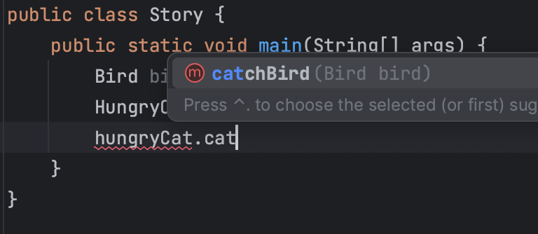
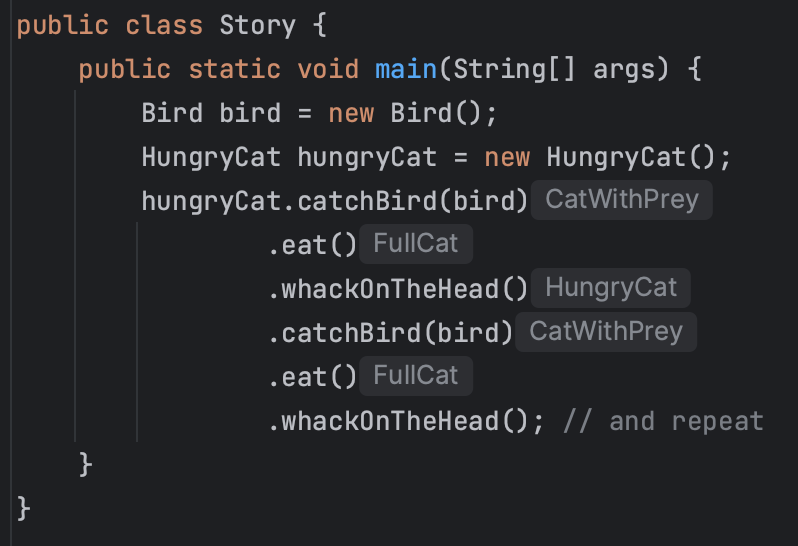

+++
title = 'Fluent APIs and Types'
date = "2023-09-05"
tags = [
    "software-design",
]
+++

*This article was originally published on [Linkedin](https://www.linkedin.com/pulse/fluent-apis-types-matteo-vaccari/ "Fluent APIs and Types")*


I'd like to borrow  [an example](https://www.slideshare.net/mariofusco/from-object-oriented-to-functional-domain-modeling)  from  [Mario Fusco](https://www.linkedin.com/in/mario-fusco-3467213/)  to illustrate how to take advantage of types to make programming safer and more fun. Consider this Java class:

```java
public class Cat {
    private Bird caughtBird;
    private boolean isFull = false;

    public Cat catchBird(Bird bird) {
        if (caughtBird != null) {
            throw new RuntimeException("Caught one bird already");
        }
        caughtBird = bird;
        return this;
    }

    public Cat eat() {
        if (caughtBird == null) {
            throw new RuntimeException("Must catch a bird first");
        }
        this.caughtBird = null;
        this.isFull = true;
        return this;
    }

    public static void main(String[] args) {
        Cat cat = new Cat();
        Bird bird = new Bird();
        cat.eat().catchBird(bird); // calls out of order; 
                                   // throws exception
    }
}
```

The class uses the `return this` trick to enable method call chaining. However, there is a temporal dependency between the methods in this class, and if I&nbsp;call them out of order, I&nbsp;will get an exception at runtime.  ***At runtime***, possibly throwing an exception in the face of a user!

The nice thing is that we can use  types  to prevent this error  at programming time. That&nbsp;is:

```java
class HungryCat {
    public CatWithPrey catchBird(Bird bird) {
        return new CatWithPrey(bird);
    }
}

class CatWithPrey {
    private Bird caughtBird;

    public CatWithPrey(Bird bird) {
        this.caughtBird = bird;
    }

    public FullCat eat() {
        return new FullCat();
    }
}

class FullCat {
    public HungryCat whackOnTheHead() {
        System.out.println("Whack! (Coughs up the bird)");
        return new HungryCat();
    }
}
```

Now if you start with a `HungryCat`, the only option you have is to call method `catchBird(...)`, and the IDE itself will guide you towards invoking the correct method:

<figure>
  
  <figcaption>Autocomplete to the rescue</figcaption>
</figure>

And this is how you do a fluent API: at every step, the IDE guides us to choose among the available methods, and the compiler prevents us to invoke methods out of order.

<figure>
  
  <figcaption>The IDE shows the types returned at every step</figcaption>
</figure>

The original example from Mario Fusco is just 2 slides out of  [this slideshare presentation](https://www.slideshare.net/mariofusco/from-object-oriented-to-functional-domain-modeling), that contains a lot of other good stuff.

