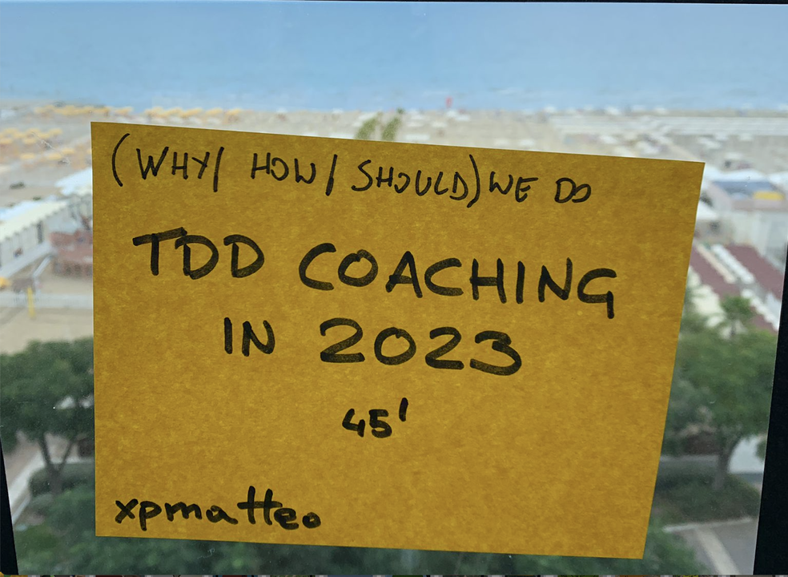

+++
title = 'TDD Coaching and Training in 2023'
date = "2023-09-15"
tags = [
    "TDD",
]
+++

*This article was originally published on [LinkedIn](https://www.linkedin.com/pulse/tdd-coaching-training-2023-matteo-vaccari/ "TDD Coaching and training in 2023")*

<figure>
  
  <figcaption>A "marketplace" post-it from the unconference</figcaption>
</figure>

During the awesome  [Avanscoperta](https://www.linkedin.com/company/avanscoperta-s-r-l-/)  retreat in Riccione I hosted a session on TDD training and coaching. Here's a recap.

Participants:  [Alessandro Di Gioia](https://www.linkedin.com/in/alessandro-di-gioia/)  [Cédric Pontet](https://www.linkedin.com/in/c%C3%A9dric-pontet/)  [Marco Consolaro](https://www.linkedin.com/in/marco-consolaro/)  [Gianluca Padovani](https://www.linkedin.com/in/gpad/)  Simone V.  [Emanuele DelBono](https://www.linkedin.com/in/emanueledb/)  [Alessandro Melchiori](https://www.linkedin.com/in/amelchiori/)

Thanks to all who participated; what follows is my own summary of contributions coming from the people above. Any factual errors below are mine. And Thank you to Avanscoperta for inviting me!

Question: how do you know your training succeeds?
-------------------------------------------------

-   Various meanings of "succeeds": 1. they learned the things we wanted them to learn; 2. there is a change in their behaviour at work 3. they deliver software faster, more reliably and safely
-   If you "train from the back of the room" you will assign tasks to the trainee, and then observe how they perform them session by session; you can then assess the improvement.
-   You can set the expectation that the trainee presents something of their choice at the end of the training track.   If you succeeded in creating a safe environment, they might choose to talk about one thing they feel they need to understand better.   One great option is for them to demo a live kata
-   Repetition of katas is a core technique. Repeat katas in different ways, and especially pairing with different people. Give the learners the homework of pairing with other learners, and expect them to come to the next session with  new questions
-   After training, assist the learners on real work problems. The coach does not touch the code directly: the key is to have the learners perform the work, with suggestions from the coach
-   Homework for refactoring: go and look at your codebase, and come back with the smells you found and that you're able to  name.  (Learn the names of smells)
-   As a trainer you can't give them "all" you want to pass. Focus on the core things you really want them to get and expect them to miss out a part of the rest. They might not be ready yet: they can pick it up at a later time.

Difference between training and coaching:
-----------------------------------------

-   The trainer has a set of learning goals; the coach follows the needs of the coachee
-   A sports coach is someone who is with you on Sunday during the game; a sports trainer is someone who is with you during the week and trains you to perform the moves correctly

There's a difference between internal and external coaching. An external coaching program might start with

-   Perform a team assessment by mob programming with them on some work problem
-   I ask them to show me their "best" and "worst" code, in their opinion
-   suggest one or two training topics to train

What is the syllabus for TDD training?
--------------------------------------

There is a big difference between TDD and "refactoring legacy code".  The latter uses different and sometimes opposite techniques!  This is why refactoring legacy code is an advanced technique. A recommended sequence of topics to master:

1.  TDD with katas
2.  Software Design principles and patterns
3.  Refactoring on tested code
4.  Refacroring code without tests (ie, legacy code)

More generally, there is a book that covers a comprehensive training program:  [Agile Technical Practices Distilled](https://leanpub.com/agiletechnicalpracticesdistilled)  is the result of "distilling" years of experience in training

The best trainer in Europe is probably  [Emily Bache](https://www.linkedin.com/in/emilybache); her book and method  [Samman Technical Coaching](https://sammancoaching.org/)  is highly recommended

TDD for the Front-End?
----------------------

One side question is "do you really TDD on the frontend"? Testing int the front-end is universally thought of as more difficult than testing in the back-end.

One school says that the key is to make testing the FE more similar to testing in the BE: apply the  [Humble Object](https://martinfowler.com/bliki/HumbleObject.html)  pattern, extract logic objects that do not depend on visible features.  See also the concept of sub-cutaneous testing, that was introduced by David Astels in his book  [Test-Driven Development: A Practical Guide](https://www.google.it/books/edition/Test_driven_Development/6awpwcRKpa4C)

Another school relies on visual testing with  [Playwright](https://playwright.dev/)  or Cypress;  [approval testing](https://www.youtube.com/watch?v=0ZVKcFsEp-4)  means you approve snapshots of the UI and then the system checks that those snapshots do not change

Other notable mention: Aslak Hellesøy's work on  [Sub-Second Acceptance Testing](https://www.youtube.com/watch?v=PE_1nh0DdbY)

Generally speaking, you want to have only a few very important end-to-end acceptance tests, and one of those is the  [walking skeleton](https://wiki.c2.com/?WalkingSkeleton), that is an early test that the technical components of the system are talking to each other.