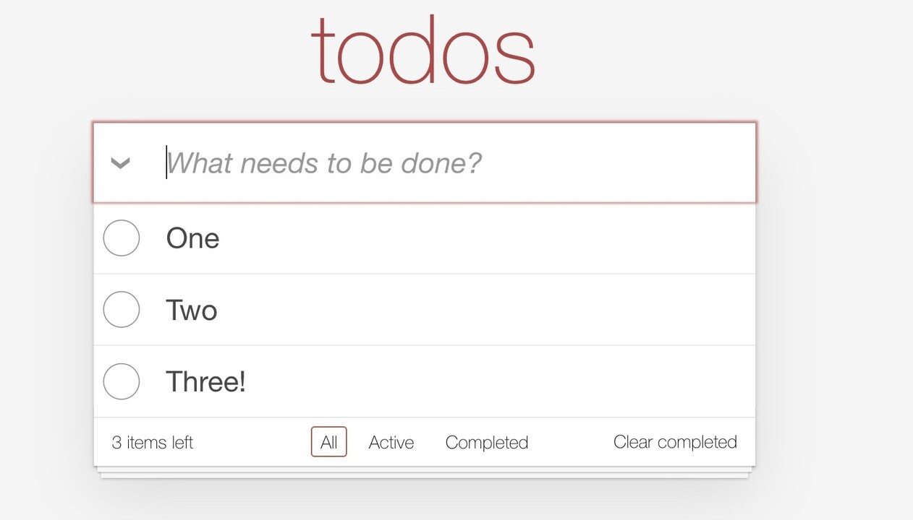

+++
title = 'A Convenient Alternative to SPA'
date = "2024-02-04"
tags = [
    "go",
    "webapp",
    "HTMX",
]
+++

*This article was originally published on [Linkedin](https://www.linkedin.com/pulse/convenient-alternative-spa-matteo-vaccari-97j5f "A convenient alternative to SPA")*

<figure>
  
  <figcaption>A sample screenshot of the TodoMVC application</figcaption>
</figure>

In 2022 the Thoughtworks Radar warned against adopting  [SPA By Default](https://www.thoughtworks.com/radar/techniques/spa-by-default),   meaning that building a JavaScript-based Single Page Application is not the only option, and should not even be the default choice.  In fact, SPAs are extremely expensive to write and maintain over time: the extreme cost comes from several factors, including:

-   the need to maintain two builds, one for the frontend and one for the backend;
-   in many cases the two parts use different programming languages and require then two different set of skills and people;
-   frontend technologies in particular are extremely fragmented, with tens of current popular frameworks, making it harder to find the right skillset, and making it more expensive not just for employers, but also for developers, who need to devote lots of time to stay current;
-   frontend technologies exhibit heavy churn; any technology chosen today is likely to be regarded as obsolete in a few years by the frontend community, increasing the cost of ownership of applications written only 2-3 years ago.

One testimonial of the fragmentation of JavaScript technologies is the  [TodoMVC](https://todomvc.com/)  project, that aims to compare tens of different implementations of the same sample app, using different JavaScript frameworks.

So what alternatives are there?

[Google defines Software Engineering as "Programming over time"](https://learning.oreilly.com/library/view/software-engineering-at/9781492082781/), meaning, Software Engineering is made of the techniques we use to ensure our software solutions keep meeting our needs and costs constraints over time.  One important ingredient is to use  stable technologies.  The core Web technologies such as HTML and CSS are in continuous evolution, but are at the same time remarkably stable; old HTML and CSS code keeps working well in today's browsers.

One primary alternative then is to rely on html, rendered by the backend; which is how most web applications were written until about 2010. An example of a popular application written in this style is  [Wikipedia](https://en.wikipedia.org/wiki/MediaWiki).  I'm not talking at all about the increasingly sophisticated and complicated approaches such as  [Qwik](https://github.com/BuilderIO/qwik); I'm talking about simply instantiating HTML templates and returning the resulting HTML from the backend; for instance  [Apache FreeMarker](https://freemarker.apache.org/index.html).

One primary drawback of this approach is that every user operation forces a complete reload of the page; and this can be fixed through libraries such as  [htmx](https://htmx.org/).

To explore this approach, I  [implemented the TodoMVC application using Go and htmx](https://github.com/xpmatteo/todomvc-golang). Why  [Go](https://go.dev/)?  Because it is a stable technology!  And because Go web apps generally do not require to learn a framework; you can write a complete app using just the standard Go library.

Why  [htmx](https://htmx.org/)? Initially I was interested in learning  [Turbo](https://turbo.hotwired.dev/handbook/introduction), a similar library written by  [DHH](https://dhh.dk/); but then I found that the documentation does not explain very well how to start, and then I suspect it's optimized for Ruby on Rails, which I don't want to use.

So, converting my TodoMVC app to htmx was surprisingly easy.  Please take a look!