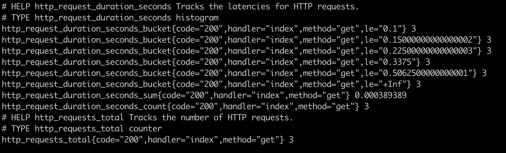

+++
title = 'Publish Metrics From a Go Web App'
date = "2024-02-09"
slug = "publish-metrics-from-a-go-web-app"
tags = [
    "go",
    "webapp",
    "observability",
]
+++

*This article was originally published on [Linkedin](https://www.linkedin.com/pulse/publish-metrics-from-go-web-app-matteo-vaccari-m2bbf/ "Publish metrics from a Go web app"); it was updated on 2024-02-25 to use go&nbsp;1.22 http routing style*

<figure>
  
  <figcaption>An extract of Prometheus metrics exposed by a web app</figcaption>
</figure>


I keep being delighted by how easy and fun it is to write web applications in Go. Today I&nbsp;wanted to learn how to instrument an application with Prometheus, and it turned out to be very easy, and most importantly, no magic! Everything I care about is opted-in explicitly  and  controlled through my code,  unlike popular Java frameworks, where 99% works out of the box and the remaining 1% requires me to experiment with configuration options, hoping to find the right ones!

In Go, your application is built explicitly by the application programmer in the main function, by declaring a set of http handlers. Http handlers have an interface similar to that of a Java servlet: it is passed two objects, one contains information about the request, and the other can be used to write the response.

This is how the main might initially look like:

```go
func main() {
    templ := template.Must(template.ParseFiles("templates/index.html"))
    http.Handle("GET /", web.IndexHandler(templ, model))
    http.Handle("POST /new-todo", web.NewItemHandler(templ, model))
    http.Handle("POST /toggle", web.ToggleHandler(templ, model))
    http.Handle("POST /edit", web.EditHandler(templ, model))
    http.Handle("POST /destroy", web.DestroyHandler(templ, model))

    http.Handle("GET /img/", http.StripPrefix("/img/", http.FileServer(http.Dir("./public/img"))))
    http.Handle("GET /css/", http.StripPrefix("/css/", http.FileServer(http.Dir("./public/css"))))
    http.Handle("GET /js/", http.StripPrefix("/js/", http.FileServer(http.Dir("./public/js"))))

    log.Println("Listening on port " + port)
    log.Fatal(http.ListenAndServe(":"+port, nil))
}
```

Here the various `web.SomethingHandler(...)` are my own code, in package "web".

We introduce Prometheus by adding a Prometheus handler, coming from the Prometheus Golang client library:

```go
func main() {
  //... above as before

  http.Handle("GET /metrics", promhttp.Handler())

  log.Println("Listening on port " + port)
  log.Fatal(http.ListenAndServe(":"+port, nil))
}
```

And this produces a page of metrics at `/metrics`, that already exposes a lot of useful metrics about the process and the OS. What it does  not  do, however, is expose metrics about each individual "route" of the application, which is of course very important to have.

<div align="center">
  *&nbsp;&nbsp;&nbsp;&nbsp;&nbsp;&nbsp;&nbsp;&nbsp;&nbsp;&nbsp;&nbsp;&nbsp;&nbsp;&nbsp;&nbsp;&nbsp;*<br>*
</div>

In Java web applications, logging, metrics and other cross-cutting concerns are implemented through web Filters, that are classes implementing a certain interface and executed by the framework at appropriate times during the http request cycle.

In a Go web app, instead, cross-cutting concerns are implemented by wrapping the handlers. These wrappers are called "middleware" in Go web app jargon. For instance, here is my middleware for logging a request:

```go
func Logging(h http.Handler) http.Handler {
    return http.HandlerFunc(func(w http.ResponseWriter, r *http.Request) {

        h.ServeHTTP(w, r)

        var body interface{}
        if len(r.Form) > 0 {
            body = r.Form
        } else {
            body = ""
        }
        log.Printf("%-4s %s %s", r.Method, r.URL.String(), body)
    })
}
```

It is a function that takes an http.Handler and returns a wrapped http.Handler (you can ignore the complicated stuff in the second line).

It turns out that handler-specific Prometheus metrics are implemented similarly, by means of a new middleware. The wrapper below is the result of less than one hour of work and it provides the basic functionality we need.

```go
func Metrics(handlerName string, handler http.Handler) http.Handler {
    // We label every metric we create here with the handlerName
    reg := prometheus.WrapRegistererWith(prometheus.Labels{"handler": handlerName}, prometheus.DefaultRegisterer)

    // Create counters for the number of times our handler was called
    totalOpts := prometheus.CounterOpts{
        Name: "http_requests_total",
        Help: "Tracks the number of HTTP requests.",
    }
    // We want a separate counter for each http method (get, post) and http status code (200, 400, etc.)
    labelNames := []string{"method", "code"}
    requestsTotal := promauto.With(reg).NewCounterVec(totalOpts, labelNames)

    // Create a "histogram" for the duration (ie latency) of our handler
    const bucketStart = 0.1
    const bucketFactor = 1.5
    const bucketsCount = 5
    durationOpts := prometheus.HistogramOpts{
        Name:    "http_request_duration_seconds",
        Help:    "Tracks the latencies for HTTP requests.",
        Buckets: prometheus.ExponentialBuckets(bucketStart, bucketFactor, bucketsCount),
    }
    requestDuration := promauto.With(reg).NewHistogramVec(durationOpts, []string{"method", "code"})

    // Wrap the original handler with a wrapper that updates the counters, and a wrapper that
    // updates the durations
    return promhttp.InstrumentHandlerCounter(requestsTotal,
        promhttp.InstrumentHandlerDuration(requestDuration, handler))
}
```

And this is how you use it in practice, together with other middlewares:

```go
http.Handle("/",
    web.Metrics("index",
        web.Logging(
            web.IndexHandler(templ, model)))))
```

This code is part of my [ongoing TodoMVC experiment](https://github.com/xpmatteo/todomvc-golang)  on how to rewrite the classic TodoMVC SPA benchmark with server-side html rendering.