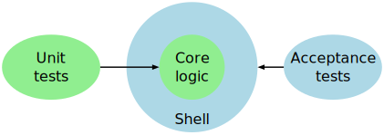

+++
title = 'One way to do acceptance tests in Go'
date = 2024-03-08
draft = false
tags = [
    "go",
    "TDD",
    "XP",
]
+++

<figure>
  
  <figcaption>
    A simple application architecture, and how to test it.<br>This diagram was produced with <em>pic</em>, a "little language" dedicated to producing diagrams (<a href="https://gist.github.com/xpmatteo/a01b705c5e33281034d044bda632c324">see the source</a>)
  </figcaption>
</figure>

> Give me six hours to chop down a tree,<br>and I will spend the first four sharpening the axe
> <br>— <cite>Attributed to Abraham Lincoln</cite>


[Acceptance tests](https://ronjeffries.com/xprog/what-is-extreme-programming/#customer "What is Extreme Programming?") are tests that prove that a feature works as intended.  Unlike *unit tests*, acceptance tests are always written in terms of what the business originally requested, and for this reason they are also known as *customer tests*.  They are one of the original [12 practices of Extreme Programming](https://ronjeffries.com/xprog/what-is-extreme-programming/ "What is Extreme Programming?").

<figure>
  
  <figcaption>The 12 practices of XP from Ron Jeffries' website; acceptance tests are called <em>customer tests</em> here</figcaption>
</figure>

I was watching [this excellent presentation by Russ Cox](https://research.swtch.com/testing "research!rsc: Go Testing By Example") about testing in Go, and I was struck by the emphasis on acceptance tests; though he does not call it this way.  He was presenting the tests for the "go" command, which is the command-line entry point for a number of Go utility commands.  For instance, you build a Go program with the command `go build`; you format a Go program with `go fmt`, you test a Go progam with `go test`, and so on.

The tests for the `go` program are written as text files, the simplest of which is

```text
! go asdf
stderr '^go asdf: unknown command'
```

The first line means that when you execute the command `go asdf`, wher `asdf` stands for any non-existent command name, the command should return a failure status code (the `!` means "expect this command to fail").  The second line means that we expect the message "go asdf: unknown command" to be printed in the *standard error* channel.

It's that simple!  Adding a new test just requires to write a new text file; as of go 1.22, there are 806 of them.  Another example:

```text
! go list a.go
! stdout .
stderr 'invalid import path'
! stderr panic

-- a.go --
package a

import ""
```

Here the bottom part after `-- a.go --` means "create a file with name `a.go` with the following contents."  You can guess what the rest means.

It is a very powerful way to create tests; however, it requires a certain amount of work for interpreting the text files.  In general, Russ Cox encourages us to create small domain-specific languages for testing our things.  As with many things in Go, this suggestion is very much in the tradition of the Unix world: it reminds me of the old article by Jon Bentley about [little languages](https://dl.acm.org/doi/10.1145/6424.315691), that I read so long ago and got me hooked on the [pic diagramming language](https://dl.acm.org/doi/10.1145/872730.806459 "PIC—a language for typesetting graphics | ACM SIGPLAN Notices") (but this is another story).

<div align="center"> *&nbsp;&nbsp;&nbsp;&nbsp;&nbsp;&nbsp;&nbsp;&nbsp;&nbsp;&nbsp;&nbsp;&nbsp;&nbsp;&nbsp;&nbsp;&nbsp;*<br>*
</div>

Now the other day I was working on the first exercise in the excellent [Gophercises](https://gophercises.com/ "Gophercises - Coding exercises for budding gophers") course by [Jon Calhoun](https://www.calhoun.io/ "Calhoun.io - Go for Everyone"). It's about creating a little console interactive quiz application, and I thought, why not test it in the same way?  So I started looking at https://pkg.go.dev/rsc.io/script, which is an open-source extraction of the script-interpretation language for the `go` command; but it turned out to be too difficult to adapt to my needs, at least for me at this time.  

I would have liked something like

```text
What is 3+4? 
> 7
Correct!
What is 2-1? 
> 2
Wrong!
Your score is 50% (1/2)
```

where the lines starting with `> ` are user input, and other lines are output from the program; but I could not see how to do it with `rsc.io/script`.

So I asked myself, what's the next simplest thing I could do?  The obvious way to test a console program is through a Bash script.  After a few iterations, I came up with something like this:

```bash {linenos=true}
go build -o quiz || exit 1
printf "7\n2\n" | ./quiz -q testdata/two-questions.csv > /tmp/actual.txt

expected=\
'What is 3+4? Correct!
What is 2-1? Wrong!
Your score is 50% (1/2)'

diff <(echo "$expected") /tmp/actual.txt
```
In line 1, we build the program and terminate with error if the build fails.

In line 2, the `printf` command sends all the answers to the program under test, which will read them one at a time and produce output that is captured in file `/tmp/output.txt`.  

Then in line 9 we compare what we got to expected output, thanks to the `diff` utility.  If `diff` finds no difference, it will print nothing and the script will return a success status code.  If `diff` finds a difference, it return a failure status code, and will print explicative output such as 

```text {linenos=true}
1c1
< What is 3+4? Correct!
---
> What is 3+4? OK
```
The above means: "I expected the text at line 2, but got the text at line 4".

The funky `<(echo "$expected")` syntax means "save the contents of the `$expected` variable to a temporary file and return its name"; it is a quick way to transform pass the contents of a Bash variable to a utility that expects a filename.

This style of testing is much less declarative, but it is still quite effective; it's not as readable as I'd like, but it serves the purpose of proving that the feature works.  For example, here is how we test another feature: "if the user takes too much time answering, the application terminates with a 'timeout' message"

```bash {linenos=true}
go build -o quiz || exit 1
sleep 5 | ./quiz -t 1 -q testdata/two-questions.csv > /tmp/actual.txt

expected=\
'What is 3+4? Timeout!
Your score is 0% (0/2)'

diff <(echo "$expected") /tmp/actual.txt
```

Here in line 2 we add a `-t 1` flag, that is supposed to tell our program to "set timeout to one second".  The `sleep 5 |` simulates a user that does nothing; the input simply blocks for 5 seconds.

If our program works correctly, it should exit after one second with a "Timeout!" message, and print the score accordingly.  Since my implementation does not yet implement this feature, the test fails after 5 seconds with this error message:

```text
1,2c1,6
< What is 3+4? Timeout!
< Your score is 0% (0/2)
---
> What is 3+4? panic: EOF
>
> goroutine 1 [running]:
> main.main()
>   /Users/matteo/..../2024-03-05-gophesercises-quiz/quiz.go:83 +0x24e
> exit status 2
```

and this proves that the acceptance test is doing its job!

<div align="center"> *&nbsp;&nbsp;&nbsp;&nbsp;&nbsp;&nbsp;&nbsp;&nbsp;&nbsp;&nbsp;&nbsp;&nbsp;&nbsp;&nbsp;&nbsp;&nbsp;*<br>*
</div>

The one thing that is left is to connect the acceptance tests to the standard Go test mechanism, so that they will run, together with all the other tests, when we execute <code>go&nbsp;test</code>.  It turns out to be quite easy:

```go {linenos=true}
func TestAll(t *testing.T) {
  matches, err := filepath.Glob("testdata/*.sh")
  if err != nil {
    panic(err)
  }
  for _, match := range matches {
    t.Run(match, func(t *testing.T) {
      cmd := exec.Command("bash", match)
      output := new(bytes.Buffer)
      cmd.Stdout = output
      cmd.Stderr = output
      err := cmd.Run()
      if err != nil {
        t.Errorf("%s\n%s", err, string(output.Bytes()))
      }
    })
  }
}
```

At line 2, we scan the `testdata` directory for all the files matching `*.sh`.  Then, for each of these files, we run it as a separate test, named with the name of the file (line 7).

In each test, we execute the Bash file (lines 8-12).  At lines 9-11, we collect the standard output and error from the process in a buffer.

If the test fails, it will return an error status code, which will become a non-nil `err` returned by `cmd.Run()`.  In this case, we use the contents of the byte buffer to create an explicative error message.  For instance, if I now run the <code>go&nbsp;test</code> command, I get:

```text
$ go test
--- FAIL: TestAll (6.16s)
    --- FAIL: TestAll/testdata/timeout.sh (5.22s)
        acceptance_test.go:26: exit status 1
            1,2c1,5
            < What is 3+4? Timeout!
            < Your score is 0% (0/2)
            ---
            > What is 3+4? panic: EOF
            >
            > goroutine 1 [running]:
            > main.main()
            > 	/Users/matteo/..../2024-03-05-gophesercises-quiz/quiz.go:83 +0x24e
FAIL
exit status 1
FAIL	github.com/xpmatteo/gophesercises-quiz	6.518s
```

<div align="center"> *&nbsp;&nbsp;&nbsp;&nbsp;&nbsp;&nbsp;&nbsp;&nbsp;&nbsp;&nbsp;&nbsp;&nbsp;&nbsp;&nbsp;&nbsp;&nbsp;*<br>*
</div>

Why are these acceptance tests important?  I see several reasons.  

One is that they clarify what is the end goal of a user story: they push me to define the final expected behaviour.

Another reason is that they bridge the gap from the unit tests to the "outer shell" of the application.  You see, unit tests are great for developing the core business logic of the app.  In this core, I don't have I/O and i don't have timeouts.  The business logic is simply an object that has the following methods:

```go
Start() (prompt string)
Answer(ans string) (response string, more bool)
Timeout() (response string)
```

The outer shell calls `Start()` when the application starts, calls `Answer()` when there is input from the user, and calls `Timeout()` when time is up.  The outer shell deals with all the messy real-world things.  So while the core business logic is pure Platonic logic, very easy to test, the outer shell is very hard to test with conventional unit tests.  This is where these acceptance tests shine: they treat the whole application as a black box, and check that the outer shell and the core logic together behave the way they should.


My conclusions? 

1. Bash test script make viable acceptance tests for console applications
2. It's easy to collect these scripts and run them with the standard Go test library
3. It's good to write at least one acceptance tests before starting to TDD
4. It is worth investing the time to get the acceptance tests right

Keep on testing!

