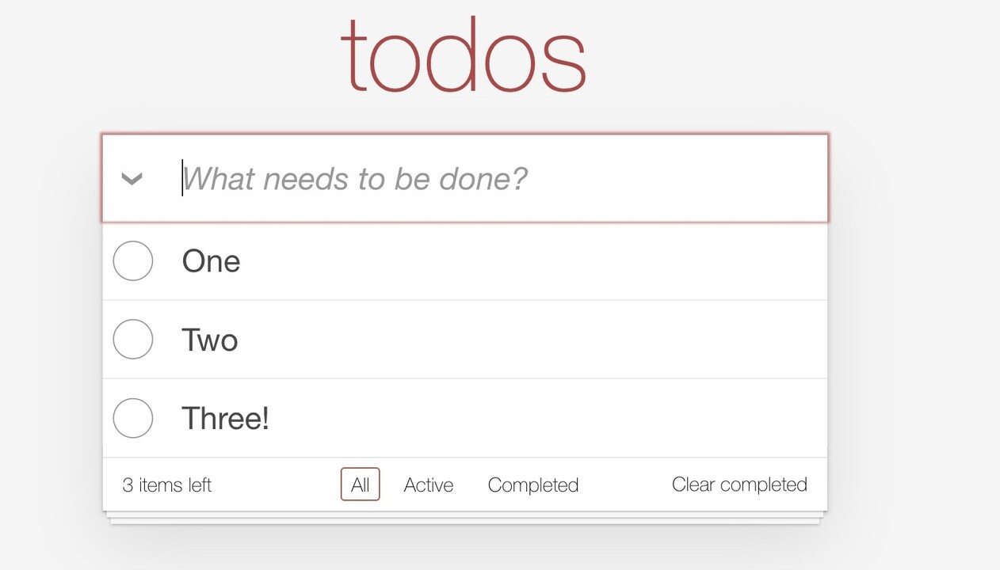

+++
title = 'Test-Driving HTML Templates in Go'
slug = 'test-driving-html-templates-in-go'
date = "2024-03-11"
tags = [
    "Go",
    "Webapp",
    "TDD",
]
draft = false
+++

<figure>
  
  <figcaption>A sample screenshot of the TodoMVC application</figcaption>
</figure>

Why test-drive HTML templates?  After all, the most reliable way to check that a template works is by rendering it to HTML and opening it in a browser, right?

There's some truth in this; unit tests cannot prove that a template looks the way we expect, and testing them by hand is necessary.  And if we make a mistake in the logic of a template, **usually** the template breaks immediately, so it's difficult not to notice the error.

On the other hand:

* Relying on manual tests only is risky; what if we make a change that breaks a template, and we don't test it because we did not think it would impact the template?  We would get a runtime error! 
* Templates often contain logic.  There usually are if-then-else's, and when iterating over an array of items, we usually want to present something different when there are no items to display. Testing both cases, for all of these bits of logic, becomes unsustainable very quickly
* There are errors that are not visible in the browser.  Browsers are extremely tolerant of inconsistencies in HTML, relying on heuristics to fix our broken HTML, but then we might get different results in different browsers.  It's good to check that the HTML structures we are building in our templates correspond to what we think.

It turns out that test-driving HTML templates is easy; let's see how to do it in Go.  I will be using the [TodoMVC template](https://github.com/tastejs/todomvc-app-template "GitHub - tastejs/todomvc-app-template: Template used for creating TodoMVC apps"), which is a sample application that is used to showcase JavaScript frameworks.

<div align="center"> *&nbsp;&nbsp;&nbsp;&nbsp;&nbsp;&nbsp;&nbsp;&nbsp;&nbsp;&nbsp;&nbsp;&nbsp;&nbsp;&nbsp;&nbsp;&nbsp;*<br>*
</div>


The number one thing I want to check is that the HTML we produce is basically sound. I don't mean to check that HTML is valid according to the W3C; not because I think it is not valuable, but because I think it's better to start with much simpler and fast checks.  For instance, I want my tests to break if the template generates something like

```html
<div>foo</p>
```

Let's see how to do it in stages: we start with the following test that tries to compile the template. 

```go
func Test_wellFormedHtml(t *testing.T) {
  templ := template.Must(template.ParseFiles("index.gotmpl"))
  _ = templ
}
```
If we run this test, it will fail, complaining that the `index.gotmpl` does not exist. So we create it, containing the above broken HTML.  Now the test should pass.

Then we create a *model* for the template to use.  I have one from my previous work on TodoMVC, so I will use it here.

```go
func Test_wellFormedHtml(t *testing.T) {
  templ := template.Must(template.ParseFiles("index.gotmpl"))
  model := todo.NewList()
  _ = templ
  _ = model
}
```
Then we render the template, saving the results in a bytes buffer.
```go
func Test_wellFormedHtml(t *testing.T) {
  templ := template.Must(template.ParseFiles("index.gotmpl"))
  model := todo.NewList()
  var buf bytes.Buffer
  err := templ.Execute(&buf, model)
  if err != nil {
    panic(err)
  }
}
```
At this point, we want to *parse* the HTML and we expect to see an error, because in our broken HTML there is a `div` element that is closed by a `p` element.  There is an HTML parser in the Go standard library, 
```go
func Test_wellFormedHtml(t *testing.T) {
  // as above
  _, err = html.Parse(bytes.NewReader(buf.Bytes()))
  if err != nil {
    t.Errorf("Broken HTML: %s", err)
  }  
}
```
but it is too lenient: if we run it on our broken HTML, we don't get an error. Luckily, the standard library also has an XML parser that can be configured to parse HTML (thanks to [this Stackoverflow answer](https://stackoverflow.com/a/52410528/164802 "HTML Validation with Golang - Stack Overflow"))
```go
func Test_wellFormedHtml(t *testing.T) {
  templ := template.Must(template.ParseFiles("index.gotmpl"))
  model := todo.NewList()
  
  // render the template into a buffer
  var buf bytes.Buffer
  err := templ.Execute(&buf, model)
  if err != nil {
    panic(err)
  }

  // check that the template can be parsed as (lenient) XML
  decoder := xml.NewDecoder(bytes.NewReader(buf.Bytes()))
  decoder.Strict = false
  decoder.AutoClose = xml.HTMLAutoClose
  decoder.Entity = xml.HTMLEntity
  for {
    _, err := decoder.Token()
    switch err {
    case io.EOF:
      return // We're done, it's valid!
    case nil:
      // do nothing
    default:
      t.Fatalf("Error parsing html: %s", err)
    }
  }
}
```
This code configures the HTML parser to have the right level of leniency for HTML, and then parses the HTML token by token.  Indeed, we see the error message we wanted:
```text
--- FAIL: Test_wellFormedHtml (0.00s)
    index_template_test.go:61: Error parsing html: XML syntax error on line 4: unexpected end element </p>
```
Success! Now if we copy over [the contents of the TodoMVC template](https://github.com/tastejs/todomvc-app-template/blob/main/index.html "Template • TodoMVC") to our `index.gotmpl` file, the test passes.

The test, however, is very verbose; we extract two helper functions, in order to make the intention of the test clearer, and we get

```go
func Test_wellFormedHtml(t *testing.T) {
  templ := template.Must(template.ParseFiles("index.gotmpl"))
  model := todo.NewList()
  
  buf := renderTemplate(templ, model)
  
  assertWellFormedHTML(t, buf)
}
```

<div align="center"> *&nbsp;&nbsp;&nbsp;&nbsp;&nbsp;&nbsp;&nbsp;&nbsp;&nbsp;&nbsp;&nbsp;&nbsp;&nbsp;&nbsp;&nbsp;&nbsp;*<br>*
</div>

The next step is to prove that when I pass a non-empty todo list, the items are rendered correcly in the template.  The TodoMVC template I downloaded currently returns two pre-populated elements (slightly simplified here):
```html
...
<ul class="todo-list">
  <!-- These are here just to show the structure of the list items -->
  <!-- List items should get the class `completed` when marked as completed -->
  <li class="completed">
    <div class="view">
      <input class="toggle" type="checkbox" checked>
      <label>Taste JavaScript</label>
      <button class="destroy"></button>
    </div>
  </li>
  <li>
    <div class="view">
      <input class="toggle" type="checkbox">
      <label>Buy a unicorn</label>
      <button class="destroy"></button>
    </div>
  </li>
</ul>
...
```

How do we assert on the content of our generated HTML?  Testing for string equality makes no sense; the size of the HTML text is too much, and there's a lot of details in there that we don't really want to test.  We'd like to make assertions on the structure of the html, ignoring most of the details: we'd like our test to look like this:

```go
func Test_todoItemsAreShown(t *testing.T) {
  templ := template.Must(template.ParseFiles("index.gotmpl"))
  model := todo.NewList()
  model.Add("Foo")
  model.Add("Bar")

  buf := renderTemplate(templ, model)

  // assert there are two <li> elements inside the <ul class="todo-list"> 
  // assert the first <li> text is "Foo"
  // assert the second <li> text is "Bar"
}
```
How do we implement these assertions?  One good way would be to use CSS selectors: in CSS, you can express "all the `li` elements inside an `ul` element that has class X" with `ul.X li`.  Now all we need is a good library that understands CSS selectors, and luckily there is the [goquery](https://github.com/PuerkitoBio/goquery "GitHub - PuerkitoBio/goquery: A little like that j-thing, only in Go.") package, that implements an API inspired by jQuery.  Our test with goquery becomes:
```go
func Test_todoItemsAreShown(t *testing.T) {
  templ := template.Must(template.ParseFiles("index.gotmpl"))
  model := todo.NewList()
  model.Add("Foo")
  model.Add("Bar")

  buf := renderTemplate(templ, model)

  document, err := goquery.NewDocumentFromReader(bytes.NewReader(buf.Bytes()))
  if err != nil {
    t.Fatalf("Error rendering template %s", err)
  }
  selection := document.Find("ul.todo-list li.completed")
  if selection.Length() != 2 {
    t.Fatalf("Expected 2 list items, found: %d", selection.Length())
  }
}
```
We still haven't changed the template to populate the list from the model, yet, unfortunatly, this test passes, because the static HTML indeed contains two list items.  To make it fail, we need to add an assertion on the *content* of the list items:
```go
func Test_todoItemsAreShown(t *testing.T) {
  // ... as before
  
  document, err := goquery.NewDocumentFromReader(bytes.NewReader(buf.Bytes()))
  if err != nil {
    t.Fatalf("Error rendering template %s", err)
  }
  firstItem := document.Find("ul.todo-list li:nth-of-type(1)")
  want, got := "Foo", strings.TrimSpace(firstItem.Text())
  if want != got {
    t.Errorf("First list item: want %s, got %s", want, got)
  }
  secondItem := document.Find("ul.todo-list li:nth-of-type(2)")
  want, got = "Bar", strings.TrimSpace(secondItem.Text())
  if want != got {
    t.Errorf("Second list item: want %s, got %s", want, got)
  }
}
```
Now indeed our test fails, and fails for the right reason:
```text
--- FAIL: Test_todoItemsAreShown (0.00s)
    index_template_test.go:44: First list item: want Foo, got Taste JavaScript
    index_template_test.go:49: Second list item: want Bar, got Buy a unicorn
```
We fix it by making the template use the model data:
```html
<ul class="todo-list">
  <!-- List items should get the class `completed` when marked as completed -->
  {{ range .Items }}
    <li {{ if .IsCompleted }} class="completed" {{ end }}>
      <div class="view">
        <input class="toggle" type="checkbox">
        <label>{{ .Title }}</label>
        <button class="destroy"></button>
      </div>
      <input class="edit" value="Rule the web">
    </li>
  {{ end }}
</ul>
```
Our test works, but it's very verbose.  If we're going to have more tests for variations of the input data, these tests will become difficult to read, so we make it more concise by extracting one helper function, and by using the [assert](https://github.com/stretchr/testify "GitHub - stretchr/testify: A toolkit with common assertions and mocks that plays nicely with the standard library") package
```go {hl_lines=["9-12"]}
func Test_todoItemsAreShown(t *testing.T) {
  templ := template.Must(template.ParseFiles("index.gotmpl"))
  model := todo.NewList()
  model.Add("Foo")
  model.Add("Bar")

  buf := renderTemplate(templ, model)

  document := parseHtml(t, buf)
  assert.Equal(t, 2, document.Find("ul.todo-list li").Length())
  assert.Equal(t, "Foo", strings.TrimSpace(document.Find("ul.todo-list li:nth-of-type(1)").Text()))
  assert.Equal(t, "Bar", strings.TrimSpace(document.Find("ul.todo-list li:nth-of-type(2)").Text()))
}
```
Much better! At least in my opinion. Now we are in a good position for testing more rendering logic.  A comment inside the template says "List items should get the class `completed` when marked as completed".  We can write a test for this:

```go {hl_lines=[5,10]}
func Test_completedItemsGetCompletedClass(t *testing.T) {
  templ := template.Must(template.ParseFiles("index.gotmpl"))
  model := todo.NewList()
  model.Add("Foo")
  model.AddCompleted("Bar")

  buf := renderTemplate(templ, model)

  document := parseHtml(t, buf)
  selection := document.Find("ul.todo-list li.completed")
  assert.Equal(t, 1, selection.Length())
  assert.Equal(t, "Bar", strings.TrimSpace(selection.Text()))
}
```
So little by little, we can test and add the various dynamic features that our template should have.

This article is part of a series on an exercise in implementing the TodoMVC application in Go; see here [the code](https://github.com/xpmatteo/todomvc-golang "GitHub - xpmatteo/todomvc-golang: A Golang implementation of the TodoMVC standard app"), and the [first article in the series](http://localhost:1313/posts/2024-02-04-a-convenient-alternative-to-spa/ "A Convenient Alternative to SPA | Matteo Vaccari")

*Want to leave a comment? Please do so on Linkedin!*
