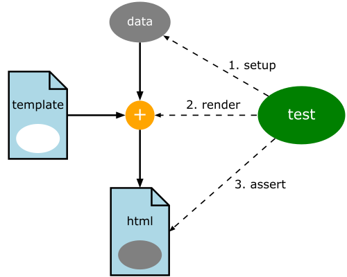
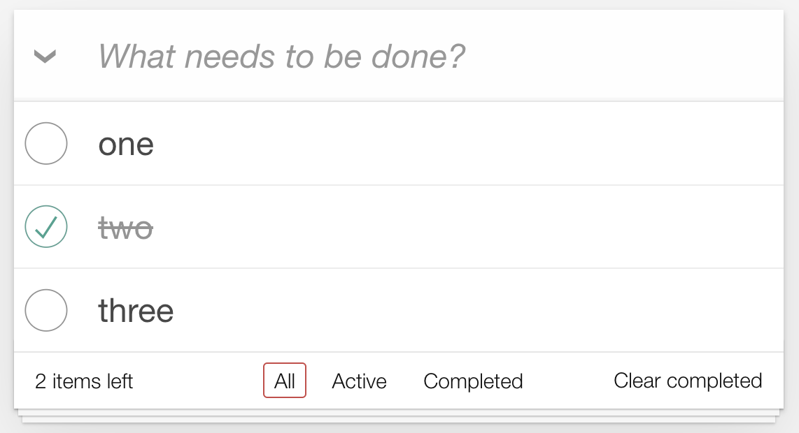

+++
title = 'Test-Driving HTML Templates, revised'
slug = 'test-driving-html-templates-revised'
date = "2024-03-20"
tags = [
    "Go",
    "Webapp",
    "TDD",
]
toc = true
draft = true
+++

<figure>
  
  <figcaption>
    Testing a template. 
    Image produced with the <em>pic</em> language (<a href="test.pic">source</a>,
    <a href="Makefile">Makefile</a>)
  </figcaption>
</figure>

## Why?

Why test-drive HTML templates?  After all, the most reliable way to check that a template works is to render it to HTML and open it in a browser, right?

There's some truth in this; unit tests cannot prove that a template looks the way we expect, and testing them by hand is necessary.  And if we make a mistake in the logic of a template, **usually** the template breaks immediately, so it's difficult not to notice the error.

On the other hand:

* Relying on manual tests only is risky; what if we make a change that breaks a template, and we don't test it because we did not think it would impact the template?  We would get a runtime error! 
* Templates often contain logic.  There usually are if-then-else's, and when iterating over an array of items, we usually want to present something different when there are no items to display. Testing both cases, for all of these bits of logic, becomes unsustainable very quickly
* There are errors that are not visible in the browser.  Browsers are extremely tolerant of inconsistencies in HTML, relying on heuristics to fix our broken HTML, but then we might get different results in different browsers.  It's good to check that the HTML structures we are building in our templates correspond to what we think.

It turns out that test-driving HTML templates is easy; let's see how to do it in Go.  I will be using the [TodoMVC template](https://github.com/tastejs/todomvc-app-template "GitHub - tastejs/todomvc-app-template: Template used for creating TodoMVC apps"), which is a sample application that is used to showcase JavaScript frameworks.

The examples will use the Go programming language, but the techniques can be applied to any language.


## Checking for sound HTML


The number one thing I want to check is that the HTML we produce is basically sound. I don't mean to check that HTML is valid according to the W3C; not because I think it is not valuable, but because I think it's better to start with much simpler and fast checks.  For instance, I want my tests to break if the template generates something like

```html
<div>foo</p>
```

Let's see how to do it in stages: we start with the following test that tries to compile the template. 

```go
func Test_wellFormedHtml(t *testing.T) {
  templ := template.Must(template.ParseFiles("index.gotmpl"))
  _ = templ
}
```
If we run this test, it will fail, complaining that the `index.gotmpl` does not exist. So we create it, containing the above broken HTML.  Now the test should pass.

Then we create a *model* for the template to use.  I have one from my previous work on TodoMVC, so I will use it here.

```go
func Test_wellFormedHtml(t *testing.T) {
  templ := template.Must(template.ParseFiles("index.gotmpl"))
  model := todo.NewList()
  _ = templ
  _ = model
}
```
Then we render the template, saving the results in a bytes buffer.
```go
func Test_wellFormedHtml(t *testing.T) {
  templ := template.Must(template.ParseFiles("index.gotmpl"))
  model := todo.NewList()
  var buf bytes.Buffer
  err := templ.Execute(&buf, model)
  if err != nil {
    panic(err)
  }
}
```
At this point, we want to *parse* the HTML and we expect to see an error, because in our broken HTML there is a `div` element that is closed by a `p` element.  There is an HTML parser in the Go standard library, 
```go
func Test_wellFormedHtml(t *testing.T) {
  // as above
  _, err = html.Parse(bytes.NewReader(buf.Bytes()))
  if err != nil {
    t.Errorf("Broken HTML: %s", err)
  }  
}
```
but it is too lenient: if we run it on our broken HTML, we don't get an error. Luckily, the standard library also has an XML parser that can be configured to parse HTML (thanks to [this Stackoverflow answer](https://stackoverflow.com/a/52410528/164802 "HTML Validation with Golang - Stack Overflow"))
```go
func Test_wellFormedHtml(t *testing.T) {
  templ := template.Must(template.ParseFiles("index.gotmpl"))
  model := todo.NewList()
  
  // render the template into a buffer
  var buf bytes.Buffer
  err := templ.Execute(&buf, model)
  if err != nil {
    panic(err)
  }

  // check that the template can be parsed as (lenient) XML
  decoder := xml.NewDecoder(bytes.NewReader(buf.Bytes()))
  decoder.Strict = false
  decoder.AutoClose = xml.HTMLAutoClose
  decoder.Entity = xml.HTMLEntity
  for {
    _, err := decoder.Token()
    switch err {
    case io.EOF:
      return // We're done, it's valid!
    case nil:
      // do nothing
    default:
      t.Fatalf("Error parsing html: %s", err)
    }
  }
}
```
This code configures the HTML parser to have the right level of leniency for HTML, and then parses the HTML token by token.  Indeed, we see the error message we wanted:
```text
--- FAIL: Test_wellFormedHtml (0.00s)
    index_template_test.go:61: Error parsing html: XML syntax error on line 4: unexpected end element </p>
```
Success! Now if we copy over [the contents of the TodoMVC template](https://github.com/tastejs/todomvc-app-template/blob/main/index.html "Template • TodoMVC") to our `index.gotmpl` file, the test passes.

The test, however, is very verbose; we extract two helper functions, in order to make the intention of the test clearer, and we get

```go
func Test_wellFormedHtml(t *testing.T) {
  model := todo.NewList()
  
  buf := renderTemplate(model)
  
  assertWellFormedHTML(t, buf)
}
```

## What else should we test?

We know that the looks of a page can only be tested, ultimately, by a human looking at how it is rendered in a browser.  However, there often is logic in templates, and we want to be able to test that logic.

One might be tempted to test the rendered HTML with string equality, but this technique fails in practice, because templates contain a lot of details that make string equality assertions impractical.  The assertions become very verbose, and when reading the assertion, it becomes difficult to understand what it is that we're trying to prove.

What we need is a technique to assert that *some parts* of the rendered HTML correspond to what we expect, and to *ignore all the details we don't care about.*  One way to do this is by running queries with the [CSS selector language](https://developer.mozilla.org/en-US/docs/Web/CSS/CSS_selectors "CSS selectors - CSS: Cascading Style Sheets | MDN"): it is a powerful language that allows us to select the elements that we care about from the whole HTML document.  Once we have selected those elements, we (1)&nbsp;count that the number of element returned is what we expect, and (2)&nbsp;that they contain the text or other content that we expect.

The UI that we are supposed to generate looks like this:



There are several details that are rendered dynamically:

1. The number of items and their text content change, obviously
2. The style of the todo-item changes when it's completed (e.g., the second)
3. The "2 items left" text will change with the number of non-completed items
4. The "Clear completed" button should only be visible if any item is completed 
5. One of the three buttons "All", "Active", "Completed" will be highlighted, depending on the current url; for instance if we decide that the url that shows only the "Active" items is `/active`, then when the current url is `/active`, the "Active" button should be surrounded by a thin red rectangle

Each of this concerns can be tested with the help of CSS selectors.

This is a snippet from the TodoMVC template (slightly simplified).  I have not yet added the dynamic bits, so what we see here is static content, provided as an example:
```html
<ul class="todo-list">
  <!-- These are here just to show the structure of the list items -->
  <!-- List items should get the class `completed` when marked as completed -->
  <li class="completed">
    <div class="view">
      <input class="toggle" type="checkbox" checked>
      <label>Taste JavaScript</label>
      <button class="destroy"></button>
    </div>
  </li>
  <li>
    <div class="view">
      <input class="toggle" type="checkbox">
      <label>Buy a unicorn</label>
      <button class="destroy"></button>
    </div>
  </li>
</ul>
<footer class="footer">
  <!-- This should be `0 items left` by default -->
  <span class="todo-count"><strong>0</strong> item left</span>
  <ul class="filters">
    <li>
      <a class="selected" href="#/">All</a>
    </li>
    <li>
      <a href="#/active">Active</a>
    </li>
    <li>
      <a href="#/completed">Completed</a>
    </li>
  </ul>
  <!-- Hidden if no completed items are left ↓ -->
  <button class="clear-completed">Clear completed</button>
</footer>
```

By looking at the static version of the template, we can deduce which CSS selector can be used to identify the relevant elements for the 5 dynamic features listed above:

| feature | css selector |
| - | - |
| All the items | `ul.todo-list li` |
| Completed items| `ul.todo-list li.completed`
| Items left| `span.todo-count`
| Highlighted navigation link| `ul.filters a.selected`


And so on.

## Writing the test in Go


The first test will look for **all the items**, and prove that the data set up by the test is rendered correctly.

```go
func Test_todoItemsAreShown(t *testing.T) {
  model := todo.NewList()
  model.Add("Foo")
  model.Add("Bar")

  buf := renderTemplate(model)

  // assert there are two <li> elements inside the <ul class="todo-list"> 
  // assert the first <li> text is "Foo"
  // assert the second <li> text is "Bar"
}
```

We need a way to query the HTML document with our CSS selector; a good library for this is [goquery](https://github.com/PuerkitoBio/goquery "GitHub - PuerkitoBio/goquery: A little like that j-thing, only in Go."), that implements an API inspired by jQuery.  Our test with goquery becomes:

```go {linenos=true}
func Test_todoItemsAreShown(t *testing.T) {
  model := todo.NewList()
  model.Add("Foo")
  model.Add("Bar")

  buf := renderTemplate(model)

  // parse the HTML with goquery
  document, err := goquery.NewDocumentFromReader(bytes.NewReader(buf.Bytes()))
  if err != nil {
    // if parsing fails, we stop the test here with t.FatalF
    t.Fatalf("Error rendering template %s", err)
  }
  
  // assert there are two <li> elements inside the <ul class="todo-list"> 
  selection := document.Find("ul.todo-list li.completed")
  if selection.Length() != 2 {
    // if we are not finding exactly 2 todo items, we stop the test here
    t.Fatalf("Expected 2 list items, found: %d", selection.Length())
  }
  
  // assert the first <li> text is "Foo"
  firstItem := document.Find("ul.todo-list li:nth-of-type(1)")
  want, got := "Foo", strings.TrimSpace(firstItem.Text())
  if want != got {
    t.Errorf("First list item: want %s, got %s", want, got)
  }
  
  // assert the second <li> text is "Bar"
  secondItem := document.Find("ul.todo-list li:nth-of-type(2)")
  want, got = "Bar", strings.TrimSpace(secondItem.Text())
  if want != got {
    t.Errorf("Second list item: want %s, got %s", want, got)
  }
}
```
If we still haven't changed the template to populate the list from the model, this test will fail at lines 26 and 33, because the static template todo items have different text:
```text
--- FAIL: Test_todoItemsAreShown (0.00s)
    index_template_test.go:44: First list item: want Foo, got Taste JavaScript
    index_template_test.go:49: Second list item: want Bar, got Buy a unicorn
```
We fix it by making the template use the model data:
```html {hl_lines=[3,7,12]}
<ul class="todo-list">
  <!-- List items should get the class `completed` when marked as completed -->
  {{ range .Items }}
    <li>
      <div class="view">
        <input class="toggle" type="checkbox">
        <label>{{ .Title }}</label>
        <button class="destroy"></button>
      </div>
      <input class="edit" value="Rule the web">
    </li>
  {{ end }}
</ul>
```
Our test works, but it's very verbose.  If we're going to have more tests for variations of the input data, these tests will become difficult to read, so we make it more concise by extracting helper functions, and by using the [assert](https://github.com/stretchr/testify "GitHub - stretchr/testify: A toolkit with common assertions and mocks that plays nicely with the standard library") package
```go {hl_lines=["8-11"]}
func Test_todoItemsAreShown(t *testing.T) {
  model := todo.NewList()
  model.Add("Foo")
  model.Add("Bar")

  buf := renderTemplate(model)

  document := parseHtml(t, buf)
  assert.Equal(t, 2, countOf(document, "ul.todo-list li"))
  assert.Equal(t, "Foo", textOf(document, "ul.todo-list li:nth-of-type(1)")))
  assert.Equal(t, "Bar", textOf(document, "ul.todo-list li:nth-of-type(2)")))
}
```
Much better! At least in my opinion.
Now we are in a good position for testing more rendering logic.  The second dynamic feature in our list is "List items should get the class `completed` when marked as completed".  We can write a test for this:
```go {hl_lines=[4,"9-10"]}
func Test_completedItemsGetCompletedClass(t *testing.T) {
  model := todo.NewList()
  model.Add("Foo")
  model.AddCompleted("Bar")

  buf := renderTemplate(model)

  document := parseHtml(t, buf)
  assert.Equal(t, 1, countOf(document, "ul.todo-list li.completed"))
  assert.Equal(t, "Bar", textOf(document, "ul.todo-list li.completed"))
}
```
And this test can be made green by adding this bit of logic to the template:
```html {hl_lines=[3]}
<ul class="todo-list">
  {{ range .Items }}
    <li class="{{ if .IsCompleted }} completed {{end}}">
      <div class="view">
        <input class="toggle" type="checkbox">
        <label>{{ .Title }}</label>
        <button class="destroy"></button>
      </div>
      <input class="edit" value="Rule the web">
    </li>
  {{ end }}
</ul>
```

So little by little, we can test and add the various dynamic features that our template should have.

## Make it easy to add new tests

The first of the 20 tips from the excellent <a href="https://research.swtch.com/testing">talk by Russ Cox on Go Testing</a> is "Make it easy to add new test cases".  Indeed, in Go there is a tendency to make most tests parameterized, for this very reason. Indeed, our previous two tests seem to have the same structure, so we could factor them into a single parameterized test.  

A test case for us will consist of:

* A name (so that we can produce clear error messages when the test fails)
* A model (in our case a `todo.List`)
* A CSS selector
* A list of text matches that we expect to find when we run the CSS selector on the rendered HTML.

So this is the data structure for our test cases:

```go
var testCases = []struct {
  name     string
  model    *todo.List
  selector string
  matches  []string
}{
  {
    name: "all todo items are shown",
    model: todo.NewList().
      Add("Foo").
      Add("Bar"),
    selector: "ul.todo-list li",
    matches:  []string{"Foo", "Bar"},
  },
  {
    name: "completed items get the 'completed' class",
    model: todo.NewList().
      Add("Foo").
      AddCompleted("Bar"),
    selector: "ul.todo-list li.completed",
    matches:  []string{"Bar"},
  },
}
```
And this is our parameterized test:
```go
func Test_allDynamicFeatures(t *testing.T) {
  for _, test := range testCases {
    t.Run(test.name, func(t *testing.T) {
      buf := renderTemplate(test.model)

      document := parseHtml(t, buf)
      selection := document.Find(test.selector)
      assert.Equal(t, len(test.matches), len(selection.Nodes), "unexpected # of matches")
      for i, node := range selection.Nodes {
        assert.Equal(t, test.matches[i], text(node))
      }
    })
  }
}
```
Having rewritten our two existing tests in table form, we can now add another.  The test for the "X&nbsp;items left" text is now easy to add:
```go
{
  name: "items left",
  model: todo.NewList().
    Add("One").
    Add("Two").
    AddCompleted("Three"),
  selector: "span.todo-count",
  matches:  []string{"2 items left"},
},
```
And the corrisponding change in the html template is
```html
<span class="todo-count"><strong>{{len .model.ActiveItems}}</strong> items left</span>
```
(Note that now that adding new tests is easy, we could test drive the special case for "1&nbsp;item left" where the word "item" is singular)

We now test the "All", "Active" and "Completed" navigation link at the bottom of the UI (<a href="#ui-picture">see the picture above</a>); now the test depends on which url we are currently visiting, and this is something that our template currently has no way to find out.  So we need to pass this information to the template; our `renderTemplate` function must change.  An easy way to pass more than one piece of information to a Go template is to pass a map:
```go {hl_lines=[1,"4-8"]}
func renderTemplate(model *todo.List, path string) bytes.Buffer {
  templ := template.Must(template.ParseFiles("index.gotmpl"))
  var buf bytes.Buffer
  data := map[string]any{
    "model": model,
    "path":  path,
  }
  err := templ.Execute(&buf, data)
  if err != nil {
    panic(err)
  }
  return buf
}
```
And correspondingly our test cases table has one more field:
```go {hl_lines=[4,11,17,23]}
var testCases = []struct {
  name     string
  model    *todo.List
  url      string
  selector string
  matches  []string
}{
// ... the previous cases
  {
    name:     "highlighted navigation link: All",
    url:      "/",
    selector: "ul.filters a.selected",
    matches:  []string{"All"},
  },
  {
    name:     "highlighted navigation link: Active",
    url:      "/active",
    selector: "ul.filters a.selected",
    matches:  []string{"Active"},
  },
  {
    name:     "highlighted navigation link: Completed",
    url:      "/completed",
    selector: "ul.filters a.selected",
    matches:  []string{"Completed"},
  },
}
```
Note that for these three cases, the contents of the model are irrelevant, so we don't pass it here; if we were to add `model: todo.NewList().Add("foo")` one could be led to think that the behaviour depends on the model having one item, or something like this.  In order to make the model optional in the test table, we test for nil:
```go {hl_lines=["4-6"]}
func Test_allDynamicFeatures(t *testing.T) {
  for _, test := range testCases {
    t.Run(test.name, func(t *testing.T) {
      if test.model == nil {
        test.model = todo.NewList()
      }
      buf := renderTemplate(test.model, test.url)
      // ... same as before 
    })
  }
}
```
We are making the test code a little bit more complicated, so that the test cases are clearer: this is a very good tradeoff!

## Conclusion

Modern web applications often have very complicated templates. In my experience, when you start testing these templates, you inevitably find errors: the templates do not always produce the HTML you think.  And often, time is lost debugging the templates, when we could let automated tests do the testing for us instead.

For these reasons, I think it's a good practice to test HTML templates.  I hope I showed that it's easy (and fun!) to test them.

The complete code for these examples [is available in this gist](https://gist.github.com/xpmatteo-tw/9a98b56f8ee08524a721271d7f0e145c "Test-driving HTML templates in Go · GitHub").

<!-- This article is part of a series on an exercise in implementing the TodoMVC application in Go; see here [the code](https://github.com/xpmatteo/todomvc-golang "GitHub - xpmatteo/todomvc-golang: A Golang implementation of the TodoMVC standard app"), and the [first article in the series](http://localhost:1313/posts/2024-02-04-a-convenient-alternative-to-spa/ "A Convenient Alternative to SPA | Matteo Vaccari")

*Want to leave a comment? Please [do so on Linkedin](https://www.linkedin.com/posts/matteovaccari_test-driving-html-templates-in-go-activity-7173075313403412480-8N1f "Matteo Vaccari on LinkedIn: Test-Driving HTML Templates in Go")!*
 -->
