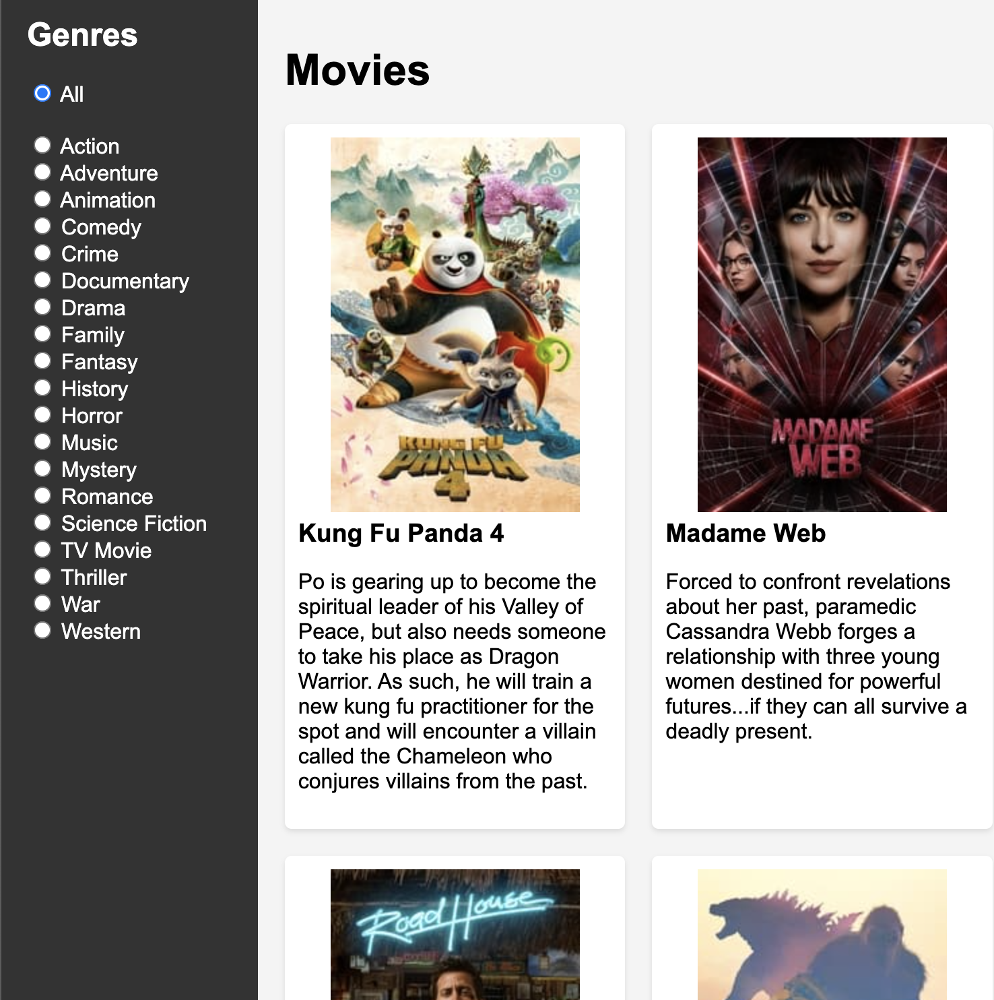

+++
title = 'Infinite Scrolling in Go'
slug = 'infinite-scrolling-in-go'
date = 2024-03-28T19:12:19+01:00
tags = [
    "go",
    "webapp"
]
draft = false
+++

<figure>
  
  <figcaption>A screenshot of the MovieGoers application</figcaption>
</figure>


I'm continuing my exploration server-side rendered HTML with [HTMX](https://htmx.org/ "&lt;&#x2F;&gt; htmx - high power tools for html"), to achieve of <abbr title="Single-Page Application">SPA</abbr>-like features, with no JavaScript frameworks.

This time I'm implementing a [standard SPA sample project](https://github.com/tastejs/movies/blob/main/spec.md "movies/spec.md at main · tastejs/movies · GitHub"), namely a [TMDB](https://www.themoviedb.org/ "The Movie Database (TMDB)") client.

The [source code is on Github](https://github.com/xpmatteo/moviegoers "GitHub - xpmatteo/moviegoers: An experiment in delivering a very fast webapp with HTMX").  The UI is inspired by [this Angular example](https://angular-movies-a12d3.web.app/list/category/popular "HubMovies").  This Angular app is admittedly fast, but my version is at least as fast.

The SPA-like features of this app are 
1. Infinite scrolling
2. Smooth changing of the genre with no full page reload

The starting point was a plain HTML application that can be used without JavaScript.  Adding Ajax is just a matter of including the HTMX library, and adding appropriate HTMX attribute.  The only line of JavaScript is used to hide the "submit" button of the genre form, because it is not needed on a JavaScript-enabled browser.  In fact, the application is still usable with JavaScript disabled.

The infinite scrolling effect is achieved by adding a few HTMX attributes to the element that we want to animate:

```html
<div class="grid-container" id="movieGrid">
  {{ $nextPageUrl := printf "/?page=%d&genre=%d" $.nextPage $.selectedGenre }}
  {{  range $index, $movie := .movies }}
  <div
    class="movie"
    {{ if eq 19 $index }}
      data-hx-get="{{ $nextPageUrl }}"
      data-hx-trigger="revealed"
      data-hx-swap="afterend"
      data-hx-select="#movieGrid .movie"
    {{end}}
  >
    {{ if .PosterPath }}
      
    {{ else }}
      
    {{end}}
    <h3>{{.Title}}</h3>
    <p class="overview">{{.Overview}}</p>
  </div>
  {{ end }}
</div>
```
The key attribute is `data-hx-trigger="revealed"` that kicks in when the user scrolls the page down enough to reveal the last element; in this case I hardcoded `19` because the application always delivers pages of 20 movies.  The other HTMX attributes we add are
* `data-hx-get` contains the url we want to get;
* `data-hx-swap` tells HTMX where to put the results of the call and
* `data-hx-select` specifies that only certain HTML elements of the results are to be used.  In fact, the request returns a complete page that, when used in a non-Ajax context, could be rendered directly in the browser.

The other bit of HTMX is in the genre selection form.
```html
<form action="/"
  data-hx-trigger="change"
  data-hx-get="/"
  data-hx-target="#movieGrid"
  data-hx-select="#movieGrid .movie"
  data-hx-push-url="true"
  data-hx-swap="innerHTML show:#main:top"
>
  <label><input type="radio" name="genre" value="0" {{if eq 0 $.selectedGenre}} checked="checked" {{end}}> All</label><br>
  <br>
  {{ range .genres }}
    <label><input type="radio" name="genre" value="{{.Id}}" {{if eq .Id $.selectedGenre}} checked="checked" {{end}}> {{.Name}}</label><br>
  {{ end }}
  <input id="submitGenre" type="submit" value="Choose">
  <script>document.getElementById("submitGenre").style.display = "none"</script>
</form>
```
Here we add two more HTMX attributes:
* `data-hx-target` means that the results should be placed in the specified HTML element, and
* `data-hx-swap` specifies that we want to scroll the page to the top (thus avoiding an immediate trigger of the infinite scroll) and
* `data-hx-push-url` makes HTMX copy the new url in the address bar.

The bit of JavaScript is meant to hide the submit button when JavaScript is enabled. If JavaScript is not enabled, the HTMX attributes have no effect and this form works perfectly well as a non-Ajax, traditional HTML form.  

The conclusion?  It seems to me you can get sleek SPA-like effects at a fraction of the development cost (assuming you already have a backend team) and with a  performance that is at least comparable to what you get with the big JavaScript frameworks.


*Want to leave a comment? Please [do so on Linkedin](https://www.linkedin.com/posts/matteovaccari_infinite-scrolling-in-go-activity-7179207369359253506-xEj0?utm_source=share&amp;utm_medium=member_desktop "Matteo Vaccari on LinkedIn: Infinite Scrolling in Go")!*
