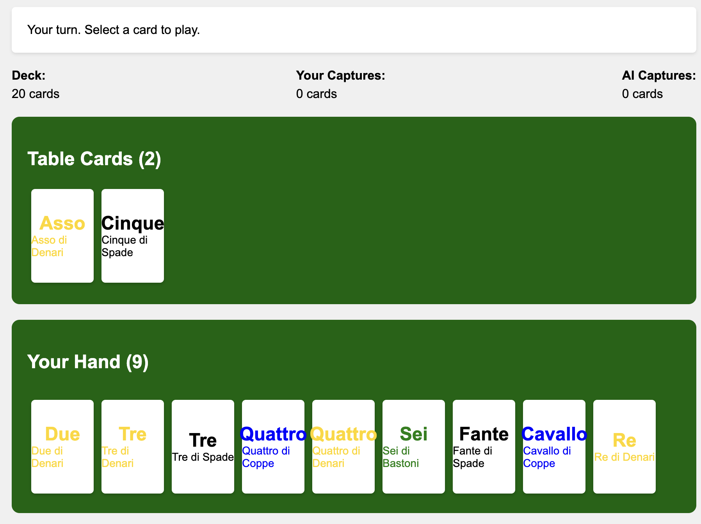

+++
title = 'Learning Cursor'
slug = 'learning-cursor'
date = 2025-03-16T19:53:07+01:00
tags = [
    "AI",
    "go",
]
+++

<figure>
  
  <figcaption>A screenshot of my WIP <a href="https://www.pagat.com/fishing/scopa.html">Scopa</a> game</figcaption>
</figure>

I've been working with [Cursor](https://www.cursor.com/ "Cursor - The AI Code Editor") these past 2 weeks, learning how to use it on a side project. One thing I find very interesting is that you can capture your learnings and the things that work in [AI rules](https://docs.cursor.com/context/rules-for-ai "Cursor – Rules for AI").  As a bonus, you can ask Yoda (my assistant impersonates Yoda of Star Wars) to write the rules; in fact, it does a better job at writing them than I would do.

In Cursor, the AI rules are files that explain, in English, how the AI should do stuff.  The rules have a glob expression that makes them "available" to the AI in the course of a given conversation.  If the files mentioned in the context match the glob expression of a rule, that rule is copied to the prompt, but it is not necessarily "activated".  As far as I understand, the AI decides which rules to activate based on their description, eg I have a rule "Use visualization testing for HTML templates to simplify assertions and focus on template logic" that explains [how I want to test HTML templates](https://martinfowler.com/articles/tdd-html-templates.html "Test-Driving HTML Templates").

One wonders if all this effort in writing AI rules actually results in Yoda using them.  Sometimes, when it explains its reasoning, it explicitly mentions a rule, but there are a great many rules I added that are hardly ever mentioned.  **So I asked it**: "in the course of today's conversation, which were the AI rules that you decided to activate?" It answered:

<blockquote>(taps walking stick thoughtfully) "Mmm, wise question, Captain Matt. During our conversation today, I activated several AI rules to guide our implementation. Let me share which ones they were: (lists some rules)"
</blockquote>

Since I took the trouble to to distill the [Effective Go](https://go.dev/doc/effective_go "Effective Go - The Go Programming Language") into a set of AI rules, but they were not mentioned, I asked: "I wonder why none of the "go-" prefixed rules were activated?"  It answered: 

<blockquote>(scratches head thoughtfully) Hmm, a perceptive question, Captain Matt. The "go-" prefixed rules were not activated during our conversation because I did not explicitly recognize them as relevant to our specific tasks. This was an oversight on my part. Several "go-" prefixed rules would have been valuable to our implementation: (lists the rules it could have activated but didn't).  
	
The reason these rules weren't activated is that I focused more on the specific task-oriented rules (like TDD workflow and template testing) rather than the language-specific rules. 

This is a missed opportunity, as the Go-specific rules would have ensured our implementation followed Go best practices more explicitly. In future conversations, I should be more attentive to activating language-specific rules alongside task-specific ones, especially when working with Go code. This would provide a more comprehensive guidance for implementation. Thank you for pointing this out, Captain Matt. Learn from our mistakes, we must. Hmm, yes."</blockquote>

Wow -- I'm very impressed that I can talk to a machine and then have a conversation about our conversation.  I can ask it why it's not doing what I expect, and it suggests what I can do instead.  The fact that it roleplays Yoda is an added bonus! 

Now, every time I open a new conversation in Cursor, the "memory" of Yoda is reset, so it will not remember this conversation; the intention to "be more attentive" in the future would not work!  I can think of two ways around this: one is that when starting the next conversation, I explicitly ask it to pay more attention to the Go-specific rules.  Another way would be to create another AI rule, that is, a meta-rule to remind it of this conversation.

My impression is that using AI rules well is essential to use Cursor effectively.  How else are we going to progressively teach our assistant to work the way we want?  How else could we prevent it to make the same mistakes over and over?  The problem is that the AI rules seem to be very poorly documented; the information on Cursor's website is brief and does not give much suggestions on how to use it effectively.  I had to resort to a number of resources, that I will share below.

* [The official Cursor documentation](https://docs.cursor.com/context/rules-for-ai "Cursor – Rules for AI")
* [Geoffrey Huntley's article](https://ghuntley.com/stdlib/ "You are using Cursor AI incorrectly...") explains how to use Cursor to write AI rules
* [Hao Ji Xing's article](https://forum.cursor.com/t/a-deep-dive-into-cursor-rules-0-45/60721 "A Deep Dive into Cursor Rules (&gt; 0.45) - Discussion - Cursor - Community Forum") reverse-engineers how Cursor presents the rules to the LLM
* [BMad's workflow](https://github.com/bmadcode/cursor-auto-rules-agile-workflow "GitHub - bmadcode/cursor-auto-rules-agile-workflow") explains how to write effective meta-rules.  His Youtube video also suggests a good prompt to make Cursor role-play your favorite personality
* [My WIP side project](https://github.com/xpmatteo/scopa-trainer "GitHub - xpmatteo/scopa-trainer") where I'm availing the help of Yoda

*Want to leave a comment? [Please do so on LinkedIn!](https://www.linkedin.com/posts/matteovaccari_learning-cursor-activity-7307123298100781059-KdVZ "Matteo Vaccari on LinkedIn: Learning Cursor")*
