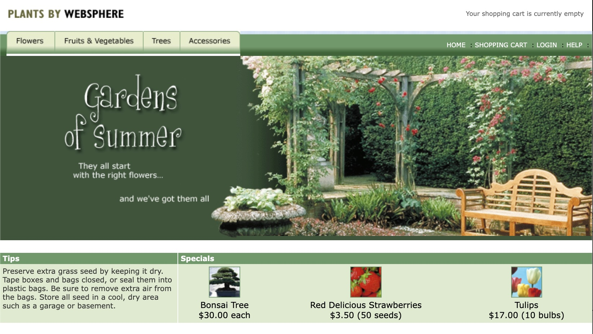
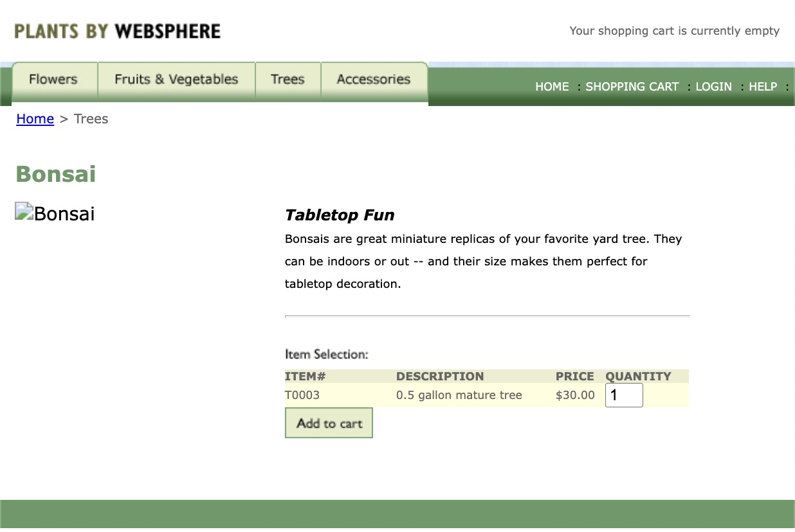
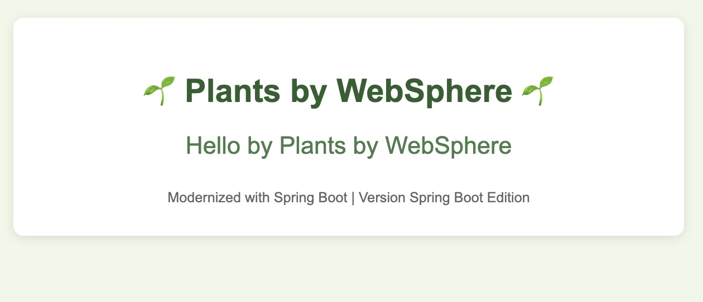

+++

title = 'AI-assisted modernization of Java, part III'
slug = 'ai-assisted-modernization-of-java-part-iii'
date = 2025-09-26T08:32:18+02:00
tags = [
    "AI",
    "java",
    "modernization",
]
draft = true
+++

<style>
pre {
  overflow-x: auto;
  white-space: pre;
}
</style>

Disclaimer: This series of articles is about solving an exercise; actual work is going to be more difficul than this. However, by practicising like this, I believe **we can build skills** that will enable us to deal with the more complicated challenges in real life

# Converting the landing page

In parts [I](/posts/ai-assisted-modernization-of-java-part-i/) and [II](/posts/ai-assisted-modernization-of-java-part-ii/), we got an abandoned Java EE 6 application running in Docker, explored its architecture (JSF frontend, EJBs, JPA persistence), and documented the codebase structure and user workflows. Now in this installment, we use characterization logs to make sure we can observe the behaviour of the legacy app, then we kickstart the conversion, starting with the app home page.

Characterization logging captures the complete behavior of a system by recording inputs, outputs, database operations, and internal state changes—creating a behavioral specification for the modernized system. This approach allows us to understand what the legacy application actually does, rather than relying exclusively on analysis of the source code.

## Characterization

I now attempted a couple of times to start the modernization.  The first one was by exploring how difficult it would be for the AI to replicate the UI of the landing page on Spring Boot.  It turns out it's very easy.

The second was to see how hard it would be to write characterization tests to "block" the behaviour of the legacy, so that we can use the same "golden master" to test the Spring Boot port.  The tests were easy to write for the AI; however, this is not likely to be fruitful.  You see, JSF is a web-unfriendly framework, where every user click results in a POST; we don't want to keep this behaviour in our port, so returning the exact same HTML as the legacy will not work.

I think the best approach to get started is to characterize what the application does in response to user actions through logging.  Let's record what input is received, what output is returned, what changes are made to the DB, and let's use this as a "spec" for the port.  This approach is not new of course; see for instance this [recent article by Irene Sandler and Shodhan Sheth](https://www.thoughtworks.com/insights/blog/engineering-effectiveness/rethinking-the-r-s-of-mainframe-modernization "How AI and a test-first approach can tackle modernization trade-offs | Thoughtworks").

<blockquote>
  <b>We would like now to characterize what goes on this app, with the goal to modernize it.  Can we add logging of requests, to get
  - path, params and body of the request<br>
  - which "controller" is invoked<br>
  - which operations are performed on the DB<br>
  - what status code is returned<br>
  - which tempalte is activated<br>
  - what data is passed to the template<br>
  and ensure we do this through a new utility log function that we add to the pbw-util module.  Also log which EJB method is being invoked.
</b>

* * *

⏺ Perfect! I've successfully implemented comprehensive logging for the Plants by WebSphere application. Here's a summary of what was
  accomplished:

  Comprehensive Logging Implementation Complete

  Created Components:

  1. RequestLogger Utility (pbw-lib/src/main/java/com/ibm/websphere/samples/pbw/utils/RequestLogger.java)
    - Centralized logging utility with methods for all required metrics
    - Automatically masks sensitive data (passwords)
    - Uses existing Util.debug() infrastructure
  2. RequestLoggingFilter (pbw-web/src/main/java/com/ibm/websphere/samples/pbw/war/RequestLoggingFilter.java)
    - HTTP filter that intercepts all requests
    - Captures response status codes using a wrapper
    - Filters out static resources to reduce noise
  3. Enhanced EJB Logging
    - Added logging to CustomerMgr (login, registration, updates)
    - Added logging to CatalogMgr (inventory operations)
    - Added logging to BackOrderMgr (back order management)
  4. Enhanced Servlet Logging
    - Added controller logging to AdminServlet and AccountServlet
    - Added template rendering logging to requestDispatch methods
</blockquote>

Then I also asked to turn on JPA persistence logging so that we see what exact queries are sent to the DB.

Claude worked for a while, created a logging utility, added lots of logging calls, and then claimed victory.  However, it was not working: when I tried reloading the app home page, nothing was logged.  So I asked Claude to debug the issue, but I was at the end of the context window, and Claude was beginning to get confused between our own logging facility and the Util.debug facility that was present in the legacy code.  Better to start from scratch.

I added a `Makefile` with the proper way to restart the application, to prevent Claude Code (CC) to just call `docker-compose restart`, which does not rebuild the container with the new binaries.

```
.PHONY: restart
restart:
        mvn clean package
        docker-compose down
        docker-compose up -d --build
```

**🔧 The Makefile Heuristic**: provide a `Makefile` (or equivalent tool) that makes it easy for humans and AI to start and restart the application, and to do the common dev tasks; it makes it less likely for the AI to waste time with wrong commands. (Thanks [Armin Ronacher](https://lucumr.pocoo.org/2025/6/12/agentic-coding/ "Agentic Coding Recommendations | Armin Ronacher's Thoughts and Writings") for this)

I told CC to remember this in `CLAUDE.md`.  Then I restarted the app, reloaded the home page, and saw that the logs were ineed appearing, but showing too much noise related to loading of images and other static assets.  I asked CC to refine the logs and then we finally had useful logs.  I had to iterate again with CC to get clarity on which template is instantiated, and with which data;  and to add logging to the "perform" methods of the backing beans, which are the JSF equivalent of Spring MVC controller methods. Again, the Iteration Heuristic.  This logging task took much longer than I expected.

This is what is logged when we visit the landing page, which is step 1 in the purchase workflow:



```
[PBW-LOG] REQUEST: Path=/promo.jsf, Method=GET, QueryString=null, Params={}
[INFO    ] Reading standard config META-INF/standard-faces-config.xml
[INFO    ] Reading config /WEB-INF/faces-config.xml
[INFO    ] Serialization provider : class org.apache.myfaces.shared_impl.util.serial.DefaultSerialFactory
[INFO    ] SRVE0292I: Servlet Message - [pbw-web]:.No state saving method defined, assuming default server state saving
[INFO    ] [TEMPLATE] Rendering template: /promo.xhtml
[INFO    ] [TEMPLATE] Template file path: /.../pbw-web.war/promo.xhtml
[PBW-LOG] RESPONSE: Path=/promo.jsf, Status=200
```

No java code seems to be involved, so the info about the three promotional items seems to be hardcoded in the HTML template 🤐.

Then when we click on the "bonsai" link, we get this page: 



and this is logged

```
pbw-app    | [PBW-LOG] REQUEST: Path=/promo.jsf, Method=POST, QueryString=null, Params={javax.faces.ViewState=NDRZy6fnb5vKQ2SXOr2picnXipc/BNT3w/sv7e0WFPofBYyONCG9j3pL7epTIrWbDgYOcA==, itemID=T0003, promo:_idcl=promo:j_id_1w, promo_SUBMIT=1}
pbw-app    | [INFO    ] Reading standard config META-INF/standard-faces-config.xml
pbw-app    | [INFO    ] Reading config /WEB-INF/faces-config.xml
pbw-app    | [INFO    ] Serialization provider : class org.apache.myfaces.shared_impl.util.serial.DefaultSerialFactory
pbw-app    | [INFO    ] SRVE0292I: Servlet Message - [pbw-web]:.No state saving method defined, assuming default server state saving
pbw-app    | [INFO    ] [ShoppingBean] performProductDetail() - itemID: T0003
pbw-app    | [PBW-LOG] EJB: CatalogMgr.getItemInventory(T0003)
pbw-app    | [PBW-LOG] DB_OP: FIND - Inventory with params: [T0003] (SQL details in EclipseLink logs)
pbw-app    | [EL Fine]: sql: 2025-09-26 11:52:24.996--ServerSession(41195565)--Connection(1977774638)--Thread(Thread[Default Executor-thread-2,5,Default Executor Thread Group])--SELECT INVENTORYID, CATEGORY, COST, DESCRIPTION, HEADING, IMAGE, IMGBYTES, ISPUBLIC, MAXTHRESHOLD, MINTHRESHOLD, NAME, NOTES, PKGINFO, PRICE, QUANTITY FROM INVENTORY WHERE (INVENTORYID = ?)
pbw-app    | 	bind => [T0003]
pbw-app    | [PBW-LOG] EJB_RESULT: CatalogMgr.getItemInventory returned Inventory[T0003]
pbw-app    | [INFO    ] [ShoppingBean] performProductDetail() -> returning: 'product' (resolves to: product.xhtml)
pbw-app    | [INFO    ] [ShoppingBean] Product data: ProductBean[id=T0003, name=Bonsai, price=$30.00, quantity=1, category=Trees]
pbw-app    | [INFO    ] [NAVIGATION] Action completed -> navigating to: /product.xhtml
pbw-app    | [INFO    ] [TEMPLATE] Rendering template: /product.xhtml
pbw-app    | [INFO    ] [TEMPLATE] Template file path: /.../pbw-web.war/product.xhtml
pbw-app    | [PBW-LOG] RESPONSE: Path=/promo.jsf, Status=200
```

We see that:

* the call is a POST, even though it does not change the app state (it should have been a GET, but this is sadly how JSF does things)
* the path is the same as the landing page; another web-unfriendly thing from JSF 
* the first Java code being invoked is `ShoppingBean.performProductDetail`
* the `ShoppingBean` invokes the EJB `CatalogMgr.getItemInventory`
* the SQL code is straightforward

The `ShoppingBean` method calls the `CatalogMgr`

```java
public String performProductDetail () {
	FacesContext facesContext = FacesContext.getCurrentInstance();
	ExternalContext externalContext = facesContext.getExternalContext();
	Map<String, String> requestParams = externalContext.getRequestParameterMap();

	String itemID = requestParams.get("itemID");

	this.product = new ProductBean(this.catalog.getItemInventory(requestParams.get("itemID")));

	return ShoppingBean.ACTION_PRODUCT;
}
```

The `CatalogMgr` just invokes the JPA "entity manager".

```java
public Inventory getItemInventory(String inventoryID) {
	Inventory si = em.find(Inventory.class, inventoryID);
	return si;
}
```

So far so good; this logic seems straightforward.


## Starting a Spring Boot application from scratch

Now that we can observe what the legacy actually does, we can start porting it, using the logs as a specification to ensure we preserve the old behaviour. 

Given the extent of the changes we are applying, I don't think it's feasible to do a change in place.  Our strategy will be to create a fresh Spring Boot 3 in a subfolder of the project, and add incrementally bits from the old application.  I used the [Spring Initializr](https://start.spring.io/), choosing the Web, JDBC and Mustache extensions.  Why choose Mustache for HTML templates?  I like it because it's low-key, very simple to use, and much less enterprisey than Thymeleaf.  Freemarker would also be a good choice, but Mustache seems easier to configure.

After creating the app, I asked CC to build it
<blockquote>
  <b>check out the spring-boot-pbw/ folder, where I downloaded a fresh spring boot application.  Run ./mvn package and fix any issues there</b>
  
* * *

The ./mvnw package command is failing because the Spring Boot application needs database configuration to match the legacy application's
MySQL setup.  
</blockquote>

I asked it to fix it by using the same DB as the legacy application.  Then I wanted to ensure it really connects to the DB, so I asked 

<blockquote>
  <b>Let's add to the spring boot application a /ready endpoint that checks DB connectivity with something like "select 2" and returns 200</b>
</blockquote>

It did that, and proceeded to test it manually with the DB up and with the DB down.  Good job; I would have done the same. Next step was to create a "hello, world" page as the landing page.

<blockquote>
  <b>now please add a Mustache template that returns "hello by plants by websphere", and create a new controller for the "/promo" route that runs  that template</b>
</blockquote>
 
It did that, in the usual Claude style, going a bit overboard with more styling than we needed




## Finally, we convert the home page

Then I asked it to recreate in Mustache the legacy home page.

<blockquote>
  <b> now let's think deeply about how to port the jsf pages from the legacy application to spring boot.  We want to convert the old templates to
  mustache, keep the original html, keep the original css, and replicate the template logic with mustache.  What options do we have?</b>

* * * 

⏺ User approved Claude's plan: <br>
  ⎿ JSF to Spring Boot + Mustache Migration Plan

Current State Analysis

- 12 JSF pages (~2000 lines total) using Facelets template architecture
- Template-based: PlantTemplate.xhtml provides header/footer/navigation
- Backing beans: ShoppingBean, AccountBean, HelpBean with EL expressions
- Complex features: Forms, data tables, AJAX, conditional rendering, validation
- Assets: 33 images, CSS files, JavaScript files to preserve

Migration Strategy: Hybrid Approach (Starting with promo.xhtml)

Phase 1: Establish Foundation (Focus: promo.xhtml)

1. Create Base Mustache Template - Convert PlantTemplate.xhtml to layout.mustache
  - Preserve exact HTML structure and CSS classes
  - Convert JSF resource references to Spring Boot static resources
  - Create template sections for title, content, navigation state
2. Convert promo.xhtml to promo.mustache
  - Map static promotional content
  - Convert #{shopping.performProductDetail} links to Spring MVC endpoints
  - Handle hardcoded product data (T0003, V0006, F0017)
  - Preserve all styling and layout
3. Create PromoController
  - Serve promo page data
  - Handle product detail navigation
  - Integrate with existing database/product catalog
4. Asset Migration
  - Copy CSS files to src/main/resources/static/css/
  - Copy images to src/main/resources/static/images/
  - Update resource references in templates

Phase 2: Conversion Patterns & Utilities

1. JSF to Mustache Mapping Patterns
  - #{bean.property} &rarr; {{property}}
  - rendered=&quot;#{condition}&quot; &rarr; {{#condition}}...{{/condition}}
  - &lt;c:forEach items=&quot;#{list}&quot; var=&quot;item&quot;&gt; &rarr; {{#items}}...{{/items}}
  - &lt;h:commandLink action=&quot;#{bean.method}&quot;&gt; &rarr; &lt;a href=&quot;/endpoint&quot;&gt;
2. Template Helper Methods
  - Currency formatting utilities
  - Date formatting helpers
  - Conditional rendering helpers

Key Conversion Challenges & Solutions

1. Template Inheritance: Replace &lt;ui:composition template&gt; with Mustache partials
2. Navigation State: Convert JSF navigation rules to Spring MVC request mappings
3. Form Processing: Replace JSF form handling with Spring MVC form binding
4. Resource Management: Use Spring Boot's static resource handling
5. Session Management: Replace JSF session scope with Spring session attributes

Recommended Approach Benefits

- Incremental: Start simple with promo page, build expertise
- Risk Mitigation: Test patterns before tackling complex pages
- Reusable Components: Create base templates and utilities for other pages
- Original Fidelity: Preserve exact HTML structure and styling
- Modern Standards: Leverage Spring Boot best practices

Success Criteria for Phase 1

- Promo page renders identically to JSF version
- All product links work correctly
- Navigation maintains visual state
- Images and styling preserved exactly
- Performance equivalent or better than JSF version

This approach allows us to establish proven patterns with the simplest page first, then apply learnings to more complex pages like
cart.xhtml (164 lines) and register.xhtml (270 lines).  
</blockquote>

I used "think deeply" to trigger more reasoning.  I liked that it proposed to go by stages, so I asked it to proceed with converting the landing page, and the result was nearly identical to the original, minus a little spacing variation that you can only see if you flip quickly between one page and the other.  So, well done!


## Dude, where's the tests?

All right, all right, we have no tests!  The test was to visually compare the ported page with the old one, and it passed; now we want to write a non-regression automated test that will ensure it will not break in the future.  I did not start TDD yet; in fact we might not have a lot of use for TDD; we are testing legacy behaviour, not creating new behaviour.  I think we could use the [Golden Master](https://blog.thecodewhisperer.com/permalink/surviving-legacy-code-with-golden-master-and-sampling "Surviving Legacy Code with Golden Master and Sampling - The Code Whisperer") technique, that is, we compare the (slightly normalized) html generated by the app with a known good copy.  If some day the actual normalized output differs from the golden master, either we have a regression, or we have a change that we want and we will update the golden master.  This technique is appropriate when working with legacy code.

<blockquote>
  <b> please write a non-regression test in the spring-boot module for the landing page generated by spring boot.  we should compare it against a  golden master.</b>
  
⏺ I'll create a non-regression test for the Spring Boot landing page using a golden master approach, Captain Matt. Let me examine the Spring  Boot module structure first.  

* * *

⏺ Perfect! The golden master test is now working correctly, Captain Matt. Here's what I've created:

Golden Master Test for Landing Page

I've successfully implemented a non-regression test using the golden master approach at:
spring-boot-pbw/src/test/java/it/xpug/pbw/controller/PromoControllerGoldenMasterTest.java:1

Key Features:

1. Two Test Cases: Tests both the / (home) and /promo endpoints
2. Golden Master Files: Located in src/test/resources/golden-masters/
  - home-page.html - Golden master for the home page
  - promo-page.html - Golden master for the promo page
3. HTML Normalization: The test normalizes whitespace and line endings to avoid false positives from formatting differences
4. Automatic Golden Master Creation: On first run, it creates the golden master files and fails with a clear message to review them

How It Works:

- First Run: Creates golden master files and fails with instructions to review
- Subsequent Runs: Compares current HTML output against the golden masters
- Regression Detection: If HTML changes, the test fails with a clear message about the mismatch
- Regeneration: Delete golden master files and run again to update them for intentional changes

The test now passes successfully on subsequent runs, confirming that the golden master approach is working correctly for detecting any
regressions in the landing page HTML output.
</blockquote>

CC saved the golden master in `src/test/resources/golden-masters`.  I tested if it worked as advertised by changing the Mustache template and seeing the error message:

```
[INFO] Tests run: 1, Failures: 0, Errors: 0, Skipped: 0, Time elapsed: 0.304 s -- in it.xpug.pbw.PbwApplicationTests
[INFO]
[INFO] Results:
[INFO]
[ERROR] Failures:
[ERROR]   PromoControllerGoldenMasterTest.promoPageShouldMatchGoldenMaster:33->assertMatchesGoldenMaster:71 HTML output does not match golden master. If this change is intentional, delete the golden master file and run the test again to regenerate it. ==> expected: 
```

The actual-expected comparison is unreadable on the command-line, but the beginning of the error message makes sense.  Good enough for now.


## Conclusions

Today we created the basis for proceeding:

- we can observe what Java code is triggered by user actions in the legacy app
- we can observe the interaction with the DB
- we started a fresh Spring Boot app that will host the ported app
- we converted the home page, which is step 0 in the purchasing journey
- we wrote our first non-regression test (about time!)

### Useful patterns

In this exercise, we applied a few useful patterns for working effectively with AI and with legacy code:

**🔧 The Makefile Heuristic**: Provide explicit build/restart commands to prevent AI from making wrong assumptions about your stack. The Makefile with proper Docker rebuild commands saved significant debugging time and prevented Claude from using ineffective `docker-compose restart` commands.

**🔄 The Iteration Heuristic**: Plan for multiple rounds of refinement rather than expecting perfect results on first try. The characterization logging took several iterations to filter noise, add template logging, and capture backing bean methods—this is normal and expected.

**🧠 Context Window Management**: When AI gets confused between similar concepts (our custom logging vs existing Util.debug facility), it's better to start fresh rather than continue debugging in a degraded context.

**💭 Prompt Specificity**: Using "think deeply" triggered better architectural reasoning and comprehensive migration planning. Explicit guidance on reasoning depth significantly improved output quality.

**👁️ Visual Validation**: Screenshots for before/after UI comparison worked effectively when automated testing wasn't immediately available. Sometimes manual verification is the right first step.

**When AI excelled:**
- JSF to Mustache conversion saved me a lot of boring work
- Writing the golden master test
- Fixing fiddly technical issues, such as DB connectivity in Spring Boot and Docker configuration

**When AI struggled:**
- Initial characterization setup took much longer than expected. I might have done the characterization work faster myself and learned more about the legacy app in the process


Next steps: we continue with the purchasing journey: the user clicks on the "bonsai tree" link, and sees the product details.  Stay tuned!


*Want to leave a comment? Please do so on Linkedin!*


<details>
<summary>Change history</summary>

* 2025-09-26 Initial publication

</details>


 