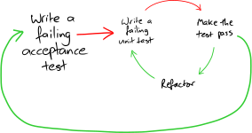

+++
title = 'Acceptance Tests for AI-assisted development'
slug = 'acceptance-tests-for-ai-assisted-development'
date = 2025-09-29T12:18:09+02:00
tags = [
    "AI",
    "modernization",
]
+++

In my experiments with AI-assisted software development, and especially when trying spec-driven development, I found that Acceptance Tests are key to enable success.  Here's my take on them.

# The scoop on Acceptance Tests

One of the original practices of [Extreme Programming](https://ronjeffries.com/xprog/what-is-extreme-programming/ "What is Extreme Programming?") was "[Customer Tests](https://ronjeffries.com/xprog/what-is-extreme-programming/#customer "What is Extreme Programming?")", more commonly known as "Acceptance Tests": these are tests that are written from the point of view of the business, and they prove that a given business rule has been implemented by checking specific examples of that business rule; e.g., when the user does X, in context Y, then Z should happen.

Being written *from the point of view of the business* means that, when a customer reads these tests, they should understand what is the business rule being tested, even though they might not be a technical person, and they should be able to confirm that the examples are correct.  These tests are contrasted to [Programmer Tests](https://ronjeffries.com/xprog/what-is-extreme-programming/#test "What is Extreme Programming?"), that is, the tests that we usually write with Test-Driven Development: programmer tests are not necessarily understandable by business people, as they might be testing internal parts of the software that are there because they are part of how the programmers chose to design the system.

Ideally, every user story being implemented should be proved to work by one or more acceptance tests: when the acceptance tests pass, the feature is done. Probably. At least from the point of view of the business rules being implemented.

Acceptance tests have many benefits:

 1. they act as a means of communication between technical and less-technical stakeholders: we use them to agree that the developers understood the business rules correctly.  As Alberto Brandolini says, [It's the developer's understanding, not your knowledge, that becomes software](https://x.com/ziobrando/status/634668319006683136)
 2. they frame the amount of logic that should be implemented for a given user story, that is, we make it clear what's part of this story and what's not included, so they support thin slices of value, a very good development organization technique
 3. they act as non-regression tests long after the user story was completed.  In particular, if an AT for an old user story fails, it's usually easy to understand what's broken.  Programmer tests are great, but they run the risk to be too techhical and detail-oriented and sometimes, when an old programmer test breaks, it's hard to understand what is wrong.  AT do not have this problem, because they tell you exactly which customer-wanted behaviour is breaking
 
AT also have problems.  They are often implemented as end-to-end tests, and in this case, they suffer all the problems of e2e tests: they are slow, they are flaky, they are unreliable.  When and e2e test fails, it's sometimes necessary to analyze logs to understand what broke, and it sometimes happen that the breakage is due to some system outside our control that is temporarily down; so e2e tests in the end might negate benefit #3 above.

# Doing AT well

Around 2010, there was a big discussion in the XP community, [sparked by James Shore](https://ronjeffries.com/xprog/xpmag/problems-with-acceptance-testing/ "Problems with Acceptance Testing"), who complained about these problems we just mentioned.  At around the same time, [the second-best book on TDD](http://www.growing-object-oriented-software.com/ "Growing Object-Oriented Software Guided by Tests: About the Book") was published, and they advocated starting development from an acceptance test.  Wow! Who should we listen to?

<figure style="margin: 0 auto; display: block; width: 80%">
   
  <figcaption>TDD with acceptance tests. From <a href="http://www.growing-object-oriented-software.com/figures.html">Freeman's and Pryce's book</a>,  <br> reproduced here with a <a href="https://creativecommons.org/licenses/by-sa/4.0/">Creative Commons Attribution-ShareAlike 4.0</a> license
  </figcaption>
</figure>


Actually, there's a way to write AT that run as fast, and as reliable, as regular unit tests.  The TL;DR is: **we should not run the AT through the UI**.  In more detail: Alistair Cockburn introduced the [Ports-and-adapters architecture](https://alistair.cockburn.us/hexagonal-architecture "hexagonal-architecture"), which is a way to design applications that separates the "inside" of the application that implements the business rules, from the "outside", which takes care of I/O and infrastructure.  

<figure style="margin: 0 auto; display: block; width: 80%">
   
  <figcaption>The Ports-and-adapters architecture. From <a href="http://www.growing-object-oriented-software.com/figures.html">Freeman's and Pryce's book</a>,  <br> reproduced here with a <a href="https://creativecommons.org/licenses/by-sa/4.0/">Creative Commons Attribution-ShareAlike 4.0</a> license
  </figcaption>
</figure>

Implementing AT with the Ports-and-adapters architecture allows you to make the AT precise, fast and reliable.  

1. The AT connects to the UI port (bypassing the UI technology)
2. The persistence ports are connected to either a local, fast DB, or to an in-memory implementation of the persistence interface (which is NOT the same as using an in-memory DB such as H2: implementing the repository interface in memory is going to be way simpler)
3. Any external systems that we don't control are most definitely replaced by local versions, or in-memory implementations of the interface.


# AI-assisted development and AT

What I have seen to work well, is to split development along thin slices (eg use [Harper Reed's method](https://harper.blog/2025/05/08/basic-claude-code/ "Basic Claude Code | Harper Reed's Blog")) and then ask the AI to start development by writing the AT first.  But this only works well when you provide an example of how an AT in your situation should look like.  I have seen this work well also in brownfield, real work: point the AI to a Jira ticket, and ask it to write the AT for it, *based on an example that we provide*.

What?  We let the AI write the AT?  Isn't this dangerous?  Of course we should review that the AI-written test makes sense; it is probably going to be easy because the AT should be written in terms of the user story, so **it should be easy to understand**.  If it's hard to understand, we probably better iterate until it becomes easy.  And I prefer to let the AI write the AT because 

1. I want to offload as much tedious work as possible, and testing the fiddly details of CRUD HTTP calls is tedious, and 
2. the AI is more detail-oriented than I am and **together we do a better job** than either human alone or AI alone.

Here are examples of ATs that I used.  This one is from when I replicated [Harper Reed's BASIC interpreter](https://harper.blog/2025/05/08/basic-claude-code/ "Basic Claude Code | Harper Reed's Blog") experiment:

```yaml
tests:
  - name: "LEN function basic tests"
    program: |
      10 PRINT LEN("HELLO WORLD")
      20 PRINT LEN("")
      30 PRINT LEN("A")
      40 END
    expected:
      - "11\n"
      - "0\n"
      - "1\n"

  - name: "LEFT$ function basic tests"
    program: |
      10 PRINT LEFT$("HELLO WORLD", 5)
      20 PRINT LEFT$("HI", 10)
      30 PRINT LEFT$("TEST", 0)
      40 PRINT LEFT$("HELLO", 3)
      50 END
    expected:
      - "HELLO\n"
      - "HI\n"
      - "\n"
      - "HEL\n"

  - name: "RIGHT$ function basic tests"
    program: |
      10 PRINT RIGHT$("HELLO WORLD", 5)
      20 PRINT RIGHT$("HI", 10)
      30 PRINT RIGHT$("TEST", 0)
      40 PRINT RIGHT$("HELLO", 2)
      50 END
    expected:
      - "WORLD\n"
      - "HI\n"
      - "\n"
      - "LO\n"
```

In this BASIC program, the AT are written as yaml files, that are then read and interpreted by Go code.  Initially this started as a regular tabular test in Go code, but the Go file was growing way beyond the limit after which the AI coding assistants find it difficult to work with a file (that is, beyond 500 lines), so I had it move the test tables to yaml files.  Every feature had its own dedicated yaml file; there were 38 of them, and the interpreter still did not cover all of the C64 BASIC features.

What enabled effective ATs in this case was that the BASIC interpreter did not do I/O directly; it would use a Runtime port, which could be reimplemented in the AT to prevent real I/O from happening.  The following is the Runtime interface:

```go
// Runtime provides an interface for all I/O operations
// This allows the interpreter to work with different environments (console, test, etc.)
type Runtime interface {
	// Print outputs a string without a newline
	Print(value string) error

	// PrintLine outputs a string with a newline
	PrintLine(value string) error

	// Input prompts for user input and returns the entered string
	Input(prompt string) (string, error)

	// Clear clears the output (if supported by the runtime)
	Clear() error

	// Random returns a pseudo-random float64 in [0,1).
	// Implementations may be deterministic (TestRuntime) or seeded (StandardRuntime).
	Random() float64
}
```

The following example is from a REST API written in Go (sanitized not to give away client code.)  The user story was about implementing an HTTP entrypoint, so the language of the AT talks about payload and expected HTTP status codes; this is consistent with the language of the Jira ticket.

```go
func TestCreateThing_InvalidInput(t *testing.T) {
	type any = interface{}

	testCases := []struct {
		label     string
		body      map[string]any
		raw       string
		wantStatus int
		wantBody  map[string]any
	}{
		// --- malformed / non-JSON payloads ---
		{
			label:      "malformed json",
			raw:        "{",
			wantStatus: http.StatusBadRequest,
			wantBody: map[string]any{
				"error":  "Bad Request",
				"errors": []any{"malformed JSON payload"},
				"code":   "E_BAD_JSON",
				"status": 400,
			},
		},
		{
			label:      "non-json payload",
			raw:        "this is not json",
			wantStatus: http.StatusBadRequest,
			wantBody: map[string]any{
				"error":  "Bad Request",
				"errors": []any{"payload must be JSON"},
				"code":   "E_BAD_JSON",
				"status": 400,
			},
		},

		// --- title ---
		{
			label: "title: missing",
			body: map[string]any{
				"parentId":  1001,
				"details":   "some details",
			},
			wantStatus: http.StatusBadRequest,
			wantBody: map[string]any{
				"error":  "Bad Request",
				"errors": []any{"missing field: title"},
				"code":   "E_MISSING_TITLE",
				"status": 400,
			},
		},
		{
			label: "title: nil",
			body: map[string]any{
				"title":    nil,
				"parentId": 1001,
				"details":  "some details",
			},
			wantStatus: http.StatusBadRequest,
			wantBody: map[string]any{
				"error":  "Bad Request",
				"errors": []any{"invalid field type: title"},
				"code":   "E_INVALID_TITLE",
				"status": 400,
			},
		},
		{
			label: "title: empty string",
			body: map[string]any{
				"title":    "",
				"parentId": 1001,
				"details":  "some details",
			},
			wantStatus: http.StatusBadRequest,
			wantBody: map[string]any{
				"error":  "Bad Request",
				"errors": []any{"title must not be empty"},
				"code":   "E_INVALID_TITLE",
				"status": 400,
			},
		},
		{
			label: "title: wrong type (int)",
			body: map[string]any{
				"title":    4,
				"parentId": 1001,
				"details":  "some details",
			},
			wantStatus: http.StatusBadRequest,
			wantBody: map[string]any{
				"error":  "Bad Request",
				"errors": []any{"invalid field type: title"},
				"code":   "E_INVALID_TITLE",
				"status": 400,
			},
		},
		{
			label: "title: too long",
			body: map[string]any{
				"title":    strings.Repeat("t", 300),
				"parentId": 1001,
				"details":  "some details",
			},
			wantStatus: http.StatusBadRequest,
			wantBody: map[string]any{
				"error":  "Bad Request",
				"errors": []any{"title exceeds max length (255)"},
				"code":   "E_INVALID_TITLE",
				"status": 400,
			},
		},

    // ... dozen more tests
	}

	for _, tc := range testCases {
		t.Run(tc.label, func(t *testing.T) {
			// ... 
		})
	}
}
```

Again, what enabled effective AT in this case was that the HTTP API was being defined in the Go application by a single, specific Go function that had as input all the external adapters it needed, and returned a Go stdlib router.

```go
package api

func Create(
	config *configs.OurConfig,
	persistence *mysql.Persistence,
	sessions redis.Sessions,
	awsClient aws.Client,
) *http.ServeMux {
	middlewares := []func(http.Handler) http.Handler{
		middleware.NewTimeoutHandler(time.Duration(config.TimeoutSeconds) * time.Second),
		middleware.FeatureToggleMiddleware(config.Environment, awsClient),
		middleware.NewAuthentication(sessions),
	}

	mux := http.NewServeMux()
	mux.HandleFunc("GET /health", handler.HealthCheckHandler)
	mux.HandleFunc("GET /ready", handler.ReadyCheckHandler(sessions, persistence))
	mux.HandleFunc("GET /thingy/v1/swagger", swagger.SwaggerHandler)
	mux.Handle("GET /thingy/v1/thing/{id}", applyMiddlewares(middlewares, makeFetchHandler(persistence)))
	mux.Handle("POST /thingy/v1/thing", applyMiddlewares(middlewares, makeCreateHandler(persistence)))
	return mux
}
```

# Conclusions

AI-assisted developments needs strong guardrails; the better your guardrails, the better AI can help you.  Acceptance tests look like the first and maybe the most important guardrails for AI to work within, giving it clear specifications while keeping the business logic testable and maintainable.  We will need all sorts of guardrails of course, but this particular type of guardrail offers safety and clarity.

David Farley of [Modern Software Engineering](https://www.davefarley.net/?p=352 "What is Modern Software Engineering? | Dave Farley&#8217;s Weblog") fame, [recently video-blogged](https://www.youtube.com/watch?v=NsOUKfzyZiU "- YouTube") about ATDD as the future of programming (with AI.)  I agree with lots of what he says, but I disagree when he says that humans should write all AT.  As I discussed before, I find it more productive both in terms of quality and coverage to pair with AI in this.  

There is a key technical enablement that makes AT effective: use the Ports-and-adapters architecture to make the AT fast and reliable.  Make both the input ports and the output ports configurable so that you can connect your modules together to make a version of your application that is perfect for running AT against.


*Want to leave a comment? Please do so on Linkedin!*
