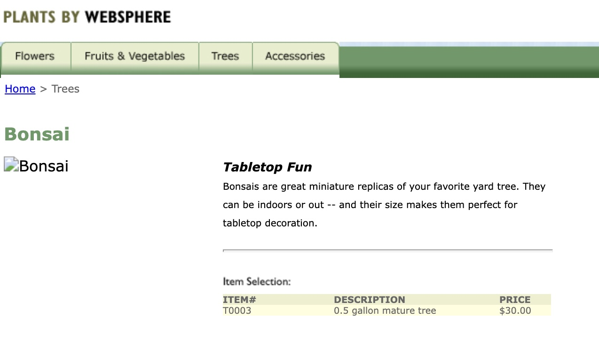

+++
title = 'AI-assisted modernization of Java, part IV'
slug = 'ai-assisted-modernization-of-java-part-iv'
date = 2025-10-15T16:59:35+02:00
tags = [
    "AI",
    "java",
    "modernization",
]
+++

<style>
pre {
  overflow-x: auto;
  white-space: pre;
}
</style>

Disclaimer: This series of articles is about solving an exercise; actual work is going to be more difficult than this. However, by practicing like this, I believe **we can build skills** that will enable us to deal with the more complicated challenges in real life.

Setup:

- Claude Code with Claude Sonnet 4.5 (new!)
- My global CLAUDE.md is a variant of [Harper Reed's](https://github.com/harperreed/dotfiles/blob/35c2d5508f36b7ad6a845f605c12bcdb16fb15a3/.claude/CLAUDE.md "dotfiles/.claude/CLAUDE.md at 35c2d5508f36b7ad6a845f605c12bcdb16fb15a3 · harperreed/dotfiles · GitHub")
- The [repo for the exercise, in the state it was when we started this session](https://github.com/xpmatteo/app-modernization-plants-by-websphere-jee6/tree/89589297ec0deaadf1a65f598cd187eb2676a3a4 "GitHub - xpmatteo/app-modernization-plants-by-websphere-jee6 at 89589297ec0deaadf1a65f598cd187eb2676a3a4")
- The [repo at the end of this session](https://github.com/xpmatteo/app-modernization-plants-by-websphere-jee6/tree/0347e36f5cca9e1b4137351015c5e55de1b68a5c "GitHub - xpmatteo/app-modernization-plants-by-websphere-jee6 at 0347e36f5cca9e1b4137351015c5e55de1b68a5c")


# Reading from the DB

## Brief recap

What we're doing here: we're seeing how AI helps in the modernization of a Java application; the modernization consists in moving from an obsolete/deprecated technology, namely <abbr title="Java Enterprise Edition">JEE</abbr>, to something easier to maintain, in this case, Spring Boot. The starting point is [a WebSphere demo application](https://github.com/IBMAppModernization/app-modernization-plants-by-websphere-jee6 "GitHub - IBMAppModernization/app-modernization-plants-by-websphere-jee6: Java Enterprise Edition 6 version of the Plants By Websphere Sample modified to run in a Liberty container") that has been used in the past for another modernization exercise.

Our strategy is to create a fresh Spring Boot application in a new module in our repo, and move the interesting bits of the application from the old JEE module to the new Spring Boot module.  Oh, and the other important bit of the strategy is that we're focusing on the most important user journey: buying something.  The journey is, in brief:

1. Land on the home page
2. Click on the "Bonsai tree" link -> the product page opens
3. Click on the "Add to cart" button -> the Shopping Cart page opens
4. Click on "Checkout now" -> if you are logged in, the Checkout page opens.  If you're not, the login page opens; but we'll assume that we're logged in, because we want to focus on the smallest valuable journey
5. We fill in the order data in the Checkout page, and click on "Continue" -> the "Review your order" page opens
6. We click on "Submit Order" -> hopefully, we should see a confirmation page.  In my test, I see a javax.ejb.NoSuchEJBException; I don't know if this depends on my setup being wrong, or if the app really has a bug. We'll get to that when we get there.

In [part III](/posts/ai-assisted-modernization-of-java-part-iii/) we dealt with step 1 of the journey: we ported the home page of the application, which is more or less a static page, even though it's generated by a template.  We also wrote a characterization test for it.  In this installment, we work on step 2.

## The task

In the legacy application, when we click on the Bonsai Tree link, the application executes a POST. This is because it's using the JSF framework, which does this kind of things. In our modernized application, we change this to a GET, because it's the right thing to do in this case.  The link points to `/product?itemID=T0003`, and if we run this in the Spring Boot app, we get a 404.  Today's job is to fix this URL to produce the correct product page, pulling product information from the DB.  In fact, the test DB contains this data for the Bonsai Tree:

```sql
mysql> select * from INVENTORY where INVENTORYID = 'T0003'\G
*************************** 1. row ***************************
 INVENTORYID: T0003
        NAME: Bonsai
     HEADING: Tabletop Fun
 DESCRIPTION: Bonsais are great miniature replicas of your favorite yard tree. They can be indoors or out -- and their size makes them perfect for tabletop decoration.
     PKGINFO: 0.5 gallon mature tree
       IMAGE: trees_bonsai.jpg
    IMGBYTES: NULL
       PRICE: 30
        COST: 12
    CATEGORY: 2
    QUANTITY: 100
       NOTES: NOTES and stuff
    ISPUBLIC: 1
MINTHRESHOLD: 0
MAXTHRESHOLD: 0
1 row in set (0.004 sec)
```

The legacy page looks like this:

<figure style="margin: 0 auto; display: block; width: 80%">
  
  <figcaption>The Bonsai Tree product page
  </figcaption>
</figure>

## Planning

Let's get the AI to the task. We start Claude Code (CC), we put it in *plan mode* and ask:

<blockquote>
  <b>check out the product page at http://localhost:9080/product.jsf?itemID=T0003.  We want to port it to Spring Boot; currently
Spring Boot returns 404 at http://localhost:8080/product?itemID=T0003.  What are our options?</b>
</blockquote>

It turns out the legacy app also supports opening the product page with GET, which is helpful.  Given that I have the Puppeteer MCP server installed, Claude examines both urls.

**The Ask For Options heuristic**: start new tasks in plan mode, so that CC knows that we don't want it to rush to code. Ask for options, so that we get the model to look for more than one way to achieve what we ask it.  See Andrej Karpathy "[Don't ask for code, ask for a few high-level approaches, pros/cons.](https://x.com/karpathy/status/1915581920022585597)"

Here's CC's proposal:

<blockquote>
  Porting Product Page to Spring Boot - Options Analysis

  Current Situation

  - Legacy app (JSF): Uses /product.jsf?itemID=T0003 with JSF backing bean pattern
  - Spring Boot: Returns 404 for /product?itemID=T0003 (no controller/route exists yet)
  - The promo page already links to /product?itemID=... (lines 130, 142, 154 in promo.mustache)

  Architecture Pattern Identified

  Legacy (JSF/EJB):
  - JSF view (product.xhtml) ‚Üí JSF backing bean (ShoppingBean) ‚Üí EJB (CatalogMgr) ‚Üí JPA (Inventory entity)
  - Navigation happens via #{shopping.performProductDetail} which reads itemID param
  - Product data wrapped in ProductBean for display

  Spring Boot (Current):
  - Mustache view ‚Üí Spring MVC Controller ‚Üí (currently: static data only)

  Your Options

  Option 1: Create a Full Product Page (Recommended for Learning)

  What it involves:
  1. Create ProductController with @GetMapping("/product") accepting itemID param
  2. Create service/repository layer to query INVENTORY table by inventoryId
  3. Create product.mustache template (port from product.xhtml)
  4. Handle image serving via /servlet/ImageServlet equivalent
  5. Add "Add to Cart" functionality (requires shopping cart state management)

  Pros: Complete feature parity, teaches full Spring Boot stack
  Cons: Most work (5 files + image servlet), requires session management for cart

  Option 2: Simple Read-Only Product Page (Pragmatic)

  What it involves:
  1. Create ProductController with GET mapping
  2. Create simple JDBC repository to fetch product by ID
  3. Create basic product.mustache showing product details (no cart functionality)
  4. Skip images initially (or serve from filesystem)

  Pros: Simpler, focuses on core MVC pattern, no state management
  Cons: Incomplete feature (no cart), doesn't match legacy functionality

  Option 3: REST API Only (Modern Architecture)

  What it involves:
  1. Create REST endpoint: @GetMapping("/api/product/{itemID}")
  2. Return JSON instead of HTML
  3. Optionally add JavaScript to render on promo page

  Pros: More modern, API-first approach, easier testing
  Cons: Changes UX paradigm, requires JavaScript work

  My Recommendation

  Start with Option 2, then evolve to Option 1:
  1. Create basic read-only product page (validates database connection, MVC pattern)
  2. Add image serving (teaches static resource handling)
  3. Add cart functionality (teaches session management)

  This incremental approach lets you validate each layer before adding complexity.

  Would you like me to proceed with Option 2 (simple read-only) or go straight to Option 1 (full cart functionality)?
</blockquote>

I don't care for option 3, the "modern" option of creating a REST endpoint, because it implies that we will also create a separate frontend, which is a lot of extra work.  Server-side HTML templates work fine, because [not all frontends need to be a full-blown JavaScript single-page application](https://www.thoughtworks.com/radar/techniques/spa-by-default "SPA by default | Technology Radar | Thoughtworks").

I am also not a fan of option 2, because it seems like a waste of time; I think CC should be able to go for the real implementation directly, but it should not rush ahead and implement the "add to cart" functionality yet.  Let's iterate the plan.

<blockquote>
  <b>I would like to go with Option 1, but let's skip the "Add to cart" functionality for now.  Also, start with a test
  </b>

‚è∫ Perfect choice, Captain Matt! Let me present a plan for implementing Option 1 (full product page) without the cart
  functionality, starting with a test following ATDD principles.

 Product Page Implementation Plan (Option 1, No Cart, Test-First)

 ATDD Approach - Start with Acceptance Test

 Phase 1: Acceptance Test (End-to-End)

 1. Create ProductControllerTest.java that:
   - Makes GET request to /product?itemID=T0003
   - Verifies HTTP 200 response
   - Verifies HTML contains: product name "Bonsai", price "$30.00", description, image tag
   - Uses actual database (or test database with known data)

 Phase 2: Implement to Make Test Pass

 2.1 Create Product Domain Model
 - spring-boot-pbw/src/main/java/it/xpug/pbw/domain/Product.java - POJO for product data

 2.2 Create Product Repository (JDBC)
 - spring-boot-pbw/src/main/java/it/xpug/pbw/repository/ProductRepository.java
 - Method: Product findByInventoryId(String inventoryId)
 - Query: SELECT * FROM INVENTORY WHERE INVENTORYID = ?
 - Handle null case (product not found)

 2.3 Create ProductController
 - spring-boot-pbw/src/main/java/it/xpug/pbw/controller/ProductController.java
 - @GetMapping("/product") accepting @RequestParam String itemID
 - Inject ProductRepository
 - Fetch product, add to Model
 - Return "product" template
 - Handle 404 if product not found

 2.4 Create Product Template
 - spring-boot-pbw/src/main/resources/templates/product.mustache
 - Port structure from pbw-web/src/main/webapp/product.xhtml
 - Show: product name, heading, description, price, package info, image
 - Add breadcrumb navigation (Home > Category)
 - Use layout.mustache pattern
 - Skip: quantity input, "Add to Cart" button (future feature)

 2.5 Handle Product Images
 - Create ImageController.java or static resource mapping
 - Serve images from /servlet/ImageServlet?action=getimage&inventoryID=... pattern
 - Either serve from database IMGBYTES column or fallback to filesystem

 Phase 3: Refactor & Unit Tests

 - Add unit tests for ProductRepository
 - Add unit tests for ProductController (mock repository)
 - Extract any business logic (e.g., price formatting)

 Expected Files to Create/Modify:

 - spring-boot-pbw/src/test/java/it/xpug/pbw/controller/ProductControllerTest.java (NEW)
 - spring-boot-pbw/src/main/java/it/xpug/pbw/domain/Product.java (NEW)
 - spring-boot-pbw/src/main/java/it/xpug/pbw/repository/ProductRepository.java (NEW)
 - spring-boot-pbw/src/main/java/it/xpug/pbw/controller/ProductController.java (NEW)
 - spring-boot-pbw/src/main/resources/templates/product.mustache (NEW)
 - spring-boot-pbw/src/main/java/it/xpug/pbw/controller/ImageController.java (NEW - for image serving)

 Ready to start with the acceptance test?
</blockquote>

Note that CC picks my preference for <abbr title="Acceptance-Test-Driven-Development">ATDD</abbr> from my global CLAUDE.md file, but misinterprets the approach.  It wants to start with the AT, but then write the unit tests as an afterthought.

<blockquote>
  <b>OK with writing the AT first. But change the plan so that we write the unit test for the controller before we write the
    controller, and same with the repository.  Ok with serving the image from the IMGBYTES field of the INVENTORY table</b>

  ‚è∫ Perfect, Captain Matt! Let me revise the plan to follow proper TDD with unit tests before implementation.

 ATDD Approach - Test-First All The Way

 Phase 1: Acceptance Test (End-to-End) - FAILING

 1. Create ProductControllerTest.java (integration test)
   - GET /product?itemID=T0003 ‚Üí expect 200
   - Verify HTML contains: "Bonsai", "$30.00", description, image tag
   - This will FAIL - no controller exists yet

 Phase 2: Repository Layer (TDD)

 2.1 Unit Test First
 - Create ProductRepositoryTest.java
 - Test: findByInventoryId("T0003") returns Product with correct data
 - Test: findByInventoryId("INVALID") returns null
 - Tests will FAIL - no repository exists

 2.2 Implement Repository
 - Create Product.java domain model (POJO)
 - Create ProductRepository.java with JDBC
 - Query: SELECT * FROM INVENTORY WHERE INVENTORYID = ?
 - Run tests ‚Üí GREEN

 Phase 3: Controller Layer (TDD)

 3.1 Unit Test First
 - Create ProductControllerUnitTest.java (mock repository)
 - Test: GET with valid itemID ‚Üí model has product, returns "product" view
 - Test: GET with invalid itemID ‚Üí returns 404 or error page
 - Tests will FAIL - no controller exists

 3.2 Implement Controller
 - Create ProductController.java
 - @GetMapping("/product") with @RequestParam String itemID
 - Inject ProductRepository, fetch product, add to Model
 - Run tests ‚Üí GREEN

 Phase 4: Template & Images

 4.1 Create Product Template
 - product.mustache - port from product.xhtml
 - Show: name, heading, description, price, pkginfo, image
 - Breadcrumb navigation
 - NO cart functionality

 4.2 Image Serving (TDD)
 - Unit test: ImageControllerTest.java
 - Test: GET /servlet/ImageServlet?action=getimage&inventoryID=T0003 returns image bytes
 - Implement ImageController.java to serve from INVENTORY.IMGBYTES
 - Run tests ‚Üí GREEN

 Phase 5: Run Acceptance Test

 - Run ProductControllerTest (integration test) ‚Üí should be GREEN
 - Manual test: http://localhost:8080/product?itemID=T0003

 Files to Create (in order):

 1. ProductControllerTest.java (integration test - FAILING)
 2. ProductRepositoryTest.java (unit test - FAILING)
 3. Product.java (domain model)
 4. ProductRepository.java (implementation)
 5. ProductControllerUnitTest.java (unit test - FAILING)
 6. ProductController.java (implementation)
 7. product.mustache (template)
 8. ImageControllerTest.java (unit test - FAILING)
 9. ImageController.java (implementation)

 Ready to start with the acceptance test?
</blockquote>

Now this begins to look good!  I will accept the plan and get CC to start with the implementation.  Let's see what code it comes up with.

## Implementation

The plan is not trivial; luckily CC has a `TodoWrite` tool at its disposal that it can use to keep track of what it's doing and not get lost.  Here is how its todo list looks at first

<figure style="margin: 0 auto; display: block; width: 80%">
  
</figure>

Gee, I *love it* that it plans to test the application "manually" in the browser.

**The "let the AI do the testing" heuristic**: When the AI claims it's done with a task, let's ask the AI itself to verify it. It should use some sort of tool or MCP to access the UI of what it built and test it "manually".  In this case, I didn't have to ask.

I observe what CC is doing; it is indeed creating the AT and unit tests before the code; however, it is happy to see them fail because of compilation errors.  Proper TDD would be to write a minimal implementation for the code under test so that it compiles, and fails for the right reason, namely that the logic is not yet implemented. The risk is that the tests, once they compile, never fail because of some logic error in the tests.  I might check this later by injecting a fault in the code to get to see the tests fail; I'll let it go for now to avoid disrupting the flow, and inspect the tests later. (Update: I later checked the tests and they do indeed fail if I inject a defect in the production code)

True to its word, after all the steps are completed (it took less time that it took me to write this section up to here), it checked that the page works with the Puppeteer MCP.  It first opened the Bonsai tree page, took a screenshot and examined it.  It looks pretty much like the original:

<figure style="margin: 0 auto; display: block; width: 80%">
  
</figure>

The image is broken, but that is expected since the IMGBYTES column is empty. I'll get to that later.
Then it opened the page for a different product, took another screenshot and examined it.

<figure style="margin: 0 auto; display: block; width: 80%">
  
</figure>

Pretty good testing; however, it did not check what happens when the ID parameter is wrong.  It should have, since it wrote tests that prove that this functionality works correctly.

<blockquote>
  ‚è∫ Success! üéâ

Captain Matt, I've successfully ported the product page to Spring Boot using Test-Driven Development (TDD) and ATDD
principles! Here's what we accomplished:

What We Built

Product Detail Page at /product?itemID=T0003 with:
- ‚úÖ Product name, heading, description
- ‚úÖ Price formatting ($30.00)
- ‚úÖ Package info
- ‚úÖ Product images served from database
- ‚úÖ Breadcrumb navigation (Home > Category)
- ‚úÖ Full page layout with header, navigation, footer

Files Created (9 files total)

Tests (Test-First!):
1. ProductControllerTest.java - Integration/acceptance test
2. ProductRepositoryTest.java - Unit test for repository
3. ProductControllerUnitTest.java - Unit test for controller
4. ImageControllerTest.java - Unit test for image serving

Implementation:

5. Product.java - Domain model (POJO)
6. ProductRepository.java - JDBC repository for product data
7. ProductController.java - MVC controller
8. ImageController.java - Image serving from IMGBYTES
9. ImageRepository.java - Repository for image data
10. product.mustache - HTML template

Test Results

- ‚úÖ All 15 tests passing (4 acceptance + 4 repository + 3 controller + 4 image)
- ‚úÖ Manual browser testing successful for Bonsai and Strawberries

What We Skipped (as requested)

- ‚ùå "Add to Cart" functionality (can be added later)
- ‚úÖ But kept the quantity field visible in the UI
</blockquote>

I often have the feeling that Claude is mocking me. See how in the results above it says "Test-First!" with an exclamation mark, as if to say: "are you happy now, you silly human with this weird insistence on writing the test first?" üòÑ

**üìä The Manage Context heuristic** I now check the state of the context window with `/context`, and I'm at 82% context usage, with only 18% remaining before auto-compaction.  If I disable auto-compaction, the free space goes to 40%, but it's still not wise to let the context grow too big as it makes the models performance degrade.  I will probably clear the context before asking for more work.

<pre>
  > /context
    ⎿  Context Usage
       ⛁ ⛁ ⛁ ⛁ ⛁ ⛁ ⛁ ⛀ ⛁ ⛁   claude-sonnet-4-5-20250929 · 121k/200k tokens (60%)
       ‚õÄ ‚õÅ ‚õÅ ‚õÅ ‚õÅ ‚õÅ ‚õÅ ‚õÅ ‚õÅ ‚õÅ
       ‚õÅ ‚õÅ ‚õÅ ‚õÅ ‚õÅ ‚õÅ ‚õÅ ‚õÅ ‚õÅ ‚õÅ   ‚õÅ System prompt: 2.2k tokens (1.1%)
       ‚õÅ ‚õÅ ‚õÅ ‚õÅ ‚õÅ ‚õÅ ‚õÅ ‚õÅ ‚õÅ ‚õÅ   ‚õÅ System tools: 13.0k tokens (6.5%)
       ‚õÅ ‚õÅ ‚õÅ ‚õÅ ‚õÅ ‚õÅ ‚õÅ ‚õÅ ‚õÅ ‚õÅ   ‚õÅ MCP tools: 4.3k tokens (2.1%)
       ‚õÅ ‚õÅ ‚õÅ ‚õÅ ‚õÅ ‚õÅ ‚õÅ ‚õÅ ‚õÅ ‚õÅ   ‚õÅ Custom agents: 776 tokens (0.4%)
       ‚õÅ ‚õ∂ ‚õ∂ ‚õ∂ ‚õ∂ ‚õ∂ ‚õ∂ ‚õ∂ ‚õ∂ ‚õ∂   ‚õÅ Memory files: 1.7k tokens (0.9%)
       ‚õ∂ ‚õ∂ ‚õ∂ ‚õ∂ ‚õ∂ ‚õ∂ ‚õ∂ ‚õ∂ ‚õ∂ ‚õ∂   ‚õÅ Messages: 98.5k tokens (49.3%)
       ‚õ∂ ‚õ∂ ‚õ∂ ‚õ∂ ‚õ∂ ‚õ∂ ‚õ∂ ‚õ∂ ‚õ∂ ‚õ∂   ‚õ∂ Free space: 79k (39.7%)
       ‚õ∂ ‚õ∂ ‚õ∂ ‚õ∂ ‚õ∂ ‚õ∂ ‚õ∂ ‚õ∂ ‚õ∂ ‚õ∂

       MCP tools · /mcp
       ‚îî mcp__puppeteer__puppeteer_navigate (puppeteer): 673 tokens
       ‚îî mcp__puppeteer__puppeteer_screenshot (puppeteer): 689 tokens
       ‚îî mcp__puppeteer__puppeteer_click (puppeteer): 578 tokens
       ‚îî mcp__puppeteer__puppeteer_fill (puppeteer): 597 tokens
       ‚îî mcp__puppeteer__puppeteer_select (puppeteer): 602 tokens
       ‚îî mcp__puppeteer__puppeteer_hover (puppeteer): 579 tokens
       ‚îî mcp__puppeteer__puppeteer_evaluate (puppeteer): 576 tokens

       Custom agents · /agents
       ‚îî qa-exploratory-tester (User): 263 tokens
       ‚îî kent-beck-code-mentor (User): 240 tokens
       ‚îî code-refactoring-critic (User): 273 tokens

       Memory files · /memory
       ‚îî User (/Users/matteo/.claude/CLAUDE.md): 1.1k tokens
       ‚îî User (/Users/matteo/.claude/docs/go.md): 61 tokens
       ‚îî Project (/Users/matteo/dojo/2025-09-22-legacy-modernization-with-ai/510
       pp-modernization-plants-by-websphere-jee6/CLAUDE.md):                 tokens

       SlashCommand Tool · 0 commands
       ‚îî Total: 998 tokens
</pre>

## Verifying

Now it's time to take a look at the code it wrote.  Quick code review.

### Repository

**The Product Repository** has this one main method:

```java
/**
 * Find a product by its inventory ID
 * @param inventoryId The product inventory ID (e.g., "T0003")
 * @return Product if found, null otherwise
 */
public Product findByInventoryId(String inventoryId) {
    if (inventoryId == null) {
        return null;
    }

    String sql = "SELECT INVENTORYID, NAME, HEADING, DESCRIPTION, PKGINFO, IMAGE, " +
                "PRICE, COST, QUANTITY, CATEGORY, NOTES, ISPUBLIC " +
                "FROM INVENTORY WHERE INVENTORYID = ?";

    try {
        return jdbcTemplate.queryForObject(sql, new ProductRowMapper(), inventoryId);
    } catch (org.springframework.dao.EmptyResultDataAccessException e) {
        return null;
    }
}
```
What I don't like:

- it should return an Optional, not a possibly null value
- it should not accept a null optional parameter

Apart from this, it's more or less ok.  We could be wrapping errors other than "no data" in domain-specific errors, or maybe not; I can't think of a domain-specific meaning for a network error, for instance.

The **ProductRepositoryTest** uses the `@SpringBootTest` annotation to get a ProductRepository configured with the proper data source.

```java
@SpringBootTest
public class ProductRepositoryTest {
  @Autowired
  private ProductRepository productRepository;

  @Test
  public void shouldFindBonsaiTreeByInventoryId() {
      // Arrange: Known product in database (T0003 = Bonsai)
      String inventoryId = "T0003";

      // Act
      Optional<Product> result = productRepository.findByInventoryId(inventoryId);

      // Assert
      assertTrue(result.isPresent(), "Product should be found");
      Product product = result.get();
      assertEquals("T0003", product.getInventoryId());
      assertEquals("Bonsai", product.getName());
      assertEquals("Tabletop Fun", product.getHeading());
      assertEquals(30.00f, product.getPrice(), 0.01f);
      assertEquals("0.5 gallon mature tree", product.getPkginfo());
      assertEquals(2, product.getCategory()); // Trees category
      assertTrue(product.getDescription().contains("miniature replicas"));
  }
```

What I don't like:

 - Automated tests using the same data source that we're using for human manual testing. They should use a dedicated test DB, so that we can truncate tables and populate them with the test data appropriate for each test.
 - Using `@SpringBootTest` in repository tests.  This annotation makes the test load the whole Spring context every time it is run, which is slow.  Not that slow in this demo app, but it can take up to minutes in real Spring Boot apps.  This delay is not good when you're TDDing a repository.  I usually configure the repository tests with a "manually" configured Data Source (here "manually" means that I configure the data source for the tests with explicit code, instead of letting the Spring Boot config do it for me).  The way I currently do AI-assisted development, the TDD loop is not as small as I would do it when working without AI, as the AI seems to work well with writing multiple tests and making them all pass in one go (which deserves a separate discussion), so the penalty for slow tests is not as steep.  Anyway, I will add it to a growing list of things to fix later.
 - It is relying on the `T0003` id to be valid and to correspond to a known product.  It's better for repository tests to build the data they need, for robustness.  And also to make the test self-explanatory: tests should not rely on data defined who-knows-where. The data should be ideally defined right there in the test.
 - I prefer AssertJ for assertions, so that you can write `assertThat(foo).contains("bar")` instead of `assertTrue(foo.contains("bar"))`.  The former reads better, and provides a much more informative error message.

### Domain

The **Product domain object** is a data class masquerading as a class.  We can expect the agent's first attempt will usually by an [anemic domain model](https://martinfowler.com/bliki/AnemicDomainModel.html "Anemic Domain Model"), as the vast majority of code it was trained on is presumably like this.  However, there is not much behaviour for now that we can assign to this class, so I will let it be for the moment.

### Controller and template

The **Product controller** is ok.  Not much logic there.

```java
@GetMapping("/product")
public String showProduct(@RequestParam String itemID, Model model) {
    Product product = productRepository.findByInventoryId(itemID);

    if (product == null) {
        throw new ResponseStatusException(HttpStatus.NOT_FOUND, "Product not found");
    }

    model.addAttribute("product", product);
    model.addAttribute("title", "Plants By WebSphere Product Detail");

    // Shopping cart data - for now using static data (no cart functionality)
    model.addAttribute("cartEmpty", true);
    model.addAttribute("cartNotEmpty", false);
    model.addAttribute("cartSize", 0);
    model.addAttribute("cartTotal", "$0.00");

    return "product";
}
```

The **Product HTML template**, however, has me scratching my head.  It seems to replicate the header and footer that are already present in the layout template.  I guess that it forgot that it could use the layout.

### Overall considerations

The project is organized by layer, with a package for controllers, one for repositories, one for the domain.  The way it usually ends up is with a controller package with hundreds of controllers, and so on, which is not that helpful.  I think that [package-by-feature](http://www.javapractices.com/topic/TopicAction.do?Id=205 "Java Practices-&gt;Package by feature, not layer") is usually better, because we are grouping things by what they are for (implementing a given feature), not by what they are (a controller, a repository).

Also, when I run the tests I notice that it starts Spring Boot twice, which makes the test suite slower.

The review summary, what I would like to change:

 - return optional from the find method in the controller
 - use the HTML layout instead of duplicating the layout in the page templates
 - organize packages by feature, not by layer.

In addition, I would like to

 - add images to the DB and test that the ImageController works

## Iteration #1: fix the layout problem

Given that the context window is pretty tight, I reset the context with `/clear` and ask:

<blockquote>
  <b>Check out the @spring-boot-pbw/src/main/resources/templates/product.mustache ; it is duplicating the header and footer that are in the
    @spring-boot-pbw/src/main/resources/templates/layout.mustache .  Perhaps we forgot to use the layout in the
    @spring-boot-pbw/src/main/java/it/xpug/pbw/controller/ProductController.java .  Please check this out</b>

‚è∫ Captain Matt, I've examined the files and you're absolutely right! The product.mustache template is duplicating the entire page structure (header, navigation, footer) that's already defined in layout.mustache.
</blockquote>

Yes, I'm absolutely right. Cringe üò¨.

<blockquote>
  <b>and check if there is the same problem in the @spring-boot-pbw/src/main/resources/templates/promo.mustache template</b>

  ‚è∫ Captain Matt, I've checked promo.mustache and it has exactly the same problem! It's also duplicating the entire page structure (lines 1-201) including    header, navigation, and footer - all of which are already defined in layout.mustache.
</blockquote>

Claude researches for a while and comes up with

<blockquote>
Solution Options:

Spring Boot Mustache doesn't natively support layouts like some other template engines. We have two approaches:

Option 1: Manual composition - Controllers render the content template into a string, then pass it to the layout

Option 2: Mustache partials - Extract header/footer into partials and include them in each page (opposite of the layout approach, but more native to
Mustache)

Given that a layout.mustache already exists with {{{content}}}, I recommend Option 1 - implementing a layout wrapper mechanism.
</blockquote>

I prefer to use the most idiomatic option, that is, idiomatic when you use Mustache templates, so I ask for option 2 instead. It seems also less risky.  Claude gets to work and uses its `TodoWrite` tool again.  It's good that it again plans to test the pages "manually".  "Manually" is between quotes because it is still a test done by a machine, which, weirdly enough, is imitating how a human would test a page by looking at it.

<figure style="margin: 0 auto; display: block; width: 80%">
  
</figure>

With its usual cheer, Claude announces that the task is done. I check the pages myself, and they look OK, and I run the tests and they all pass, so we can move on.  No, wait, it did not delete the old layout file that should no longer be needed! I point this out and yes, I'm absolutely right again 🤷.  It turns out that Claude will tend to leave unused stuff around if we don't pay attention.


## Iteration 2: fix the ProductRepository

It's not that hard to fix the two complaints we had against the ProductRepository

<blockquote>
<b>please make the @spring-boot-pbw/src/main/java/it/xpug/pbw/repository/ProductRepository.java find method return an optional instead of a nullable
    value.  it's better style </b>

‚è∫ I'll update the ProductRepository.findByInventoryId method to return an Optional&lt;Product&gt; instead of a nullable value.

* * *

‚è∫ Perfect! I've successfully updated the ProductRepository.findByInventoryId method to return an Optional&lt;Product&gt; instead of a nullable value.

* * *

<b>let's not allow the findByIntentoryId method to receive a null input parameter.  Use Objects.requireNotNull to ensure we don't accept it </b>

‚è∫ I'll update the ProductRepository.findByInventoryId method to use Objects.requireNonNull to reject null inputs.

* * *

‚è∫ Perfect, Captain Matt! I've successfully updated the ProductRepository.findByInventoryId method to reject null inputs using Objects.requireNonNull.

* * *

  All 18 tests pass successfully!
</blockquote>

The changes were good.

## Intermezzo: fixing CLAUDE.md

While doing this, I noticed that Claude was not using the provided `make restart` command to rebuild and rerun the application.

<blockquote>
‚è∫ Excellent! All tests pass. Let me check if the running application has reloaded the changes properly:

‚è∫ BashOutput(Reading shell output)
  ‚éø  [INFO] Scanning for projects...
     [INFO]
     [INFO] ----------------------------< it.xpug:pbw >-----------------------------
     … +61 lines (ctrl+o to expand)
  ‚éø WARNING: A terminally deprecated method in sun.misc.Unsafe has been called
    WARNING: sun.misc.Unsafe::staticFieldBase has been called by com.google.inject.internal.aop.HiddenClassDefiner (file:/Users/matteo/.m2/wrapper/dists
    /apache-maven-3.9.11/a2d47e15/lib/guice-5.1.0-classes.jar)
    … +2 lines (ctrl+o to expand)


‚è∫ The background process was killed, but that's fine. Let me start it again to verify the application runs correctly with the changes:

‚è∫ Bash(cd spring-boot-pbw && ./mvnw spring-boot:run)
</blockquote>

So I asked Claude to update the project `CLAUDE.md` so that it knows to use it going forward

<blockquote>
  <b> I notice that you didn't use the provided `make restart` command to rebuild and restart the application.  Please update CLAUDE.md with clear
indications and strong wording to use it</b>
</blockquote>

Claude then produced instructions that were incorrect

    ## CRITICAL: Running the Applications

    ### Legacy Application (pbw-lib, pbw-web, pbw-ear)
    **⚠️ ALWAYS use `make restart` when working with the legacy application!**

    ### Spring Boot Application (spring-boot-pbw)
    **Use `cd spring-boot-pbw && ./mvnw spring-boot:run` for the Spring Boot app**

    - Spring Boot has its own standalone build and run process
    - Can be run directly with Maven wrapper
    - Does NOT use Docker or `make restart`


<blockquote>
  <b>actually, `make restart` restarts both legacy and spring boot.  The spring boot app runs with the same docker-compose as the legacy.  Please update CLAUDE.md to reflect this information BRIEFLY but clearly, and encourage Claude to use `make restart` every time it wants to test the app manually</b>
</blockquote>

This time, it produced correct information, but was repeated three times in the CLAUDE.md!

```
+**⚠️ CRITICAL: Use `make restart` to run BOTH applications together via Docker Compose**
+
+- **Legacy App**: http://localhost:9080/promo.jsf
+- **Spring Boot**: http://localhost:8080
+
+## Running the Applications
+
+**`make restart` is the REQUIRED command for testing the applications manually.**
+
+- Rebuilds and restarts BOTH legacy (WebSphere Liberty) and Spring Boot apps via Docker Compose
+- Run from project root directory
+- Use this EVERY time you want to test changes manually in either application
+- Both apps share the same MariaDB database container
```

**The Get The AI To Program Itself heuristic**: do not write documentation files directly; tell the AI the effect you want to achieve and let it work for you. I think this is good for two reasons: (1) it probably results in more effective documentation, and (2) it's less work for us!  It's not just about being lazy.  It's about learning to automate as much as possible with AI agents.  It's about building skills.


## Conclusions

I will stop now, as this post has gotten big enough already.  Key learnings:

 - A medium-sized task like the product page we coded today can be produced by the AI in one go, but just barely: we almost ran out of context space
 - The result is the average *meh* Spring Boot code, as it was to be expected given that most of the code the AI has been trained on is probably similar code.  But it's mostly good enough for now
 - It took literally two minutes to complete the task
 - It took a bit more to review and iterate on it
 - We now have quite a bit of technical debt already! Wow it does come up very quickly; see below

Time invested: the work reported here was completed very quickly; what slows me down is writing the article as I work. I wrote each section of the article at the same time as I was doing the things with Claude; in this series of articles I am not testing stuff before I write, I just write what happens as I do it.

Would I change something about what I did today?  Probably not, it was a pretty successful session.  About the amount of technical debt we created: it's fair, whenever you add stuff you also add tech debt.  It's like the TDD rhythm: first you add, then you clean.  I'm not worried about it because it took so little to create this stuff, and I imagine it will not take much to fix it.

Did the AI help?  Yes, definitely, it was much faster than I would have done by hand, especially with the template stuff.  Translating between one template engine syntax to another is boring and time consuming, and the AI got it right almost immediately.


### My TODO-list at the end of this session

- Tech debt
  - Move to package-by-feature
  - Create a dedicated DB for automated tests
  - Avoid `@SpringBootTest` in the repository test
  - Use AssertJ in tests
  - add images to the IMGBYTES column in the INVENTORY table and test that the ImageController works
- The customer purchase journey
  - Click on the "Add to cart" button -> the Shopping Cart page opens
  - Click on "Checkout now" -> assume we are logged in, and the Checkout page opens
  - Fill in the order data in the Checkout page, and click on "Continue" -> the "Review your order" page opens
  - Click on "Submit Order" (and fix the crash)


*Want to leave a comment? [Please do so on Linkedin](https://www.linkedin.com/posts/matteovaccari_ai-assisted-modernization-of-java-part-iv-activity-7384876850445094912-Q4Gk "AI-assisted modernization of Java, part IV | Matteo Vaccari")!*
