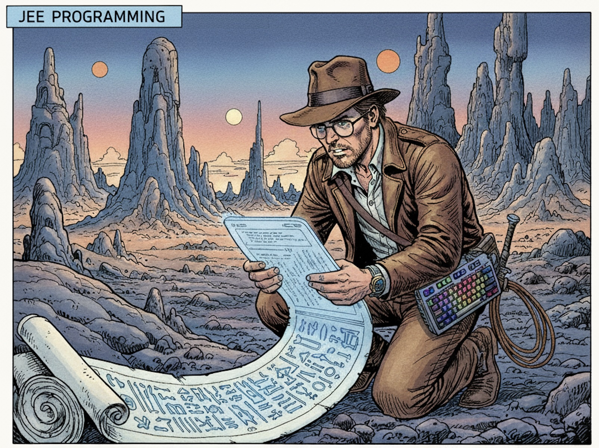
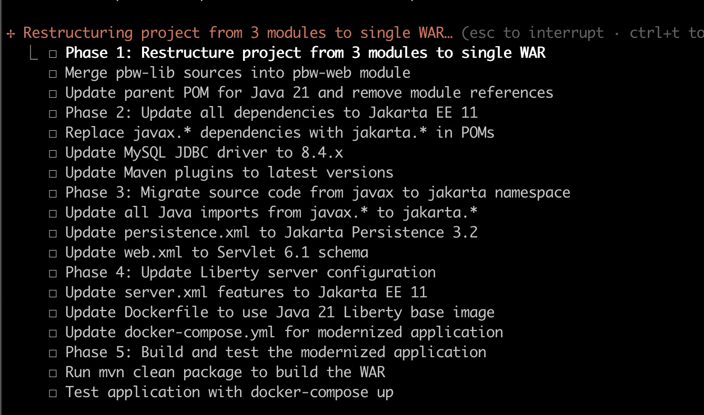
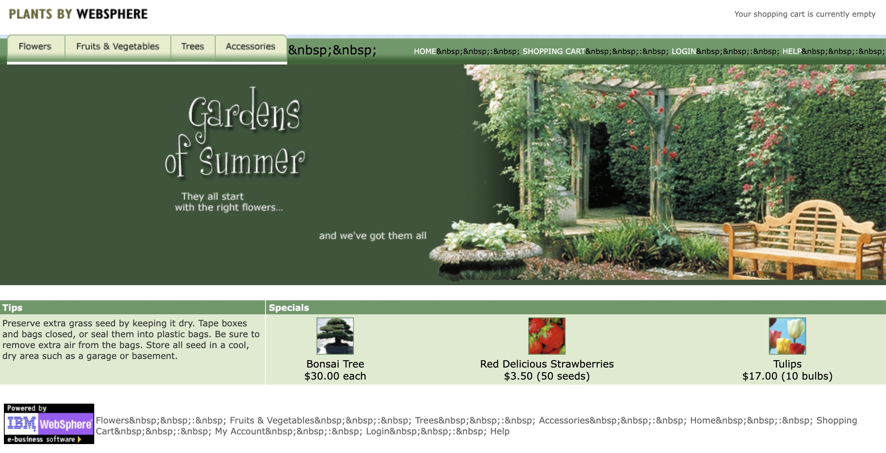
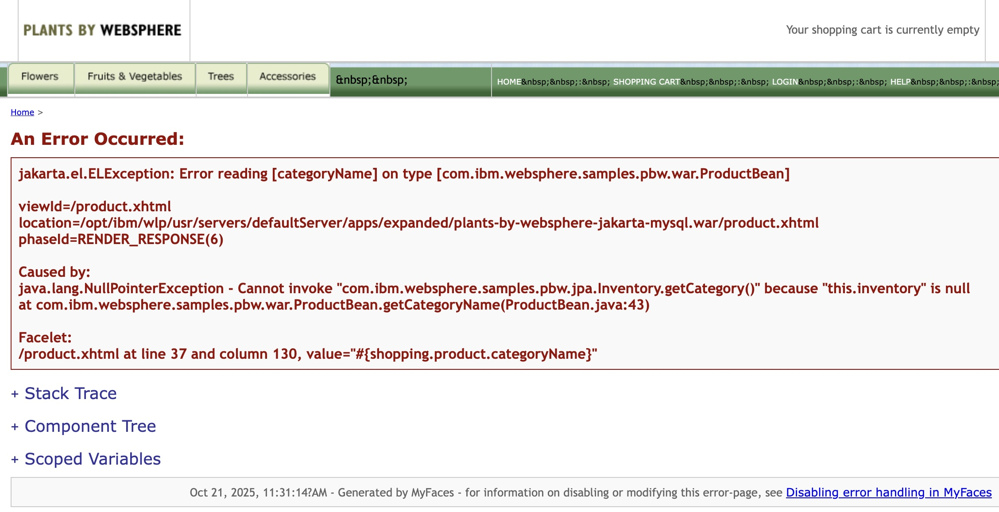
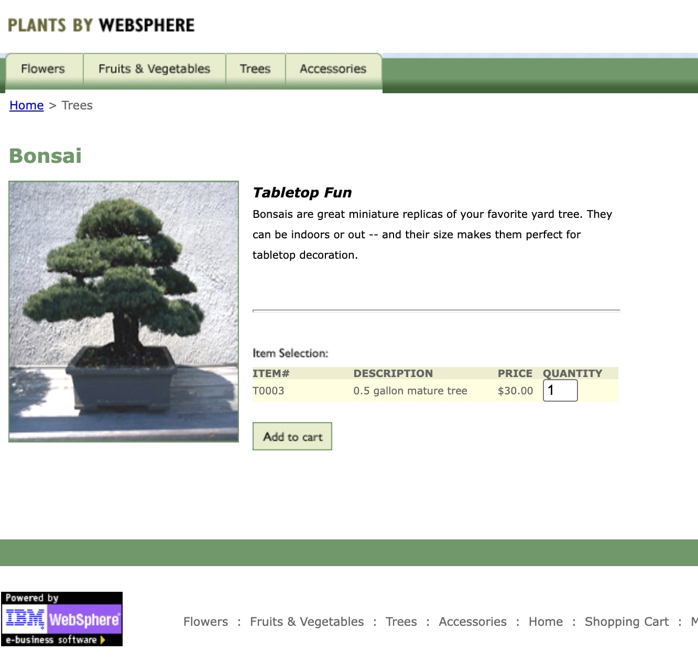

+++
title = 'AI-assisted modernization of Java, part V'
slug = 'ai-assisted-modernization-of-java-part-v'
date = 2025-10-21T11:56:53+02:00
tags = [
    "AI",
    "java",
    "modernization",
]
+++

Disclaimer: This series of articles is about solving an exercise; actual work is going to be more difficult than this. However, by practicing like this, I believe **we can build skills** that will enable us to deal with the more complicated challenges in real life.

Setup:

- Claude Code with Claude Sonnet 4.5
- My global CLAUDE.md is a variant of [Harper Reed's](https://github.com/harperreed/dotfiles/blob/35c2d5508f36b7ad6a845f605c12bcdb16fb15a3/.claude/CLAUDE.md "dotfiles/.claude/CLAUDE.md at 35c2d5508f36b7ad6a845f605c12bcdb16fb15a3 · harperreed/dotfiles · GitHub")
- The repo for the exercise [starting state](https://github.com/xpmatteo/app-modernization-plants-by-websphere-jee6/tree/01099d585c887c26b5bbebc112743555988daab5 "GitHub - xpmatteo/app-modernization-plants-by-websphere-jee6 at 01099d585c887c26b5bbebc112743555988daab5"): Java 6, Java EE 6
- The repo [at the end of this session](https://github.com/xpmatteo/app-modernization-plants-by-websphere-jee6/tree/cd5aa901dd0d5b0760a257856d1501f0948ea023 "GitHub - xpmatteo/app-modernization-plants-by-websphere-jee6 at cd5aa901dd0d5b0760a257856d1501f0948ea023"): Java 21, Jakarta EE 10

# A different approach

In [Part I](https://matteo.vaccari.name/posts/ai-assisted-modernization-of-java-part-i/ "AI-assisted modernization of Java, part I | Matteo Vaccari"), [part II](https://matteo.vaccari.name/posts/ai-assisted-modernization-of-java-part-ii/ "AI-assisted modernization of Java, part II | Matteo Vaccari"), [part III](https://matteo.vaccari.name/posts/ai-assisted-modernization-of-java-part-iii/ "AI-assisted modernization of Java, part III | Matteo Vaccari") and [part IV](https://matteo.vaccari.name/posts/ai-assisted-modernization-of-java-part-iv/ "AI-assisted modernization of Java, part IV | Matteo Vaccari"), we modernized this app by porting it to Spring Boot. Now we explore an alternative path.

I was [challenged by my friend Uberto Barbini](https://www.linkedin.com/feed/update/urn:li:activity:7384876850445094912?commentUrn=urn%3Ali%3Acomment%3A%28activity%3A7384876850445094912%2C7385913554920534016%29&amp;replyUrn=urn%3Ali%3Acomment%3A%28activity%3A7384876850445094912%2C7385993029830131712%29&amp;dashCommentUrn=urn%3Ali%3Afsd_comment%3A%287385913554920534016%2Curn%3Ali%3Aactivity%3A7384876850445094912%29&amp;dashReplyUrn=urn%3Ali%3Afsd_comment%3A%287385993029830131712%2Curn%3Ali%3Aactivity%3A7384876850445094912%29 "AI-assisted modernization of Java, part IV | Matteo Vaccari") about Spring Boot being more maintainable than <abbr title="Java Enterprise Edition">JEE</abbr>. I think that maintainability depends on context; in places where Spring Boot is the norm, you want to avoid JEE and the other way around.  I personally find that JEE has a number of nonsensical features, which I [discussed in this document](https://speakerdeck.com/xpmatteo/the-unix-way-vs-the-java-enterprise-edition-way "The UNIX Way vs. the Java Enterprise Edition Way - Speaker Deck"), but in the end I find it unpalatable because solving problems in JEE often amounts to figuring out arcane incantations in extensive, cryptic and poorly-documented XML files. 

<figure>
  
</figure>

In response to this challenge, I asked myself if what Uberto says is true, that once a JEE app is properly configured, maintenance is a breeze.  Let's see how hard it is to update the Plants By WebSphere demo app, which is so out-of-date that it uses Java 6, to modern Java and up-to-date dependencies.  With AI assistance of course!

This is a special episode: we pause the story arc of how we port JEE to Spring Boot, and present a "what if we wanted to stay with JEE after all".  Instead of creating a duplicate of the legacy app in a separate folder, we will **modernize the existing app in place**.

The goal is still to make the application *safe to operate*:

 - using up-to-date compilers and dependencies
 - easy to update through an appropriate package manager
 - running locally
 - well tested

## Getting started

I created a branch of the repo called "modernize-jee" from the last original commit of the original repo.

First step: `/init`.  Claude Code (CC) reads the codebase and prepares a `CLAUDE.md` that summarizes the architecture and how to work with the repo.

Second step: given that the `CLAUDE.md` does not mention how to run the application locally, we ask: 

<blockquote>
<b>how would we run the application?</b>  

* * *

⏺ Based on my analysis, Captain Matt, this application is designed primarily for Kubernetes/OpenShift deployment rather than local development. However, I can see how to run it
  locally. Let me create a practical guide:

  How to Run the Application

  Option 1: Local Development with Docker (Recommended for Testing)

  You'd need to:

  1. Build the application:
  2. Start a MariaDB/MySQL database:
  3. Initialize the database schema:
  4. Build and run the Liberty container:
  5. Access the application:

  Option 2: Kubernetes/OpenShift (Production-like)

  This appears to be the primary intended deployment method for this app:

  1. Build and push the Docker image to a registry
  2. Create database secrets: ./scripts/create-secrets.sh
  3. Deploy using Helm chart or generated manifests: ./scripts/create-deployment.sh

  Note: The application doesn't appear to have a docker-compose file or simple local development setup - it's clearly designed for cloud deployment scenarios.

  Would you like me to:
  1. Create a docker-compose.yml file to make local development easier?
  2. Update the CLAUDE.md with these runtime instructions?

<b>by all means create a docker-compose.yml, we need to be able to run locally!</b>
</blockquote>

What happens next is interesting:

- CC sees that the app is configured to run with Java 6, and changes the `pom.xml` to use Java 8
- Updates the maven compiler and maven-war plugins
- Sees that Liberty application server Docker image specified in the existing Dockerfile is not available for our architecture (I'm running on an MacBook with ARM architecture) and finds an alternative version that works
- Starts the docker compose and checks that the application responds on port 9080
- Documents the relevant docker-compose commands in `CLAUDE.md`

Not bad for a single-line prompt!  I commit at this point.

**🏃 The Run-Locally Heuristic** The first thing when starting work on a legacy codebase is to see if you can compile it. The second thing is to see if you can run it locally; this makes the development loop much faster for both humans and AI, as opposed to having to deploy to the cloud before you can see the app running.

## A big leap

The codebase is now on Java 8 and JEE 6.  The current LTS versions are Java 21 and Jakarta EE 11. It seems a big leap. How to get there?

**📋 The Plan-Before-You-Code Heuristic** Before attempting anything complicated, ask the AI to come up with one or more plans. Ask the AI to ask clarifying questions! Actually in this case the AI offered clarifying questions spontaneously.

I put CC in *plan mode*, and ask:

<blockquote>
  <b>hi Claude, I see that this application uses an obsolete version of JEE.  Let's think of a plan to bring it up to the latest version </b>

⏺ Hi Captain Matt! I'll help you develop a plan to modernize this Java EE 6 application to the latest Jakarta EE version. Let me first gather some information about the current  state of the application to create a comprehensive plan.

* * *

⏺ Perfect! Now I have a good understanding of the application. Before I present a plan, let me ask you a few clarifying questions to ensure the modernization approach meets your   needs:

What is your target Jakarta EE version for this modernization?

1. Jakarta EE 8 (javax → jakarta namespace change only) 
  Minimal migration - just namespace changes from javax.* to jakarta.*, compatible with Liberty 20.0.0.9+. Lower risk, faster migration.
2. Jakarta EE 9.1 (full modernization) 
  Full modernization to Jakarta EE 9.1 with modern features. Includes namespace change plus API updates, requires Liberty 21.0.0.3+.
3. Jakarta EE 10 (latest LTS) 
  Latest LTS version with newest features (CDI 4.0, Faces 4.0, etc.). Requires Liberty 22.0.0.9+, most future-proof but highest effort.
4. Type something
</blockquote>

One strategy would be to make the migration in small steps, eg, make the update to JEE 8 first, then test the app, commit, update to JEE 9, test again, and so on.  This is probably what I would recommend generally; but out of curiosity, I asked CC to go in a single step.  Let's see what happens.  The worst that can happen is that it makes a mess and we have to `git reset --hard` and try again.  So I choose 4 and type "Let's go to Jakarta EE 11".

Then it asks me

<blockquote>
  Do you want to modernize the application packaging from EAR to WAR?

1. Keep EAR packaging 
  Minimal changes - keep the current 3-module structure (pbw-lib JAR, pbw-web WAR, pbw-ear EAR). Lower risk.
2. Migrate to single WAR  
Modern approach - consolidate to single WAR module. Simpler deployment, eliminates EAR complexity, aligns with cloud-native best practices
3. Type something
</blockquote>

Of course I choose 2. The less enterprisey the solution, the better.

<blockquote>
What should we do about the JSF-based UI layer?

1. Keep JSF (Jakarta Faces) 
  Migrate existing JSF 2.2 to Jakarta Faces 3.0/4.0. Minimal UI changes, preserves existing application structure
2. Plan future migration to modern UI 
Keep JSF for now but document a future path to React/Angular/Vue. Focuses on backend modernization first
3. Type something
</blockquote>

I chose 1. As much as I think JSF is bad, I would not change it for React/Angular/Vue, with the huge associated cost and complexity.  [Not all frontends need to be a Single Page Application](https://www.thoughtworks.com/radar/techniques/spa-by-default "SPA by default | Technology Radar | Thoughtworks").

<blockquote>
Do you want to update the Java version as part of this modernization?

1. Stay on Java 8 
  Minimal changes - keep current Java 8 compatibility. Lower risk but misses modern Java features."
2. Upgrade to Java 11 (LTS) Modernize to Java 11 LTS with improved performance and features. Well-supported, good balance of risk/benefit
3. Upgrade to Java 17 (LTS) 
Latest LTS with best performance and modern features. Most future-proof, recommended for new deployments.
4. Type something
</blockquote>

I chose 4 and asked for Java 21, which is currently the latest <abbr title='Long term support'>LTS</abbr> version.

It is cool that CC asks me the "clarifying questions".  A few months ago, I used to add "ask me clarifying questions" to all my planning prompts, and now it seems it's no longer necessary: the tools are becoming easier to use.  CC then creates a plan, that I approve.

<blockquote>
⏺ User answered Claude's questions:  

 - What is your target Jakarta EE version for this modernization? → I would like to move to Jakarta EE 11.  
 - Do you want to modernize the application packaging from EAR to WAR? → Migrate to single WAR
 - What should we do about the JSF-based UI layer? → Keep JSF (Jakarta Faces)
 - Do you want to update the Java version as part of this modernization? → Upgrade to Java 21 (LTS)

⏺ Excellent choices, Captain Matt! Jakarta EE 11 with Java 21 is a very modern target. Let me create a comprehensive modernization plan for you.
                                                                                                                                    
⏺ User approved Claude's plan: 
  ⎿  Modernization Plan: Java EE 6 → Jakarta EE 11 + Java 21

 Overview

 Modernize Plants By WebSphere from Java EE 6 (Java 8) to Jakarta EE 11 (Java 21), consolidating from EAR to single WAR packaging.

 Key Changes

1. Jakarta EE 11 Migration - Latest spec (released 2024)
   - Namespace change: javax.* → jakarta.*
   - JPA 3.2, Faces 4.1, Servlet 6.1, CDI 4.1, EJB 4.0
   - Requires WebSphere Liberty 24.0.0.3+
2. Java 21 Upgrade
   - Update compiler source/target: 1.8 → 21
   - Modern JDK with virtual threads, pattern matching, records
3. Packaging Modernization
   - Consolidate 3 modules (pbw-lib, pbw-web, pbw-ear) → single WAR
   - Simplify deployment, align with cloud-native practices
4. Infrastructure Updates
   - Update Liberty base image to latest Java 21 version
   - Update MySQL JDBC driver to modern version (8.x)
   - Update Maven plugins to latest versions

 Implementation Steps

 Phase 1: Project Structure
 - Convert to single WAR module structure
 - Merge pbw-lib sources into pbw-web
 - Update parent POM for Java 21 and Jakarta EE 11

 Phase 2: Dependency Migration
 - Replace javax.* dependencies with jakarta.* equivalents
 - Update to Jakarta EE 11 API versions
 - Update MySQL connector to 8.4.x (latest)
 - Update Maven plugins (compiler, war, etc.)

 Phase 3: Source Code Migration
 - Global find/replace: javax.* → jakarta.* imports
 - Update JPA persistence.xml to Jakarta Persistence 3.2
 - Update web.xml to Servlet 6.1 schema
 - Update faces-config.xml (if exists) to Faces 4.1

 Phase 4: Liberty Configuration
 - Update server.xml features for Jakarta EE 11
 - Update Docker base image to Java 21
 - Update JDBC driver configuration

 Phase 5: Build & Test
 - Update docker-compose.yml for new image
 - Build and test application
 - Validate all functionality works

 Files to Modify

 - pom.xml (parent + modules consolidation)
 - All *.java files (namespace changes)
 - persistence.xml, web.xml, server.xml
 - Dockerfile, docker-compose.yml
 - Remove pbw-ear module entirely

 Risk Mitigation

 - Test thoroughly with docker-compose after each phase
 - Keep git history for easy rollback
 - Validate database schema compatibility

⏺ Perfect! Let's start the modernization. I'll begin by creating a comprehensive todo list to track this multi-phase project:
</blockquote>

CC writes a big todo-list and starts working on it

<figure>

</figure>

At some point it finds some difficulty in getting the Liberty app server to use JEE 11, so it decides to go with JEE 10 instead. It's OK, because it turns out that WebSphere Liberty [does not support JEE 11 yet](https://jakarta.ee/compatibility/download/ "Jakarta EE Compatible Products | Enterprise Java Application and Web Servers | Jakarta EE | The Eclipse Foundation"), and I'm happy to see it working on JEE 10 as an intermediate step.  After 10 minutes or so, CC claims victory!  I try the app url, and sure enough, I see an error message, so I ask it to test it "manually", and given that I configured the Puppeteer MCP server, CC opens the app, sees errors and fixes them.  After another 5 minutes or so, it claims victory again.  Now the application starts, and I'm impressed!  But not all is OK.  Graphical glitches: see all the &amp;nbsp;'s 

<figure>

</figure>

Clicking on the "Bonsai tree" link gives an error.

<figure>

</figure>

I commit what we have now, even if it's broken.

## Fixing

With the major migration complete but the app partially broken, it was time to debug the issues. The next logical step is to ask CC to fix these problems, one by one. But first, let's clear the context.

The &amp;nbsp; problem is quickly fixed by just asking.  I'm being lazy here, I could have fixed it myself with a simple search and replace.

Then I ask to fix the broken product page. CC quickly finds out that the problem is that the DB isn't populated, and finds that the way to populate the DB should be through the `AdminServlet`; then finds that the `AdminServlet` is broken, and fixes it. 

<blockquote>
⏺ Summary

  I've successfully fixed the issues with the JEE 10 port, Captain Matt! Here's what was wrong and what I fixed:

  Problems Found:

  1. &nbsp; entities displaying literally: After the JEE 10 migration, the double-encoded &amp;nbsp; entities were showing as literal text instead of spaces
    - Fixed in: pbw-web/src/main/.../PlantTemplate.xhtml:90-96, 117-131
    - Solution: Changed &amp;nbsp; to &nbsp; (the proper named entity)
  2. AdminServlet null pointer bug: Missing else clause on line 108 caused a NullPointerException when admintype parameter was missing
    - Fixed in: pbw-web/src/main/.../AdminServlet.java:107
    - Solution: Changed if to else if to prevent execution when admintype is null
  3. Missing pbw.properties file: The database populate function couldn't find the properties file because it was only in pbw-lib, not in pbw-web
    - Fixed by: Copying pbw-lib/src/main/resources/pbw.properties to pbw-web/src/main/resources/
    - Solution: This file contains all the inventory data needed to populate the database

  Results:

  - Navigation bar now displays correctly with proper spacing
  - Footer navigation displays correctly
  - Database successfully populated with 43 inventory items
  - Bonsai tree product page loads without errors and shows: "Tabletop Fun" description, price $30.00, and proper product details

  The application is now working correctly!  
</blockquote>

<figure>
  
</figure>

I tested the purchase workflow until the Submit Order page; there was a bug.  I showed a screenshot of the problem to CC, and it fixed it in a minute.

After all of this work, it was time to update the `CLAUDE.md` file that we created at the beginning, for the benefit of future sessions.  It's just a matter of asking: **please update CLAUDE.md to reflect the current state of the app**

# Conclusions

Let's get back to our earlier definition of "safe to operate". We got a lot done, but there is still a big omission:

 - ✅ using up-to-date compilers and dependencies (reasonably up-to-date: JEE 11 is still quite new, having been [released in June 2025](https://projects.eclipse.org/projects/ee4j.jakartaee-platform/releases/11 "Jakarta EE Platform 11 | projects.eclipse.org"))
 - ✅ easy to update through an appropriate package manager (maven)
 - ✅ running locally (with docker-compose)
 - ❌ well tested

The legacy application has no tests at all. We will have to get back to the tests in another episode as this one is long enough already.

The in-place modernization was surprisingly successful. In approximately one hour of work, we:

- Upgraded Java 6 → Java 21 (3 major LTS versions)
- Migrated JEE 6 → Jakarta EE 10 (skipping 4 major versions)
- Consolidated EAR packaging → single WAR (modern cloud-native approach)
- Fixed a few bugs

What is missing:

- automated tests

## In-place vs rewrite: what we learned

If we're staying on the same tech stack, in-place modernization can be viable. The AI handled the tedious aspects brilliantly.  There is some truth in what Uberto says, that JEE technology is stable enough over the years; however, it requires a lot of expertise to pull off the upgrades, *unless you have the AI to help you*.  I suppose that porting a Spring Boot application from Spring Boot 1.x to 3.x would require a similar level of work, and a comparable level of expertise, but of course, it all depends on the specific application.

Would I do something different?  We were lucky that CC was able to port from JEE 6 to 10 in one go.  If this was a real project, I would probably do much smaller and careful steps.  On the other hand, to paraphrase [Steve Freeman](https://wiki.c2.com/?SteveFreeman), you never know what a step that's too big looks like until you make a step that's too big!  We're here to experiment and check out what's possible.

Did the AI help?  Completely.  The AI excelled at technology details, such as package namespace migrations, configuration updates, debugging cryptic JEE errors, and was especially useful when I am clueless about this technology, and I do not particularly wish to become an expert either.

What required human skill: deciding the step size, committing frequently, keeping CLAUDE.md up-to-date. Checking the app manually. Asking the right questions.

I am not a fan of frameworks, and JEE is one that I'm the least a fan of; however, the best choice depends on your organizational context and preferences.  Whatever framework I'm using, I like to keep it away from the important logic, so that the latter can be tested without fuss.  The legacy application we have here, unfortunately, couples important logic to the framework in a way that makes testing problematic, as we will see if we will do another episode about testing the legacy.

## Takeaway

With AI assistance, technical migrations that once could have taken weeks can now be done in hours, but we need to apply the right heuristics to keep the AI on track.

*Want to leave a comment? [Please do so on Linkedin](https://www.linkedin.com/posts/matteovaccari_another-episode-in-my-ai-assisted-java-modernization-activity-7386423138722418688-jugK "Another episode in my AI-assisted Java modernization series.  This time we try something different: we port the legacy JEE version in-place, from JEE 6 to Jakarta EE 10, and from Java 6 to Java… | Matteo Vaccari")!*
