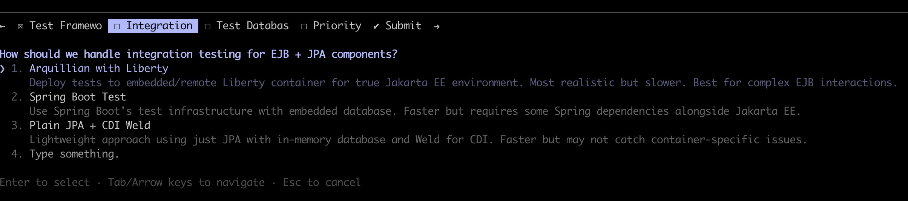

## Testing

Let's get back to our earlier definition of "safe to operate". We got a lot done, but there is still a big omission:

 - ✅ using up-to-date compilers and dependencies (reasonably up-to-date: JEE 11 is still quite new, having been [released in June 2025](https://projects.eclipse.org/projects/ee4j.jakartaee-platform/releases/11 "Jakarta EE Platform 11 | projects.eclipse.org"))
 - ✅ easy to update through an appropriate package manager (maven)
 - ✅ running locally (with docker-compose)
 - ❌ well tested

The legacy application has no tests at all.  Let's discuss with CC how to fix this.

<blockquote>
**Hi Claude, this app has no tests!  Let's discuss a testing strategy**

⏺ Hi Captain Matt! You're absolutely right - I can see this is a Jakarta EE 10 application with no test coverage. Let me explore the codebase structure to understand what we're  working with, then we can discuss a comprehensive testing strategy.

⏺ Explore(Explore codebase testing needs)
  ⎿  Done (21 tool uses · 47.4k tokens · 51.2s)

⏺ Perfect! Now let me discuss the testing strategy with you, Captain Matt.

  Testing Strategy Discussion

  Based on my exploration, this is a substantial Jakarta EE 10 application with zero test coverage - a great opportunity to build a comprehensive testing strategy from the
  ground up!

  Key Findings

  Application Complexity:
  - Multi-layered architecture: JPA entities → Stateless/Stateful EJBs → Servlets → JSF backing beans
  - Core business flows: customer registration, shopping cart, order processing, inventory management with back orders
  - Stateful shopping cart (10-min timeout) with complex order creation logic
  - Pessimistic locking for inventory updates
  - Security role enforcement on back order management

  Critical Business Logic:
  - Shopping cart that merges duplicate items and checks inventory
  - Order creation that deducts inventory and triggers back orders atomically
  - Customer authentication with password verification
  - Database population via AdminServlet

  My Recommended Testing Strategy

  Given your ATDD preference, I suggest we follow this approach:

  Phase 1: Start with Acceptance Tests

  Focus on complete user-facing workflows:
  1. Customer journey: Register → Login → Browse catalog → Add to cart → Checkout
  2. Admin workflow: Populate database with sample data
  3. Inventory/back order flow: Purchase item → Trigger back order → Fulfill back order

  Phase 2: Integration Tests for Critical Transactions

  Test EJB + JPA interactions with real database:
  - Shopping cart operations with inventory checks
  - Order creation with concurrent inventory updates (test pessimistic locking)
  - Back order creation when stock is insufficient
  - Customer authentication

  Phase 3: Unit Tests for Business Logic

  Test individual components in isolation:
  - JPA entity validation (Customer has @Pattern for zip codes, phone numbers)
  - EJB business methods with mocked EntityManager
  - Utility/validation functions  
</blockquote>

It then shows me a bunch of questions, like which unit testing framework I want (Junit 5, of course) and how should we approach the integration tests.

<figure>
  
</figure>

The integration tests options I am very uncomfortable with.  It seems that the only way to test the things that matter (eg., when I submit an order, depending on the inventory levels of the stuff I'm buying, a backorder could be automatically created to replenish the warehouse.)  This sort of important tests should, in my view, not be burdened with all this infrastructure concerns.  In the Spring Boot port, we can do fast and reliable integration tests by building a subset of the application with direct injection and using a test data source.  We bypass the Spring Context completely, and this is relatively safe because, the way I like to use Spring Boot, dependency injection is straightforward, ie, I tend to use the framework as little as possible.  The framework is a detail, and should be kept away from the important logic as much as possible.

But here, it's unclear how we can get by without loading the full JEE context.  Let's discuss with the AI.

**The Discuss With The AI heuristic**: a lot of the value of working with the AI comes out of the discussions we can have with it. When we are unsure on how to proceed, let's explain our concerns to the AI and see what it comes up with.  It's the ultimate rubber duck!

<blockquote>
⏺ User declined to answer questions

<b>I'm concerned about the integration tests.  I'm uncomfortable with using things like Arquilian for testing the core logic of the application.  For instance, let's see what  happens when we submit an order.  I understand there should be checks on inventory levels, am I right? Where is this happening and how could we test it?</b>

⏺ Great question, Captain Matt! Let me trace through the order submission flow to understand the inventory checking logic and how we could test it without heavy integration  frameworks like Arquillian.

* * *

⏺ Perfect! Now I have a complete picture. Let me explain what I found, Captain Matt:

Order Submission and Inventory Checking Flow

You're absolutely right that there are inventory checks! Here's what happens:

The Flow (AccountBean.java:126-176)

1. Order Creation First (line 132-143): shoppingCart.createOrder() is called, which:
  - Creates OrderItem objects from cart items
  - Persists the Order entity
  - Does NOT check inventory at this point
2. THEN Inventory Checking (line 149-159): After the order is persisted, the code loops through cart items and calls:
shoppingCart.checkInventory(si);

* * *

The Problem I See

The order is created BEFORE checking inventory! This means:
- Orders are always accepted, even with zero stock
- Inventory can go negative
- Back orders are created after-the-fact

How We Could Test This (Without Arquillian!)

This is actually pure business logic that can be tested with minimal infrastructure:

```java
@Test
public void testCheckInventory_withSufficientStock() {
    // Arrange
    EntityManager mockEm = mock(EntityManager.class);
    ShoppingCartBean cart = new ShoppingCartBean();
    // Inject mock EM via reflection (or create a test-friendly constructor)

    Inventory dbInventory = new Inventory();
    dbInventory.setInventoryId("TREE001");
    dbInventory.setQuantity(100);
    dbInventory.setMinThreshold(10);

    Inventory cartItem = new Inventory();
    cartItem.setInventoryId("TREE001");
    cartItem.setQuantity(5);  // Buying 5

    when(mockEm.find(Inventory.class, "TREE001")).thenReturn(dbInventory);

    // Act
    cart.checkInventory(cartItem);

    // Assert
    assertEquals(95, dbInventory.getQuantity());
    verify(mockEm, never()).persist(any(BackOrder.class));  // No back order needed
}

@Test
public void testCheckInventory_withInsufficientStock_createsBackOrder() {
    // Arrange
    EntityManager mockEm = mock(EntityManager.class);
    ShoppingCartBean cart = new ShoppingCartBean();

    Inventory dbInventory = new Inventory();
    dbInventory.setInventoryId("TREE001");
    dbInventory.setQuantity(3);  // Only 3 in stock
    dbInventory.setMinThreshold(10);

    Inventory cartItem = new Inventory();
    cartItem.setInventoryId("TREE001");
    cartItem.setQuantity(5);  // Trying to buy 5

    when(mockEm.find(Inventory.class, "TREE001")).thenReturn(dbInventory);
    when(mockEm.find(BackOrder.class, "TREE001")).thenReturn(null);  // No existing back order

    // Act
    cart.checkInventory(cartItem);

    // Assert
    assertEquals(-2, dbInventory.getQuantity());  // Goes negative!
    verify(mockEm).persist(any(BackOrder.class));  // Back order created
}
```

This is just mocking EntityManager - no Arquillian, no embedded server, no database!

What do you think?

1. Should we test this logic with mocked EntityManager (fast, isolated unit tests)?
2. Or would you prefer a real in-memory database (H2/Derby) for integration tests to verify JPA behavior?
3. Are you concerned about the "order first, check inventory second" flow? Should we test the current behavior or propose a refactor?
</blockquote>

Now we're getting somewhere.  The AI found what's probably the most interesting business logic in this codebase, and is proposing a way to test in a purely isolated way.  I like the idea; however, there's a lot that can go wrong.  I take a look at the code being tested

```java
/**
 * Provides a combination of JSF action and backing bean support for the account
 * web page.
 *
 */
@Named("account")
@SessionScoped
public class AccountBean implements Serializable {
// ...
	@EJB
	private CustomerMgr login;
	@EJB
	private MailerBean mailer;
	@Inject
	private ShoppingCartBean shoppingCart;
// ...

	public String performCompleteCheckout() {
		FacesContext context = FacesContext.getCurrentInstance();
		context.getApplication()
				.evaluateExpressionGet(context, "#{shopping}", ShoppingBean.class);

		// persist the order
		OrderInfo oi = new OrderInfo(shoppingCart.createOrder(
				customer.getCustomerID(), orderInfo.getBillName(),
				orderInfo.getBillAddr1(), orderInfo.getBillAddr2(),
				orderInfo.getBillCity(), orderInfo.getBillState(),
				orderInfo.getBillZip(), orderInfo.getBillPhone(),
				orderInfo.getShipName(), orderInfo.getShipAddr1(),
				orderInfo.getShipAddr2(), orderInfo.getShipCity(),
				orderInfo.getShipState(), orderInfo.getShipZip(),
				orderInfo.getShipPhone(), orderInfo.getCardName(),
				orderInfo.getCardNum(), orderInfo.getCardExpMonth(),
				orderInfo.getCardExpYear(), orderInfo.getCardholderName(),
				orderInfo.getShippingMethod(), shoppingCart.getItems()));

		lastOrderNum = oi.getID();

		Util.debug("Account.performCompleteCheckout: order id =" + orderInfo);

		// Check the available inventory and backorder if necessary.
		if (shoppingCart != null) {
			Inventory si;
			Collection<Inventory> items = shoppingCart.getItems();
			for (Object o : items) {
				si = (Inventory) o;
				shoppingCart.checkInventory(si);
				Util.debug("ShoppingCart.checkInventory() - checking Inventory quantity of item: "
						+ si.getID());
			}
		}
		try {
			mailer.createAndSendMail(customer, oi.getID());
		} catch (MailerAppException e) {
			System.out.println("MailerAppException:" + e);
			e.printStackTrace();
		} catch (Exception e) {
			System.out.println("Exception during create and send mail :" + e);
			e.printStackTrace();
		}

		orderInfo = null;

		// shoppingCart.setCartContents (new ShoppingCartContents());
		shoppingCart.removeAllItems();

		return AccountBean.ACTION_ORDERDONE;
	}  
```

This code has a number of problems:

 - it swallows exceptions without proper logging
 - it is coupled to a UI page
 - it is coupled to JSF
 - it is coupled to JPA
 - it is coupled to the mailer
 - as CC pointed out, it accepts any order even if we don't have the goods in the warehouse. 


