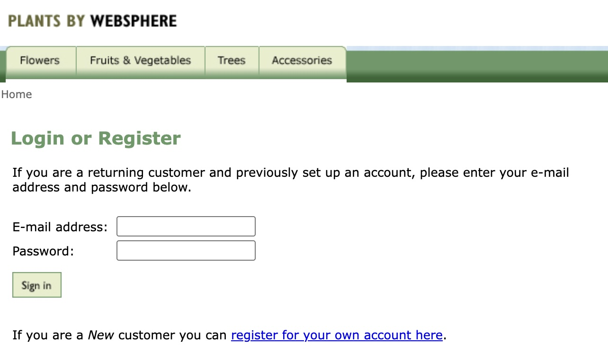
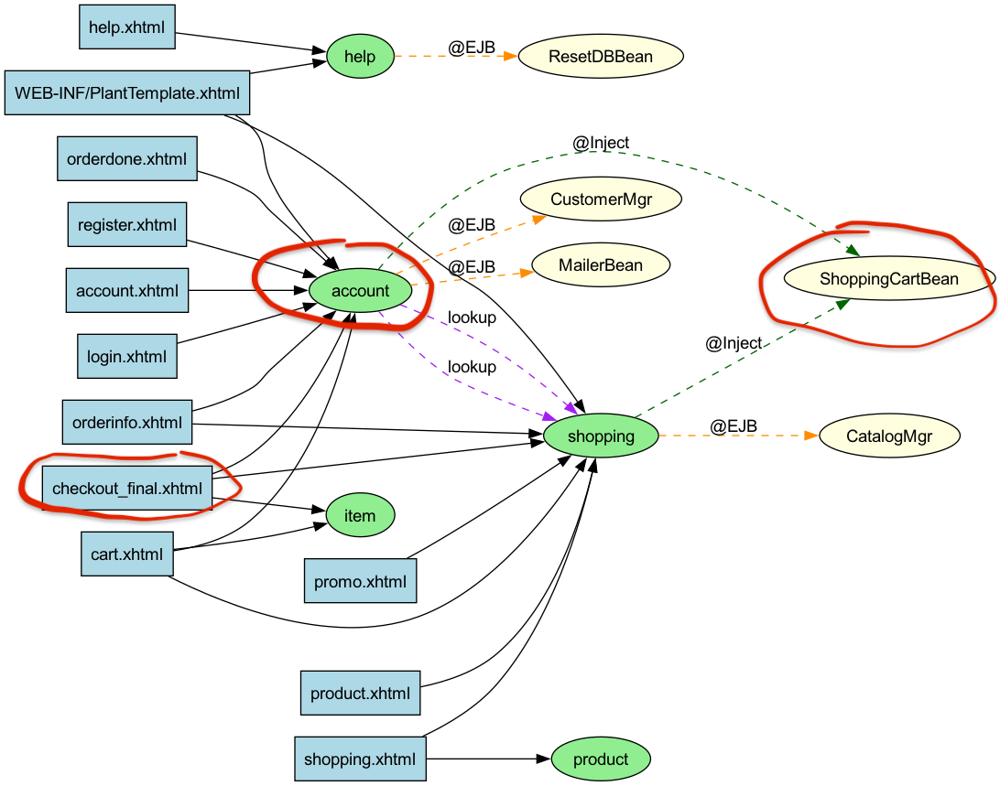

+++

title = 'AI-Assisted Modernization Part VI: testing the in-place modernization'
slug = 'ai-assisted-modernization-part-vi'
date = 2025-10-22T16:18:09+02:00
tags = [
    "Default",
]
draft = true
+++


# In-place modernization, continued from part V

In the previous part of this series, we tried a different modernization approach: porting to up-to-date JEE instead of porting to Spring Boot.  To complete the discussion, we should discuss how we test it.

Let's get back to our earlier definition of "safe to operate". We got a lot done, but there is still a big omission:

 - ✅ using up-to-date compilers and dependencies (reasonably up-to-date: JEE 11 is still quite new, having been [released in June 2025](https://projects.eclipse.org/projects/ee4j.jakartaee-platform/releases/11 "Jakarta EE Platform 11 | projects.eclipse.org"))
 - ✅ easy to update through an appropriate package manager (maven)
 - ✅ running locally (with docker-compose)
 - ❌ well tested

The legacy application has no tests at all.  Let's discuss with CC how to design a *testing strategy*.  

**The Discuss With The AI heuristic**: a lot of the value of working with the AI comes out of the discussions we can have with it. When we are unsure on how to proceed, let's explain our concerns to the AI and see what it comes up with.


## The initial discussion

<blockquote>
<b>Hi Claude, this app has no tests!  Let's discuss a testing strategy</b>

⏺ Hi Captain Matt! You're absolutely right - I can see this is a Jakarta EE 10 application with no test coverage. Let me explore the codebase structure to understand what we're  working with, then we can discuss a comprehensive testing strategy.

⏺ Explore(Explore codebase testing needs)<br>
  ⎿  Done (21 tool uses · 47.4k tokens · 51.2s)

⏺ Perfect! Now let me discuss the testing strategy with you, Captain Matt.

  Testing Strategy Discussion

  Based on my exploration, this is a substantial Jakarta EE 10 application with zero test coverage - a great opportunity to build a comprehensive testing strategy from the  ground up!

  Key Findings

  [...]

  Critical Business Logic:
  - Shopping cart that merges duplicate items and checks inventory
  - Order creation that deducts inventory and triggers back orders atomically
  - Customer authentication with password verification
  - Database population via AdminServlet

  My Recommended Testing Strategy

  Given your ATDD preference, I suggest we follow this approach:

  Phase 1: Start with Acceptance Tests

  Focus on complete user-facing workflows:
  1. Customer journey: Register → Login → Browse catalog → Add to cart → Checkout
  2. Admin workflow: Populate database with sample data
  3. Inventory/back order flow: Purchase item → Trigger back order → Fulfill back order

  Phase 2: Integration Tests for Critical Transactions

  Test EJB + JPA interactions with real database:
  - Shopping cart operations with inventory checks
  - Order creation with concurrent inventory updates (test pessimistic locking)
  - Back order creation when stock is insufficient
  - Customer authentication

  Phase 3: Unit Tests for Business Logic

  Test individual components in isolation:
  - JPA entity validation (Customer has @Pattern for zip codes, phone numbers)
  - EJB business methods with mocked EntityManager
  - Utility/validation functions  
</blockquote>

It then shows me a bunch of questions, like which unit testing framework I want (Junit 5, of course) and how should we approach the integration tests.

<figure>
  
</figure>

The integration tests options make me uncomfortable.  It seems that the only way to test the things that matter (eg., when I submit an order, depending on the inventory levels of the stuff I'm buying, a backorder could be automatically created to replenish the warehouse.)  This sort of important tests should, in my view, not be burdened with all this infrastructure concerns.  In the Spring Boot port, we can do fast and reliable integration tests by building a subset of the application with direct injection and using a test data source.  We bypass the Spring Context completely, and this is relatively safe because, the way I like to use Spring Boot, dependency injection is straightforward, ie, I tend to use the framework as little as possible.  The framework is a detail, and should be kept away from the important logic as much as possible.

## How to run integration tests?

But here, it's unclear how we can get by without loading the full JEE context.  Let's discuss.

<blockquote>
⏺ User declined to answer questions

<b>I'm concerned about the integration tests.  I'm uncomfortable with using things like Arquilian for testing the core logic of the application.  For instance, let's see what  happens when we submit an order.  I understand there should be checks on inventory levels, am I right? Where is this happening and how could we test it?</b>

⏺ Great question, Captain Matt! Let me trace through the order submission flow to understand the inventory checking logic and how we could test it without heavy integration  frameworks like Arquillian.

* * *

⏺ Perfect! Now I have a complete picture. Let me explain what I found, Captain Matt:

Order Submission and Inventory Checking Flow

You're absolutely right that there are inventory checks! Here's what happens:

The Flow (AccountBean.java:126-176)

1. Order Creation First (line 132-143): shoppingCart.createOrder() is called, which:
  - Creates OrderItem objects from cart items
  - Persists the Order entity
  - Does NOT check inventory at this point
2. THEN Inventory Checking (line 149-159): After the order is persisted, the code loops through cart items and calls:
shoppingCart.checkInventory(si);

* * *

The Problem I See

The order is created BEFORE checking inventory! This means:
- Orders are always accepted, even with zero stock
- Inventory can go negative
- Back orders are created after-the-fact

How We Could Test This (Without Arquillian!)

This is actually pure business logic that can be tested with minimal infrastructure:

```java
@Test
public void testCheckInventory_withSufficientStock() {
    // Arrange
    EntityManager mockEm = mock(EntityManager.class);
    ShoppingCartBean cart = new ShoppingCartBean();
    // Inject mock EM via reflection (or create a test-friendly constructor)

    Inventory dbInventory = new Inventory();
    dbInventory.setInventoryId("TREE001");
    dbInventory.setQuantity(100);
    dbInventory.setMinThreshold(10);

    Inventory cartItem = new Inventory();
    cartItem.setInventoryId("TREE001");
    cartItem.setQuantity(5);  // Buying 5

    when(mockEm.find(Inventory.class, "TREE001")).thenReturn(dbInventory);

    // Act
    cart.checkInventory(cartItem);

    // Assert
    assertEquals(95, dbInventory.getQuantity());
    verify(mockEm, never()).persist(any(BackOrder.class));  // No back order needed
}

@Test
public void testCheckInventory_withInsufficientStock_createsBackOrder() {
    // Arrange
    EntityManager mockEm = mock(EntityManager.class);
    ShoppingCartBean cart = new ShoppingCartBean();

    Inventory dbInventory = new Inventory();
    dbInventory.setInventoryId("TREE001");
    dbInventory.setQuantity(3);  // Only 3 in stock
    dbInventory.setMinThreshold(10);

    Inventory cartItem = new Inventory();
    cartItem.setInventoryId("TREE001");
    cartItem.setQuantity(5);  // Trying to buy 5

    when(mockEm.find(Inventory.class, "TREE001")).thenReturn(dbInventory);
    when(mockEm.find(BackOrder.class, "TREE001")).thenReturn(null);  // No existing back order

    // Act
    cart.checkInventory(cartItem);

    // Assert
    assertEquals(-2, dbInventory.getQuantity());  // Goes negative!
    verify(mockEm).persist(any(BackOrder.class));  // Back order created
}
```

This is just mocking EntityManager - no Arquillian, no embedded server, no database!

What do you think?

1. Should we test this logic with mocked EntityManager (fast, isolated unit tests)?
2. Or would you prefer a real in-memory database (H2/Derby) for integration tests to verify JPA behavior?
3. Are you concerned about the "order first, check inventory second" flow? Should we test the current behavior or propose a refactor?
</blockquote>

Now we're getting somewhere.  The AI found what's probably the most interesting business logic in this codebase, and is proposing a way to test in a purely isolated way.  I like the idea; however, there's a lot that can go wrong.  I take a look at the code being tested

```java
/**
 * Provides a combination of JSF action and backing bean support for the account
 * web page.
 *
 */
@Named("account")
@SessionScoped
public class AccountBean implements Serializable {
// ...
  @EJB
  private MailerBean mailer;
  @Inject
  private ShoppingCartBean shoppingCart;
// ...

  public String performCompleteCheckout() {
    // persist the order
    OrderInfo oi = new OrderInfo(shoppingCart.createOrder(
        customer.getCustomerID(), orderInfo.getBillName(),
        orderInfo.getBillAddr1(), orderInfo.getBillAddr2(),
        orderInfo.getBillCity(), orderInfo.getBillState(),
        orderInfo.getBillZip(), orderInfo.getBillPhone(),
        orderInfo.getShipName(), orderInfo.getShipAddr1(),
        orderInfo.getShipAddr2(), orderInfo.getShipCity(),
        orderInfo.getShipState(), orderInfo.getShipZip(),
        orderInfo.getShipPhone(), orderInfo.getCardName(),
        orderInfo.getCardNum(), orderInfo.getCardExpMonth(),
        orderInfo.getCardExpYear(), orderInfo.getCardholderName(),
        orderInfo.getShippingMethod(), shoppingCart.getItems()));

    lastOrderNum = oi.getID();

    Util.debug("Account.performCompleteCheckout: order id =" + orderInfo);

    // Check the available inventory and backorder if necessary.
    if (shoppingCart != null) {
      Inventory si;
      Collection<Inventory> items = shoppingCart.getItems();
      for (Object o : items) {
        si = (Inventory) o;
        shoppingCart.checkInventory(si);
        Util.debug("ShoppingCart.checkInventory() - checking Inventory quantity of item: "
            + si.getID());
      }
    }
    try {
      mailer.createAndSendMail(customer, oi.getID());
    } catch (MailerAppException e) {
      System.out.println("MailerAppException:" + e);
      e.printStackTrace();
    } catch (Exception e) {
      System.out.println("Exception during create and send mail :" + e);
      e.printStackTrace();
    }

    orderInfo = null;
    shoppingCart.removeAllItems();
    return AccountBean.ACTION_ORDERDONE;
  }  
```

This code has a number of problems:

 - it swallows exceptions without proper logging
 - it is coupled to a UI page
 - it is coupled to JPA
 - it is coupled to the mailer
 - it receives dependencies thanks to mysterious (to me) annotation: there is no constructor
 - it does too many things! The checkInventory call is probably doing lots of complicated stuff 

Let's park this discussion for a moment, and start another conversation

**The Start Again heuristic**: it pays to try something more than one way. The discussion might go differently, and you might learn new things.

## Deciding on a testing strategy

This conversation is interesting, if very long. I start by asking about Playwright, because I have previous experience with it, it is available as a convenient Java dependency, and it seems to work well.  Claude sounds enthusiastic about this choice, and writes a small essay. For completeness, and following **The Ask For Options heuristics**, I ask about alternatives to Playwright, and I get another small essay. Then I ask for options for the rest of our testing strategy, and get a third small essay.  The whole conversation is in the appendix; you will probably find it interesting.

Claude is proposing a comprehensive test strategy, but its plan is way too ambitious for a single session. Anyways, at the end of this conversation, *I* have a plan 🙂.  Generally speaking, from my experience, a good testing strategy for an app has four classes of tests.

1. Isolated unit tests: with no external dependencies, testing one unit of behaviour, they run very fast and they support minute-by-minute development.  Usually produced with TDD, but sometimes, in the case of legacy, they must be written after the fact.
2. Focused integration tests: typically, testing adapters, for instance database repositories.  I usually set up a test data source on a test DB that has the same technology and the same schema as the production one (at one point we went all the way to set up an Oracle DB in a container just for this purpose).  If I'm testing something that sends email, I might set up a local SMTP server just for this purpose.  They key here is that the "external" tech that I'm using is run locally, fully under my control.  In some cases, it could be running somewhere else, for instance when we work with cloud resources, but still, they would be cloud resources fully created by *me* and dedicated to *me* and the person I'm pairing with.  We don't want this type of tests to fail because some external resource is in some unexpected state.  These tests are still reasonably fast, eg, all the tests of class 1 and 2 together might run in under a second.
3. Broad-scope local tests.  These might be simple smoke tests, eg some tests that prove that the whole app, when built, hangs together, but do not exercise the full breadth of business logic;  or the could be broad acceptance tests, testing that the business rules that the business care about are implemented correctly.  In both cases these tests are slower than the previous one, but are still **rock solid reliable**.  We don't want flaky tests here, because class 1, 2, and 3 are the tests that we run before we push code to the repository.
4. The fourth category comprehends multiple different types of tests that the developers do not run frequently.  They might (and probably should) be run as part of the build pipeline.  Examples are: performance tests or security scans, which are too slow to run at every push; end-to-end tests that include external apps and systems, that might fail more frequently than we'd like.

**For this exercise, my testing strategy will be: pure unit tests for class 1, and smoke tests for class 3.**

The long conversation with the AI helped me with reassurance that I am not overlooking any good options, and helped me crystallize my intent.  Now let's get started with the implementation.

## Implementing smoke tests

This was **not** an easy task. CC took a very long time, and I had to help it along the way.  Getting started with Playwright on a project is usually not easy, in my experience, and JSF code conventions made it harder for the AI: submit buttons that are not *real* HTML submit buttons that only work thanks to JavaScript; the content changes but the browser location does not, etc.  

I trimmed down CC's plan to a very short flow: the login flow.  It took an hour, more or less, to get it working, and I suggested an improvement on the original UI: show the name of the logged in user in the header, so that we can prove in the test if the login was successful.  It's an improvement for human users too.

<figure>
  
</figure>

This is the final test for the ok case: it uses a [page object](https://martinfowler.com/bliki/PageObject.html "Page Object") to centralize the part of the logic that's specific for the particular HTML of this page.

```java
@Test
@DisplayName("User can successfully log in with valid credentials")
void testSuccessfulLogin() {
    // Navigate directly to login page
    loginPage.navigate(TestConfig.getBaseUrl());

    // Verify we're on the login page
    assertThat(loginPage.isOnLoginPage())
            .as("Should be on login page")
            .isTrue();

    // Fill in the login credentials
    loginPage.fillEmail(TEST_USER_EMAIL);
    loginPage.fillPassword(TEST_USER_PASSWORD);

    // Click the sign in button
    loginPage.clickSignIn();

    // Wait for navigation to complete (JSF pages may take a moment)
    page.waitForLoadState();

    // Verify no error message is displayed
    String errorMessage = loginPage.getErrorMessage();
    assertThat(errorMessage)
            .as("Should not have error message after successful login")
            .isEmpty();

    // After successful login, verify the header shows "Logged in as:" with the user's name
    // This text only appears when user is logged in (LOGIN link is replaced)
    assertThat(page.locator("text=/Logged in as:/i").isVisible())
            .as("Header should show 'Logged in as:' after successful login")
            .isTrue();

    // Verify the page title indicates we're on the promo page
    assertThat(page.title())
            .as("Page title should indicate promo page after successful login")
            .contains("Plants By WebSphere Promo");
}
```

Of course there's a corresponding negative test.

**The Multiple Test Cases heuristic**: good tests check for more than one behaviour in the code under test. If we only have one test case for a particular part of the application, chances are good that we missed some interesting behaviour in either the tests, or in the production code.  Interesting code has more than one behaviour!

So much for the smoke tests; now let's see what we should do for the unit tests.

# The unit tests dilemma

It's fairly easy to point an AI agent to a bit of code and ask it to cover it with tests: it will usually do a great job of identifying and testing all the behaviours.  Warning: rethorical question coming!  But is this going to give us **good tests**?

Let's start from the beginning.  The starting point was trying to understand where the interesting business logic happens.  I had spend a little time earlier asking CC to write a Python utility that will visualize which "beans" are executed in response to user actions.

<figure>
  
</figure>

It turns out that on completion of an order, in page `checkout_final`, the `AccountBean#performCompleteCheckout` method is executed (see above) and this in turn invokes the `ShoppingCartBean#checkInventory` method, which will update the current inventory levels of the products being ordered, and this will create a new `BackOrder`, that (I suppose) can be sent to fictional suppliers to replenish our fictional warehouse.  If there is already a backorder for a particular product, the backorder is updated instead of being created. This is very interesting behaviour.

<blockquote>
  <b>take a look at performCompleteCheckout in AccountBean.  We'd like to write a pure unit test for it.  Can you start out by analyzing all the things it does and what we would like to test about it? </b>
  
---

⏺ Excellent! Now I have a comprehensive understanding of the performCompleteCheckout method. Let me provide Captain Matt with a detailed analysis.

---
   Unit Test Suite: AccountBeanTest.java

   Create comprehensive unit tests using JUnit 5 + Mockito with one test per concern:

   Test cases:

   1. testPerformCompleteCheckout_CreatesOrderSuccessfully - verify order creation with correct parameters
   2. testPerformCompleteCheckout_StoresLastOrderNumber - verify lastOrderNum is captured
   3. testPerformCompleteCheckout_ChecksInventoryForAllItems - verify checkInventory called for each cart item
   4. testPerformCompleteCheckout_SendsConfirmationEmail - verify email sent with correct customer and order ID
   5. testPerformCompleteCheckout_ClearsOrderInfo - verify orderInfo nulled after completion
   6. testPerformCompleteCheckout_EmptiesShoppingCart - verify cart cleared
   7. testPerformCompleteCheckout_ReturnsCorrectAction - verify returns "orderdone"
   8. testPerformCompleteCheckout_ContinuesWhenMailerThrowsMailerAppException - verify completion despite email failure
   9. testPerformCompleteCheckout_ContinuesWhenMailerThrowsGenericException - verify completion despite generic exception
   10. testPerformCompleteCheckout_SkipsInventoryCheckWhenCartIsNull - edge case for null cart
   11. testPerformCompleteCheckout_HandlesEmptyCart - edge case for empty cart
 
</blockquote>

It wasn't easy.  At some point, the AI found it very difficult to create mocks with Mockito for the other "beans" that the `AccountBean` depends on.  

<blockquote>
⏺ The issue is that Mockito is having trouble mocking the EJB classes on Java 25. We need to add mockito-inline to support mocking final classes and classes with special class  loaders. Let me update the pom.xml:

---

⏺ The issue is Java 25 compatibility. Let me check what the CustomerMgr class looks like:

---

⏺ The issue is that we're trying to mock EJB beans which are problematic with Java 25. Since performCompleteCheckout doesn't actually use CustomerMgr, we don't need to mock it. Let me update the test to not mock CustomerMgr since it's not used in the method we're testing:

---

⏺ The problem is that Mockito is having trouble with EJB classes on Java 25. This is a known issue with Mockito and Java 25. Let me add JVM arguments to the surefire plugin to allow   Mockito to work properly:

---

⏺ This is a persistent issue with Java 25 and EJBs. Let me check what interfaces the EJB classes might be using that we can create real stub implementations for instead of mocking:

---

⏺ Now let me update the test to use these test stubs instead of Mockito mocks:
</blockquote>

It was pretty good of CC to solve the technology problems by creating "hand-rolled" mocks for the dependencies.  

And, bang! In short while, it wrote all these 11 tests.  These tests are fast, they depend on nothing, they exercise exactly one class, and each test has a single assertion!  Sounds good.  But what about the important backorder logic mentioned above?  This is the test that deals with it:

```java
@Test
@DisplayName("should check inventory for all items in cart")
void testPerformCompleteCheckout_ChecksInventoryForAllItems() throws Exception {
  // When
  accountBean.performCompleteCheckout();

  // Then
  assertThat(shoppingCart.getTotalCheckInventoryCallCount()).isEqualTo(2);

  // Verify each specific item was checked
  for (Inventory item : testCartItems) {
    assertThat(shoppingCart.getCheckInventoryCallCount(item)).isEqualTo(1);
  }
}
```

So this test checks that for every item in the shopping cart, we invoke the `ShoppingCart#checkInventory` method.  The tests for the backorder logic will be written in the <code>ShoppingCart</code> test suite.  Hmmm.

The thing that leaves me uneasy about these tests is that they look very much like [change detector tests](https://testing.googleblog.com/2015/01/testing-on-toilet-change-detector-tests.html "Google Testing Blog: Testing on the Toilet: Change-Detector Tests Considered Harmful").  This test will break when code in the `AccountBean#performCompleteCheckout` is changed. A valid and an invalid change will break this code with equal likelyhood.  

OK Matteo, if this test is not good, what should we be doing differently then?  I think that difficulty in testing comes from poor production code design.  We have that when the customer submits an order, a number of things should be done:

1. Create an order object in the DB
2. Send a confirmation email (but continue if there's any problem sending it)
3. Check inventory for each item being purchased

It seems likely that, as the business evolves, this list is likely to change.  It seems an unstable list of things to do. The first thing that comes to my mind is for `performCompleteCheckout` to generate a [Domain Event](https://martinfowler.com/eaaDev/DomainEvent.html "Domain Event"), and move the mailer and inventory check concerns in separate listeners.  I would like to make this change, but the tests are not covering me!  I would have to make the refactoring, breaking the tests, and then writing new tests for the new untested code.  We could do that, but there's a better way: let's write better tests for this functionality!

**The Testing Important Things heuristic**: our tests should be testing important behaviour, not implementation. We should be very suspicious of tests that mirror the implementation, and of tests that seem not very related to the business logic that we care about.

<blockquote>
  <b>check @.../AccountBeanTest.java , method testPerformCompleteCheckout_ChecksInventoryForAllItems.  I don't like it, as it seems it's testing implementation details, and not checking the important logic that is executed in @.../ShoppingCartBean.java.  Can
we replace it with a series of tests that check that, for different types of orders, and different items with different inventory configuration, the updating of inventory levels and
 creation or update of back orders?  Yes yes I know we should be decoupling the inventory levels logic from this method, but for the moment I would like a good test that checks the
business logic; once we have it, it will be safe to refactor.  What do you think?</b>

⏺ Captain Matt, I completely agree with your assessment! The current test testPerformCompleteCheckout_ChecksInventoryForAllItems is definitely testing implementation details
  (counting method calls) rather than verifying the actual business logic that matters.

---  

⏺ Captain Matt, we're running into issues with Mockito not being able to mock EntityManager on Java 21 with Jakarta EE. The problem is that the jakarta.persistence classes are in  sealed modules that Mockito can't instrument.

  Instead of fighting with Mockito's limitations, let me create a simpler manual mock implementation of EntityManager that we can control directly. This will be more reliable and
  actually aligns with your original request to "use a mocked entity manager" rather than a full mocking framework.

  Let me create a manual EntityManager test double:  
</blockquote>

Good, I like this.  It's picking up the design strategy of manual mocks from the other test. 

<blockquote>
⏺ Perfect, Captain Matt! I've successfully completed the task. Here's a summary of what was accomplished:

  Summary

  I replaced the implementation-detail test (testPerformCompleteCheckout_ChecksInventoryForAllItems) with a comprehensive suite of 12 business logic tests that verify the actual
  inventory management behavior.

  What Was Created:

  1. TestEntityManager (pbw-web/src/test/java/com/ibm/websphere/samples/pbw/war/TestEntityManager.java):
    - Manual mock implementation of EntityManager that stores entities in memory
    - Avoids Mockito compatibility issues with Java 21 and Jakarta EE modules
    - Tracks Inventory, BackOrder, and Customer entities
  2. AccountBeanInventoryTest (pbw-web/src/test/java/com/ibm/websphere/samples/pbw/war/AccountBeanInventoryTest.java):
    - 12 comprehensive tests covering:
        - Basic inventory scenarios (4 tests): sufficient stock, exact match, insufficient stock, zero inventory
      - Threshold-based scenarios (3 tests): dropping below/staying above minThreshold, already below threshold
      - BackOrder management (2 tests): creating new BackOrders, updating existing BackOrders
      - Multiple items (3 tests): mixed scenarios, all sufficient, all requiring backorders

  Key Business Logic Tested:

  - ✅ Inventory quantities decrease correctly after checkout
  - ✅ BackOrders created when inventory falls below minThreshold
  - ✅ BackOrder quantity = unfilled portion of order (not total order amount)
  - ✅ Existing BackOrders updated with additional unfilled quantities
  - ✅ Multiple cart items processed correctly with different inventory states
  - ✅ Edge cases: zero inventory, exact matches, partial fulfillment

  Changes to Existing Tests:

  - Removed testPerformCompleteCheckout_ChecksInventoryForAllItems from AccountBeanTest.java (pbw-web/src/test/java/com/ibm/websphere/samples/pbw/war/AccountBeanTest.java:120-133)
  - All 10 remaining tests in AccountBeanTest still pass  
</blockquote>

OK, I'm almost satisfied with these new tests.  Here's a sample:

```java
@Test
@DisplayName("should decrease inventory when sufficient stock is available")
void testSufficientInventory() throws Exception {
  // Given - plenty of stock, well above minThreshold
  createInventory("ITEM-001", 100, 50, 10.0f);
  addItemToCart("ITEM-001", 10);

  // When
  accountBean.performCompleteCheckout();

  // Then - inventory decreased correctly
  Inventory inv = testEntityManager.find(Inventory.class, "ITEM-001");
  assertThat(inv.getQuantity()).isEqualTo(90);

  // No backorder created (still above minThreshold)
  BackOrder backOrder = testEntityManager.getBackOrder("ITEM-001");
  assertThat(backOrder).isNull();
}
```

The `createInventory` call is opaque, because as I read the test, it's not clear what the 100, 50, 10.0 numbers mean.  This is easily fixed by CC with a builder:

```java
@Test
@DisplayName("should decrease inventory when sufficient stock is available")
void testSufficientInventory() throws Exception {
  // Given - plenty of stock, well above minThreshold
  inventory("ITEM-001")
    .withQuantity(100)
    .withMinThreshold(50)
    .create();
  addItemToCart("ITEM-001", 10);

  // When
  accountBean.performCompleteCheckout();

  // Then - inventory decreased correctly
  Inventory inv = testEntityManager.find(Inventory.class, "ITEM-001");
  assertThat(inv.getQuantity()).isEqualTo(90);

  // No backorder created (still above minThreshold)
  BackOrder backOrder = testEntityManager.getBackOrder("ITEM-001");
  assertThat(backOrder).isNull();
}
```


# Conclusion of this session

Testing of legacy software remains challenging, with or without AI.  

Where the AI helps:

 - Learn about options; the AI knows the technology and design patterns well, having been trained on literally all of the programming books in the world.  Having a discussion with the AI is informative, and helps us refine our thoughts
 - Executing the strategy that we decide on.  Once we know what we want, the AI is usually good at implementing our wishes.
 
Where the human must step in:

 - Deciding on an overall testing strategy.  After discussing all the options, choosing what makes sense in our situation is up to us. The AI is trained on all kinds of codebases, and it does not care much for one design choice or another; it aims to please and if we tell it that Arquillian is the way to go, they'll love it!  And if we tell it that Arquillian sucks, they will very much agree!
 - Knowing when to avoid antipatterns such as the "change detector tests"
 - Knowing what to test and what not to test, eg, mock the EntityManager, because we are not in the business of testing that JPA works; we want to test our logic, not JPA's
 - Understand that code that's difficult to test is difficult because of the way it is written, and, that when we are well covered by tests, we can safely refactor it.
 
The AI agent has been [compared to a "genie"](https://substack.com/@kentbeck).  I like that, in the sense that like a genie of legends, it grants wishes, even when what we ask for is not good for us.  What comes to me is that the AI is all INT (intelligence) and no WIS (wisdom): in [my fond memories](https://boardgamegeek.com/rpgitem/44966/dungeons-and-dragons-set-2-expert-rules "Dungeons &amp; Dragons Set 2: Expert Rules | RPG Item | BoardGameGeek") of playing Dungeons & Dragons, one being that responds to that description is the [intelligent magic sword](https://www.tenkarstavern.com/2012/12/intelligent-swords-in-ad-1e-whats-with.html?utm_source=chatgpt.com "Tenkar's Tavern: Intelligent Swords in AD&D 1e - What's With the Ego Trip?").  I think the comparison fits, because AI is the quintessential sharp tool: powerful, but dangerous.


*Want to leave a comment? Please do so on LinkedIn!*


# Appendix

Here is the full second planning conversation.  I've moved it here because, although it's interesting, it's very long and I didn't want to interrupt the flow of the discussion.


<blockquote>
<b>this codebase has no tests.  How hard would it be to test it using playwright?</b>

⏺ Captain Matt, that's an interesting question! Let me explore the codebase structure to understand what we'd be testing and assess the feasibility of using Playwright.

⏺ Explore(Explore codebase structure)<br>
  ⎿  Done (22 tool uses · 57.6k tokens · 49.3s)                                                                                      

⏺ Captain Matt, based on my exploration, Playwright would be an excellent fit for testing this application. Here's my assessment:

Difficulty Level: LOW TO MODERATE

Why Playwright Is a Great Choice

Advantages:
1. Simple Architecture: This is a traditional server-side JSF application with minimal JavaScript - no SPAs, no complex client-side frameworks
2. Clear Page Boundaries: Each user action results in a full page load/navigation, making test assertions straightforward
3. Standard HTML Forms: All interactions are through standard form inputs, dropdowns, and buttons
4. Predictable User Flows: The e-commerce journey is linear: browse → add to cart → checkout → order complete
5. Minimal AJAX: Only one AJAX call (cart recalculate), rest is traditional form submissions
6. Clear Success States: Confirmation pages like orderdone.xhtml provide obvious test completion points

Potential Challenges

Minor Challenges:
1. JSF ID Transformation: JSF generates IDs like form:email instead of just email - you'll need to use these transformed IDs or rely on labels/text content
2. Database State Management: Tests need a populated database with inventory (already solved via the AdminServlet?admintype=populate endpoint)
3. Session Management: The checkout flow spans multiple pages - need to ensure cookies/session persistence
4. Image-Based UI Elements: Some buttons use images, requiring selectors based on alt text or parent elements

Test Coverage You Could Achieve

Core User Journeys (High Priority):
- ✅ Browse catalog by category
- ✅ View product details
- ✅ Add items to cart
- ✅ Update cart quantities
- ✅ Customer registration
- ✅ Customer login
- ✅ Complete checkout flow (guest or authenticated)
- ✅ Order confirmation

Edge Cases & Validation:
- ✅ Form validation errors (empty fields, invalid email, password mismatch)
- ✅ Cart calculations (subtotal updates)
- ✅ Navigation breadcrumbs
- ✅ "Ship to billing address" checkbox behavior

Recommended Approach

I'd suggest:

1. Setup: Create a separate e2e-tests/ directory with Playwright + TypeScript configuration
2. Test Environment: Use Docker Compose to spin up isolated test instances
3. Database Fixtures: Use the populate endpoint or SQL scripts for consistent test data
4. Page Object Model: Create page objects for each major page (HomePage, ProductPage, CartPage, CheckoutPage, etc.)
5. Test Organization: Group tests by user journey (shopping, account management, checkout)

Would you like me to create a plan for implementing Playwright tests? I can set up:
- Project structure
- Configuration files
- Page object models
- Initial test suite covering the main e-commerce flow
- Docker integration for running tests against the containerized app

<b>what are the alternatives to playwright?</b>

⏺ Great question, Captain Matt! Let me outline the main alternatives to Playwright for E2E testing this JSF application:

Playwright Alternatives

1. Selenium WebDriver

Maturity: Industry standard since 2004Language Support: Java, Python, JavaScript, C#, Ruby

Pros:
- Mature ecosystem with extensive documentation
- Native Java support (matches your Java 21 codebase)
- Large community and plenty of Stack Overflow answers
- Can integrate directly with Maven/JUnit
- Industry standard for enterprise Java applications

Cons:
- More verbose API compared to Playwright
- Slower execution (older architecture)
- Requires separate driver binaries (though WebDriverManager helps)
- More flaky tests historically
- Setup complexity higher

Fit for This Project: ⭐⭐⭐⭐ (4/5) - Traditional choice for Java EE apps


2. Cypress

Maturity: Popular modern framework (2017)Language Support: JavaScript/TypeScript only

Pros:
- Excellent developer experience
- Built-in test runner with time-travel debugging
- Automatic waiting (no explicit waits needed)
- Great documentation and community
- Fast test execution

Cons:
- JavaScript/TypeScript only (not Java-native)
- Runs inside the browser (architectural limitation)
- Limited multi-tab/multi-window support
- No native mobile testing
- Some cross-origin restrictions

Fit for This Project: ⭐⭐⭐ (3/5) - Good but not Java-integrated


3. TestCafe

Maturity: 2016Language Support: JavaScript/TypeScript

Pros:
- No WebDriver needed (pure Node.js)
- Cross-browser support without browser plugins
- Automatic waiting for elements
- Can run tests in parallel
- Simpler setup than Selenium

Cons:
- Smaller community than Selenium/Cypress/Playwright
- JavaScript/TypeScript only
- Less popular than competitors
- Fewer integrations

Fit for This Project: ⭐⭐⭐ (3/5) - Solid but less popular


4. Puppeteer

Maturity: Google's Chrome automation tool (2017)Language Support: JavaScript/TypeScript (Node.js)

Pros:
- Excellent Chrome/Chromium support
- Fast and reliable
- Good API for PDF generation, screenshots
- Direct Chrome DevTools Protocol access
- Lightweight

Cons:
- Chrome/Chromium only (no Firefox/Safari without extra work)
- Not designed primarily for testing (more for automation)
- No built-in test runner
- JavaScript/TypeScript only

Fit for This Project: ⭐⭐⭐ (3/5) - Good for Chrome-only testing


5. Arquillian (Java-specific)

Maturity: JBoss/Red Hat project for Java EE testingLanguage Support: Java

Pros:
- Native Jakarta EE/Java EE integration
- Tests run inside the container (Liberty, WildFly, etc.)
- Can test EJBs, CDI beans directly
- Maven integration
- Java-native (JUnit/TestNG)

Cons:
- Steeper learning curve
- More complex setup
- Primarily for integration testing (not pure E2E UI)
- Smaller community than Selenium/Playwright
- Can be slow for UI testing

Fit for This Project: ⭐⭐⭐⭐ (4/5) - Best for integration tests, not pure E2E UI


6. REST Assured + Selenium (Hybrid)

Approach: API testing + UI testing

Pros:
- Test business logic via REST endpoints (faster)
- Use Selenium only for critical UI flows
- All Java-based
- Maven integration
- Faster test execution for non-UI tests

Cons:
- Need to expose REST APIs (may not exist)
- Two frameworks to maintain
- Complexity in orchestration

Fit for This Project: ⭐⭐⭐ (3/5) - Good if REST APIs exist


7. JUnit + HtmlUnit (Lightweight)

Maturity: Headless browser for JavaLanguage Support: Java

Pros:
- Pure Java
- Very fast (no real browser)
- Lightweight
- Good for simple HTML testing
- Maven integration

Cons:
- No JavaScript execution (doesn't support JSF AJAX well)
- Not a real browser (can miss rendering issues)
- Limited support for modern web features
- Poor for visual validation

Fit for This Project: ⭐⭐ (2/5) - Too limited for JSF with AJAX


Comparison Matrix

| Tool       | Language          | Speed     | Browser Support               | Java Integration    | Learning Curve | Community |
|------------|-------------------|-----------|-------------------------------|---------------------|----------------|-----------|
| Playwright | JS/TS/Python/Java | ⚡⚡⚡ Fast  | Chrome, Firefox, Safari, Edge | ⭐⭐⭐ Good (official) | Easy           | Large     |
| Selenium   | Java + 5 more     | ⚡⚡ Medium | All major                     | ⭐⭐⭐⭐⭐ Excellent     | Medium         | Huge      |
| Cypress    | JS/TS only        | ⚡⚡⚡ Fast  | Chrome, Firefox, Edge         | ⭐⭐ Poor             | Easy           | Large     |
| Arquillian | Java              | ⚡ Slow    | Container-based               | ⭐⭐⭐⭐⭐ Native        | Hard           | Medium    |
| Puppeteer  | JS/TS only        | ⚡⚡⚡ Fast  | Chrome only                   | ⭐⭐ Poor             | Easy           | Large     |
| TestCafe   | JS/TS only        | ⚡⚡ Medium | All major                     | ⭐⭐ Poor             | Easy           | Medium    |


My Recommendation Ranking

For This JSF Application:

1. Playwright (⭐⭐⭐⭐⭐) - Best balance of modern features, speed, multi-browser, and decent Java support
2. Selenium WebDriver (⭐⭐⭐⭐) - Traditional Java choice, mature, but slower
3. Cypress (⭐⭐⭐) - Great DX but no Java integration
4. Arquillian (⭐⭐⭐) - Best for integration tests, overkill for pure E2E UI
5. Puppeteer/TestCafe (⭐⭐⭐) - Good but smaller ecosystems


Key Decision Factors

Choose Playwright if:
- You want modern, fast, reliable tests
- Multi-browser support matters
- You're okay with JavaScript/TypeScript tests
- You want built-in features (screenshots, video, tracing)

Choose Selenium if:
- You must write tests in Java
- You need maximum Maven/Java ecosystem integration
- Enterprise compliance requires industry standard tools
- Team already knows Selenium

Choose Cypress if:
- Chrome/Firefox/Edge only is acceptable
- You want the best developer experience
- Single-domain testing is sufficient

Choose Arquillian if:
- You need to test EJBs, CDI beans directly
- Integration tests are more important than UI tests
- You want container-managed test lifecycle

Captain Matt, which direction appeals to you? I'm still leaning toward Playwright for the best balance, but Selenium would be the most "Java-native" choice if that's a
priority.

<b>I would like Playwright.  But I'm concerned that e2e tests can be very fragile.  Yet, I need to ensure that pages are not broken.  What are our options? </b>

⏺ Excellent point, Captain Matt! E2E test fragility is a real concern. Let me break down strategies to balance coverage with maintainability:

The Fragility Problem

Why E2E Tests Break:
1. UI changes: Button text, CSS selectors, layout changes
2. Timing issues: Race conditions, slow network, async operations
3. Test data pollution: Shared database state between tests
4. Environment differences: Dev vs CI vs staging
5. Over-specified assertions: Testing implementation details vs behavior

Strategic Options

#### Option 1: Layered Testing Strategy (Recommended)

Use multiple test types with different trade-offs:

Layer 1: Smoke Tests (Playwright E2E)

Purpose: Verify critical paths onlyCount: 5-10 testsCoverage: ~20% of functionality, 80% of user value

Examples for Your App:
- Can load home page
- Can view a product
- Can add item to cart
- Can complete checkout (guest)
- Can register new account

Characteristics:
- Test outcomes, not implementation details
- Use high-level selectors (text content, roles, labels)
- Run on every commit
- Fast (&lt; 5 minutes total)

Fragility: LOW ⭐⭐⭐⭐⭐

---
Layer 2: Visual Regression Tests

Purpose: Catch UI breakage without brittle assertionsTools: Playwright's built-in screenshot comparison or Percy/Chromatic

How It Works:
1. Take baseline screenshots of key pages
2. On each test run, compare new screenshots to baseline
3. Flag visual differences for human review

Examples:
- Screenshot of home page
- Screenshot of product listing
- Screenshot of cart page
- Screenshot of checkout form

Characteristics:
- Detects CSS breaks, layout issues, missing elements
- No selector brittleness
- Fast to write (just navigate + screenshot)
- Requires baseline management

Fragility: LOW-MEDIUM ⭐⭐⭐⭐

---
Layer 3: Accessibility Tests

Purpose: Ensure pages render properly via semantic HTMLTools: Playwright + axe-core

How It Works:
- Run automated accessibility checks on each page
- Verifies semantic structure exists (headings, labels, buttons, forms)
- If accessibility passes, page is probably functional

Examples:
// If this passes, the page rendered correctly
await expect(page).toHaveNoViolations();

Characteristics:
- Tests page structure without brittle selectors
- Improves app quality as side effect
- Fast execution
- Low maintenance

Fragility: LOW ⭐⭐⭐⭐⭐

---
Layer 4: Contract/API Tests

Purpose: Test backend logic without UITools: REST Assured, Playwright API testing

How It Works:
- Test servlets/REST endpoints directly
- Verify business logic (cart calculations, order creation)
- No UI involvement = no UI brittleness

For Your App:
- Test AdminServlet populate endpoint
- Test cart calculation logic (if exposed)
- Test order submission (if exposed)

Characteristics:
- Much faster than E2E
- No UI brittleness
- Might require exposing APIs

Fragility: VERY LOW ⭐⭐⭐⭐⭐

#### Option 2: Resilient Playwright Patterns

If you want more E2E coverage, use anti-fragility patterns:

Pattern 1: Semantic Selectors [...]<br>
Pattern 2: Auto-Waiting [...]<br>
Pattern 3: Page Object Model (POM) [...]<br>
Pattern 4: Test Isolation [...]<br>
Pattern 5: Flexible Assertions [...]<br>


#### Option 3: Hybrid Approach (My Recommendation)

Combine strategies for maximum confidence with minimum fragility:

```
┌───────────────────────────────────────────┐
│ 5-7 Critical Path E2E Tests (Playwright)  │ ← Run on every commit
│ - Browse product → Add to cart → Checkout │
│ - Register account                        │
│ - Login                                   │
├───────────────────────────────────────────┤
│ Visual Regression (10-15 screenshots)     │ ← Run on PR
│ - All major pages                         │
├───────────────────────────────────────────┤
│ Accessibility Tests (15-20 pages)         │ ← Run on every commit
│ - Every page in the app                   │
├───────────────────────────────────────────┤
│ API/Contract Tests (if applicable)        │ ← Run on every commit
│ - Backend logic                           │
└───────────────────────────────────────────┘

Total Maintenance Burden: LOW
Confidence Level: HIGH
Execution Time: 5-10 minutes
```
---
Specific Recommendations for Your JSF App

Minimal Viable Test Suite (Start Here)

5 Critical Path Tests:
1. ✅ Home → Product → Add to Cart: Verifies catalog browsing works
2. ✅ Cart → Update Quantity → Recalculate: Verifies cart AJAX works
3. ✅ Guest Checkout Flow: Browse → Cart → Checkout → Order Complete
4. ✅ Registration: Create new account
5. ✅ Login → Checkout: Authenticated user checkout

10 Visual Snapshots:
- Home page
- Each category page (4 categories)
- Product detail
- Cart page
- Login/register
- Checkout form
- Order confirmation

15 Accessibility Scans:
- Run axe-core on all pages during navigation

Total: ~20 tests, &lt; 5 minutes execution, LOW fragility

[...]

Summary: Addressing Your Concern

Your Concern: E2E tests are fragileSolution: Use layered approach with resilient patterns

Fragility Ranking (for this JSF app):

1. 5-7 smoke tests with semantic selectors: ⭐⭐⭐⭐⭐ (Very Low)
2. Visual regression tests: ⭐⭐⭐⭐ (Low)
3. Accessibility scans: ⭐⭐⭐⭐⭐ (Very Low)
4. 100+ detailed E2E tests: ⭐⭐ (HIGH - don't do this)

Recommended: Start with small smoke suite + visual regression + accessibility = high confidence, low fragility, low maintenance

---
Captain Matt, does this layered approach address your fragility concerns? Should I proceed with a plan that includes:
- Core: 5-7 critical path E2E tests (resilient patterns)
- Safety net: Visual regression snapshots
- Bonus: Accessibility testing

Or would you prefer a different balance?
</blockquote>

As discussed above, it turns out that this grand plan is way to ambitious for a single session.