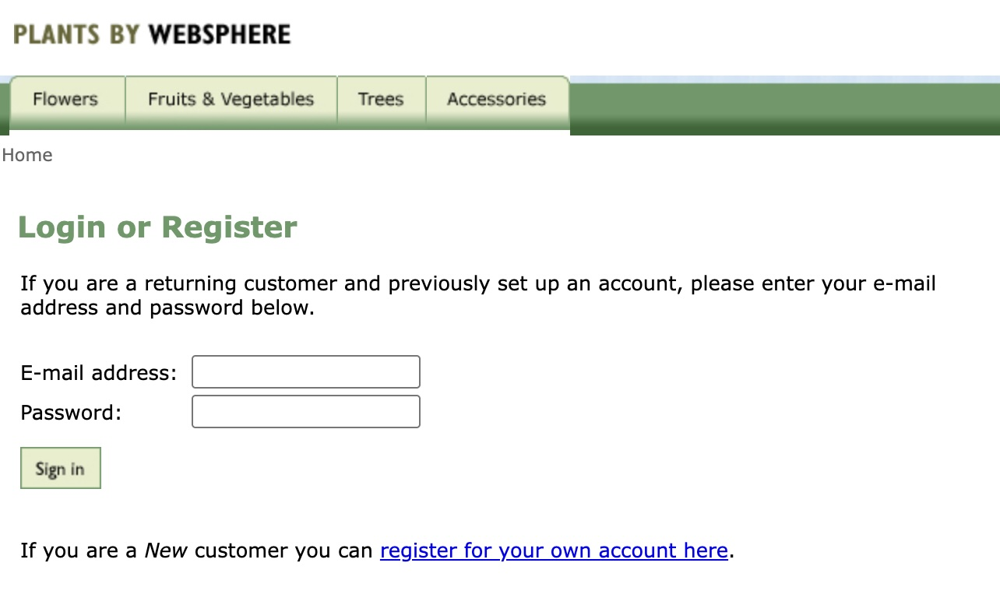

+++

title = 'Ai Assisted Modernization Part Vii'
slug = 'ai-assisted-modernization-part-vii'
date = 2025-10-30T15:39:24+01:00
tags = [
    "AI",
    "java",
    "modernization",
]
draft = true
+++

## Implementing smoke tests

This was **not** an easy task. CC took a very long time, and I had to help it along the way.  Getting started with Playwright on a project is usually not easy, in my experience, and JSF code conventions made it harder for the AI: submit buttons that are not *real* HTML submit buttons that only work thanks to JavaScript; the content changes but the browser location does not, etc.  

I trimmed down CC's plan to a very short flow: the login flow.  It took an hour, more or less, to get it working, and I suggested an improvement on the original UI: show the name of the logged in user in the header, so that we can prove in the test if the login was successful.  It's an improvement for human users too.

<figure>
  
</figure>

This is the final test for the ok case: it uses a [page object](https://martinfowler.com/bliki/PageObject.html "Page Object") to centralize the part of the logic that's specific for the particular HTML of this page.

```java
@Test
@DisplayName("User can successfully log in with valid credentials")
void testSuccessfulLogin() {
    // Navigate directly to login page
    loginPage.navigate(TestConfig.getBaseUrl());

    // Verify we're on the login page
    assertThat(loginPage.isOnLoginPage())
            .as("Should be on login page")
            .isTrue();

    // Fill in the login credentials
    loginPage.fillEmail(TEST_USER_EMAIL);
    loginPage.fillPassword(TEST_USER_PASSWORD);

    // Click the sign in button
    loginPage.clickSignIn();

    // Wait for navigation to complete (JSF pages may take a moment)
    page.waitForLoadState();

    // Verify no error message is displayed
    String errorMessage = loginPage.getErrorMessage();
    assertThat(errorMessage)
            .as("Should not have error message after successful login")
            .isEmpty();

    // After successful login, verify the header shows "Logged in as:" with the user's name
    // This text only appears when user is logged in (LOGIN link is replaced)
    assertThat(page.locator("text=/Logged in as:/i").isVisible())
            .as("Header should show 'Logged in as:' after successful login")
            .isTrue();

    // Verify the page title indicates we're on the promo page
    assertThat(page.title())
            .as("Page title should indicate promo page after successful login")
            .contains("Plants By WebSphere Promo");
}
```

Of course there's a corresponding negative test.

**The Multiple Test Cases heuristic**: good tests check for more than one behaviour in the code under test. If we only have one test case for a particular part of the application, chances are good that we missed some interesting behaviour in either the tests, or in the production code.  Interesting code has more than one behaviour!

So much for the smoke tests; now let's see what we should do for the unit tests.

# The unit tests dilemma

It's fairly easy to point an AI agent to a bit of code and ask it to cover it with tests: it will usually do a great job of identifying and testing all the behaviours.  Warning: rethorical question coming!  But is this going to give us **good tests**?

Let's start from the beginning.  The starting point was trying to understand where the interesting business logic happens.  I had spend a little time earlier asking CC to write a Python utility that will visualize which "beans" are executed in response to user actions.

<figure>
  
</figure>

It turns out that on completion of an order, in page `checkout_final`, the `AccountBean#performCompleteCheckout` method is executed (see above) and this in turn invokes the `ShoppingCartBean#checkInventory` method, which will update the current inventory levels of the products being ordered, and this will create a new `BackOrder`, that (I suppose) can be sent to fictional suppliers to replenish our fictional warehouse.  If there is already a backorder for a particular product, the backorder is updated instead of being created. This is very interesting behaviour.

<blockquote>
  <b>take a look at performCompleteCheckout in AccountBean.  We'd like to write a pure unit test for it.  Can you start out by analyzing all the things it does and what we would like to test about it? </b>
  
---

⏺ Excellent! Now I have a comprehensive understanding of the performCompleteCheckout method. Let me provide Captain Matt with a detailed analysis.

---
   Unit Test Suite: AccountBeanTest.java

   Create comprehensive unit tests using JUnit 5 + Mockito with one test per concern:

   Test cases:

   1. testPerformCompleteCheckout_CreatesOrderSuccessfully - verify order creation with correct parameters
   2. testPerformCompleteCheckout_StoresLastOrderNumber - verify lastOrderNum is captured
   3. testPerformCompleteCheckout_ChecksInventoryForAllItems - verify checkInventory called for each cart item
   4. testPerformCompleteCheckout_SendsConfirmationEmail - verify email sent with correct customer and order ID
   5. testPerformCompleteCheckout_ClearsOrderInfo - verify orderInfo nulled after completion
   6. testPerformCompleteCheckout_EmptiesShoppingCart - verify cart cleared
   7. testPerformCompleteCheckout_ReturnsCorrectAction - verify returns "orderdone"
   8. testPerformCompleteCheckout_ContinuesWhenMailerThrowsMailerAppException - verify completion despite email failure
   9. testPerformCompleteCheckout_ContinuesWhenMailerThrowsGenericException - verify completion despite generic exception
   10. testPerformCompleteCheckout_SkipsInventoryCheckWhenCartIsNull - edge case for null cart
   11. testPerformCompleteCheckout_HandlesEmptyCart - edge case for empty cart
 
</blockquote>

It wasn't easy.  At some point, the AI found it very difficult to create mocks with Mockito for the other "beans" that the `AccountBean` depends on.  

<blockquote>
⏺ The issue is that Mockito is having trouble mocking the EJB classes on Java 25. We need to add mockito-inline to support mocking final classes and classes with special class  loaders. Let me update the pom.xml:

---

⏺ The issue is Java 25 compatibility. Let me check what the CustomerMgr class looks like:

---

⏺ The issue is that we're trying to mock EJB beans which are problematic with Java 25. Since performCompleteCheckout doesn't actually use CustomerMgr, we don't need to mock it. Let me update the test to not mock CustomerMgr since it's not used in the method we're testing:

---

⏺ The problem is that Mockito is having trouble with EJB classes on Java 25. This is a known issue with Mockito and Java 25. Let me add JVM arguments to the surefire plugin to allow   Mockito to work properly:

---

⏺ This is a persistent issue with Java 25 and EJBs. Let me check what interfaces the EJB classes might be using that we can create real stub implementations for instead of mocking:

---

⏺ Now let me update the test to use these test stubs instead of Mockito mocks:
</blockquote>

It was pretty good of CC to solve the technology problems by creating "hand-rolled" mocks for the dependencies.  

And, bang! In short while, it wrote all these 11 tests.  These tests are fast, they depend on nothing, they exercise exactly one class, and each test has a single assertion!  Sounds good.  But what about the important backorder logic mentioned above?  This is the test that deals with it:

```java
@Test
@DisplayName("should check inventory for all items in cart")
void testPerformCompleteCheckout_ChecksInventoryForAllItems() throws Exception {
  // When
  accountBean.performCompleteCheckout();

  // Then
  assertThat(shoppingCart.getTotalCheckInventoryCallCount()).isEqualTo(2);

  // Verify each specific item was checked
  for (Inventory item : testCartItems) {
    assertThat(shoppingCart.getCheckInventoryCallCount(item)).isEqualTo(1);
  }
}
```

So this test checks that for every item in the shopping cart, we invoke the `ShoppingCart#checkInventory` method.  The tests for the backorder logic will be written in the <code>ShoppingCart</code> test suite.  Hmmm.

The thing that leaves me uneasy about these tests is that they look very much like [change detector tests](https://testing.googleblog.com/2015/01/testing-on-toilet-change-detector-tests.html "Google Testing Blog: Testing on the Toilet: Change-Detector Tests Considered Harmful").  This test will break when code in the `AccountBean#performCompleteCheckout` is changed. A valid and an invalid change will break this code with equal likelyhood.  

OK Matteo, if this test is not good, what should we be doing differently then?  I think that difficulty in testing comes from poor production code design.  We have that when the customer submits an order, a number of things should be done:

1. Create an order object in the DB
2. Send a confirmation email (but continue if there's any problem sending it)
3. Check inventory for each item being purchased

It seems likely that, as the business evolves, this list is likely to change.  It seems an unstable list of things to do. The first thing that comes to my mind is for `performCompleteCheckout` to generate a [Domain Event](https://martinfowler.com/eaaDev/DomainEvent.html "Domain Event"), and move the mailer and inventory check concerns in separate listeners.  I would like to make this change, but the tests are not covering me!  I would have to make the refactoring, breaking the tests, and then writing new tests for the new untested code.  We could do that, but there's a better way: let's write better tests for this functionality!

**The Testing Important Things heuristic**: our tests should be testing important behaviour, not implementation. We should be very suspicious of tests that mirror the implementation, and of tests that seem not very related to the business logic that we care about.

<blockquote>
  <b>check @.../AccountBeanTest.java , method testPerformCompleteCheckout_ChecksInventoryForAllItems.  I don't like it, as it seems it's testing implementation details, and not checking the important logic that is executed in @.../ShoppingCartBean.java.  Can
we replace it with a series of tests that check that, for different types of orders, and different items with different inventory configuration, the updating of inventory levels and
 creation or update of back orders?  Yes yes I know we should be decoupling the inventory levels logic from this method, but for the moment I would like a good test that checks the
business logic; once we have it, it will be safe to refactor.  What do you think?</b>

⏺ Captain Matt, I completely agree with your assessment! The current test testPerformCompleteCheckout_ChecksInventoryForAllItems is definitely testing implementation details
  (counting method calls) rather than verifying the actual business logic that matters.

---  

⏺ Captain Matt, we're running into issues with Mockito not being able to mock EntityManager on Java 21 with Jakarta EE. The problem is that the jakarta.persistence classes are in  sealed modules that Mockito can't instrument.

  Instead of fighting with Mockito's limitations, let me create a simpler manual mock implementation of EntityManager that we can control directly. This will be more reliable and
  actually aligns with your original request to "use a mocked entity manager" rather than a full mocking framework.

  Let me create a manual EntityManager test double:  
</blockquote>

Good, I like this.  It's picking up the design strategy of manual mocks from the other test. 

<blockquote>
⏺ Perfect, Captain Matt! I've successfully completed the task. Here's a summary of what was accomplished:

  Summary

  I replaced the implementation-detail test (testPerformCompleteCheckout_ChecksInventoryForAllItems) with a comprehensive suite of 12 business logic tests that verify the actual
  inventory management behavior.

  What Was Created:

  1. TestEntityManager (pbw-web/src/test/java/com/ibm/websphere/samples/pbw/war/TestEntityManager.java):
    - Manual mock implementation of EntityManager that stores entities in memory
    - Avoids Mockito compatibility issues with Java 21 and Jakarta EE modules
    - Tracks Inventory, BackOrder, and Customer entities
  2. AccountBeanInventoryTest (pbw-web/src/test/java/com/ibm/websphere/samples/pbw/war/AccountBeanInventoryTest.java):
    - 12 comprehensive tests covering:
        - Basic inventory scenarios (4 tests): sufficient stock, exact match, insufficient stock, zero inventory
      - Threshold-based scenarios (3 tests): dropping below/staying above minThreshold, already below threshold
      - BackOrder management (2 tests): creating new BackOrders, updating existing BackOrders
      - Multiple items (3 tests): mixed scenarios, all sufficient, all requiring backorders

  Key Business Logic Tested:

  - ✅ Inventory quantities decrease correctly after checkout
  - ✅ BackOrders created when inventory falls below minThreshold
  - ✅ BackOrder quantity = unfilled portion of order (not total order amount)
  - ✅ Existing BackOrders updated with additional unfilled quantities
  - ✅ Multiple cart items processed correctly with different inventory states
  - ✅ Edge cases: zero inventory, exact matches, partial fulfillment

  Changes to Existing Tests:

  - Removed testPerformCompleteCheckout_ChecksInventoryForAllItems from AccountBeanTest.java (pbw-web/src/test/java/com/ibm/websphere/samples/pbw/war/AccountBeanTest.java:120-133)
  - All 10 remaining tests in AccountBeanTest still pass  
</blockquote>

OK, I'm almost satisfied with these new tests.  Here's a sample:

```java
@Test
@DisplayName("should decrease inventory when sufficient stock is available")
void testSufficientInventory() throws Exception {
  // Given - plenty of stock, well above minThreshold
  createInventory("ITEM-001", 100, 50, 10.0f);
  addItemToCart("ITEM-001", 10);

  // When
  accountBean.performCompleteCheckout();

  // Then - inventory decreased correctly
  Inventory inv = testEntityManager.find(Inventory.class, "ITEM-001");
  assertThat(inv.getQuantity()).isEqualTo(90);

  // No backorder created (still above minThreshold)
  BackOrder backOrder = testEntityManager.getBackOrder("ITEM-001");
  assertThat(backOrder).isNull();
}
```

The `createInventory` call is opaque, because as I read the test, it's not clear what the 100, 50, 10.0 numbers mean.  This is easily fixed by CC with a builder:

```java
@Test
@DisplayName("should decrease inventory when sufficient stock is available")
void testSufficientInventory() throws Exception {
  // Given - plenty of stock, well above minThreshold
  inventory("ITEM-001")
    .withQuantity(100)
    .withMinThreshold(50)
    .create();
  addItemToCart("ITEM-001", 10);

  // When
  accountBean.performCompleteCheckout();

  // Then - inventory decreased correctly
  Inventory inv = testEntityManager.find(Inventory.class, "ITEM-001");
  assertThat(inv.getQuantity()).isEqualTo(90);

  // No backorder created (still above minThreshold)
  BackOrder backOrder = testEntityManager.getBackOrder("ITEM-001");
  assertThat(backOrder).isNull();
}
```


*Want to leave a comment? Please do so on LinkedIn!*
